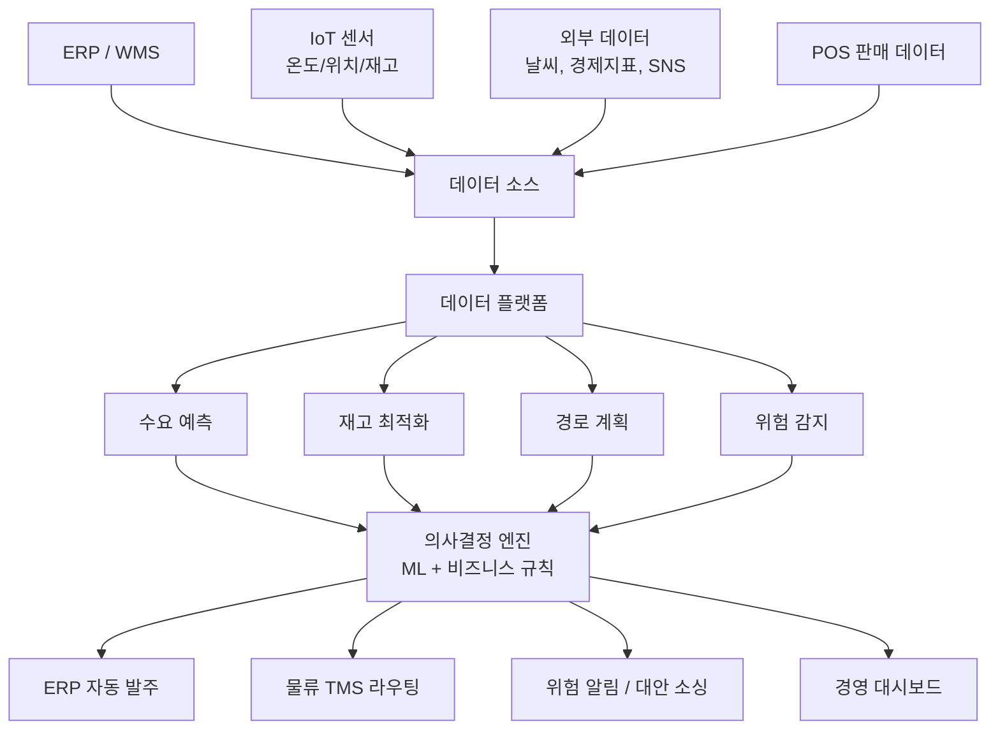
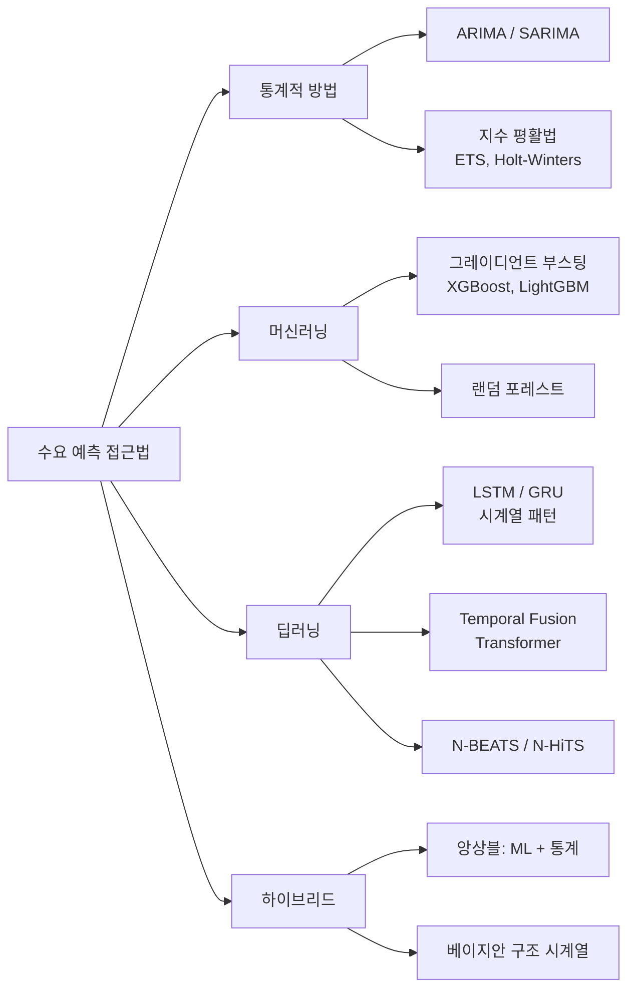
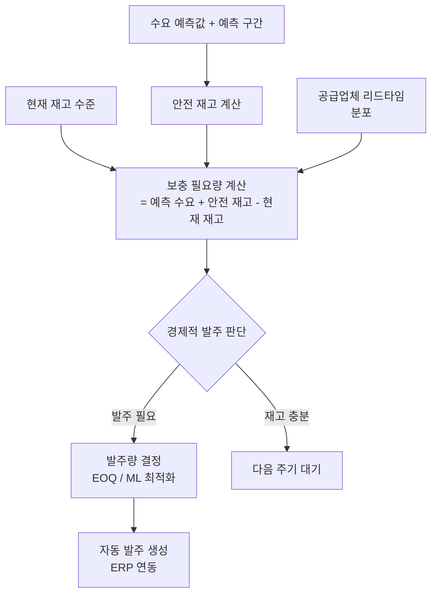
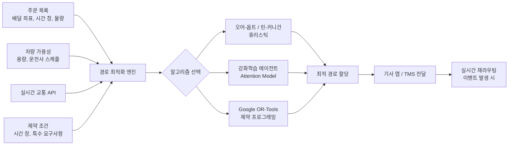
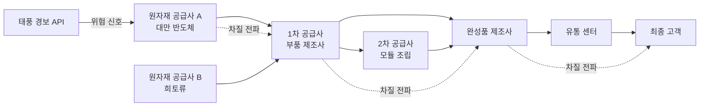
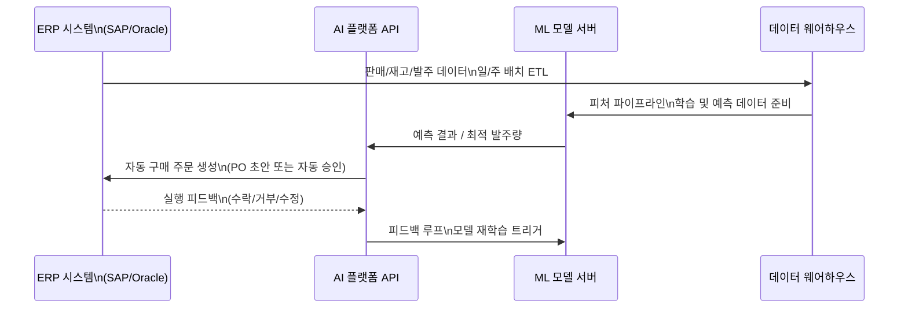

# AI 공급망 최적화

## 개요

공급망(supply chain)은 원자재 조달에서 최종 소비자 배송까지 이어지는 복잡한 네트워크다. 여기에 AI를 적용하면 수요 예측 정확도 향상, 재고 비용 감소, 배송 경로 최적화, 공급망 리스크 조기 경보 등의 효과를 얻는다.

공급망 AI의 핵심 가치는 **불확실성 관리**다. 수요는 계절, 프로모션, 외부 이벤트(팬데믹, 지정학적 리스크 등)에 따라 비선형적으로 변동하는데, 전통적인 통계 모델은 이런 복잡한 인과 구조를 포착하기 어렵다. 머신러닝과 딥러닝은 수백 개 변수의 상호작용을 모델링해 예측 정확도를 끌어올린다.

## 전체 아키텍처

이 다이어그램은 다양한 데이터 소스에서 통합 플랫폼으로 수집된 데이터가 AI 모듈별로 처리되고, 의사결정 엔진을 통해 운영 시스템(ERP, TMS)에 자동으로 반영되는 흐름을 나타낸다.

---

## 1. 수요 예측 (Demand Forecasting)

### 왜 중요한가

수요 예측 오류는 두 방향으로 비용을 발생시킨다.
- **과잉 재고(overstock)**: 보관 비용, 폐기 손실, 자본 잠금
- **품절(stockout)**: 매출 기회 손실, 고객 이탈, 긴급 조달 비용 증가

소매 산업에서 평균 수요 예측 오류율(MAPE)은 전통 방식 대비 ML 방식이 20-50% 감소한다는 사례가 보고된다.

### 모델 계층

**Temporal Fusion Transformer (TFT)**: Google이 2019년 발표한 아키텍처로, 다변수 시계열의 장단기 의존성 + 정적 메타데이터(카테고리, 지역)를 동시에 처리. 공급망 수요 예측에서 LSTM 대비 우수한 성능을 보이는 것으로 보고됨. ([[time-series-forecasting]] 참조)

### 입력 피처 설계

좋은 수요 예측 모델은 **외부 신호(exogenous features)**를 풍부하게 활용한다.

| 피처 그룹 | 예시 |
|-----------|------|
| 시간 | 요일, 주차, 월, 공휴일, 계절 |
| 가격 | 자사 가격, 경쟁사 가격, 프로모션 할인율 |
| 이벤트 | 마케팅 캠페인, 스포츠 이벤트, 날씨 예보 |
| 거시 지표 | 소비자 신뢰지수, CPI, 환율 |
| 지역 | 점포/지역별 인구통계, 경쟁 밀도 |
| 소셜 | SNS 언급량, 트렌드 검색량 |

**계층적 예측(hierarchical forecasting)**: 전체 → 카테고리 → SKU 레벨로 계층을 나눠 예측한 뒤 상향/하향 조화(reconciliation). 하위 레벨 노이즈를 상위 레벨 신호로 교정하는 효과.

---

## 2. 재고 최적화 (Inventory Optimization)

### 핵심 문제

재고 최적화는 **언제(when)**, **얼마나(how much)** 주문할지를 결정하는 문제다. 전통적인 EOQ(Economic Order Quantity) 모델은 수요가 확정적이고 일정하다고 가정하지만, 현실은 확률적(stochastic) 수요를 다룬다.

**안전 재고(safety stock)**: 수요 불확실성과 리드타임 불확실성을 완충하는 여분 재고. ML이 예측 구간(prediction interval)을 더 정확히 계산해 안전 재고를 최소화할 수 있다.

### ML 기반 보충 최적화

### 다품목 / 다창고 최적화

대기업의 경우 수만 개 SKU를 수십 개 창고에서 관리한다. 이는 조합 최폭발(combinatorial explosion) 문제가 되어 정수 프로그래밍(integer programming)만으로는 한계가 있다.

- **강화학습**: 각 창고 × 품목 조합을 에이전트로 간주해 재고 정책 학습 (수백만 스텝 시뮬레이션)
- **근사 알고리즘**: 클러스터링으로 SKU 그룹화 후 그룹 단위 최적화
- **이전 비용(transfer cost) 모델링**: 창고 간 이전 vs. 직접 조달 비용 비교

**Amazon의 사례**: 재고 배치 최적화 ML 시스템이 총 재고 비용을 크게 낮추면서도 Prime 배송 SLA를 유지하는 핵심 역할.

---

## 3. 경로 계획 (Route Optimization)

### 차량 경로 문제 (Vehicle Routing Problem, VRP)

VRP는 여러 차량이 여러 배달 지점을 최소 비용(거리/시간/연료)으로 방문하는 경로를 찾는 NP-hard 문제다. AI 접근법은 고전 휴리스틱보다 실시간 변수(교통, 날씨, 주문 변경)에 적응적이다.

**뉴럴 조합 최적화(neural combinatorial optimization)**: Pointer Network, Attention Model(AM) 등 트랜스포머 기반 모델이 VRP 인스턴스를 엔드-투-엔드로 학습. 대규모 실시간 재라우팅에 유리.

### 마지막 마일 배송 (Last-Mile Delivery)

전체 배송 비용의 50-60%를 차지하는 마지막 마일은 특히 도시 환경에서 AI 최적화 효과가 크다.

- **예측적 재배치(predictive repositioning)**: 수요 예측 기반으로 물류 거점(hub)에 미리 재고 배치
- **크라우드소싱 배송 라우팅**: Uber Eats, DoorDash의 동적 기사 배정 알고리즘
- **드론/자율주행 통합**: 라스트마일 경로에 드론 배달 반경을 고려한 통합 최적화

---

## 4. 위험 평가 및 공급망 회복력 (Supply Chain Resilience)

### 공급망 위험 유형

| 위험 유형 | 예시 | AI 접근 |
|-----------|------|---------|
| 공급 차질 | 자연재해, 공장 가동 중단 | 뉴스/SNS NLP 조기 감지 |
| 지정학적 리스크 | 수출 규제, 무역 분쟁 | 위험 국가 스코어링 모델 |
| 품질 문제 | 공급업체 불량률 급증 | 통계적 공정 제어 + 이상 탐지 |
| 수요 쇼크 | 바이럴 트렌드, 팬데믹 | 소셜 리스닝 + 시나리오 예측 |
| 물류 차질 | 항만 혼잡, 운임 급등 | 운임 예측 모델, 대안 경로 플래닝 |

### 공급망 지식 그래프(Knowledge Graph) 활용

복잡한 공급망의 의존 관계는 그래프로 표현하면 위험 전파 경로를 추적할 수 있다.

그래프 뉴럴 네트워크(GNN)가 이 의존 관계를 학습해 한 노드의 차질이 어디까지 전파되는지 시뮬레이션한다. ([[graph-neural-networks]] 참조)

---

## 5. ERP/WMS 통합 패턴

AI 모델이 아무리 정확해도 기업 운영 시스템과 통합되지 않으면 운영팀이 수동으로 결과를 옮겨야 한다. 실용적 통합 패턴:

**신뢰 구간과 인간 재확인**: AI가 생성한 발주 추천에 신뢰 구간을 함께 표시하고, 신뢰 구간이 넓거나 발주량이 임계값 초과 시 인간 승인 워크플로우로 라우팅하는 것이 현장 수용성을 높이는 핵심.

---

## 한계 및 트레이드오프

### 데이터 품질 의존성

공급망 AI의 가장 큰 적은 **더러운 데이터(dirty data)**다. ERP 마스터 데이터 불일치, SKU 통합/분리 이력, 결측값이 많은 시계열은 모델 성능을 직접 저하시킨다.

### 설명 가능성 (Explainability)

조달 담당자는 "왜 이 품목을 1000개 더 주문해야 하는가"를 설명할 수 있어야 한다. 블랙박스 딥러닝 모델보다 SHAP(SHapley Additive exPlanations) 값을 제공하는 그래디언트 부스팅 모델이 현장 수용성이 높은 이유다.

### 콜드 스타트 문제

신규 SKU나 신규 공급업체는 충분한 이력 데이터가 없어 ML 예측이 부정확하다. 유사 상품 임베딩 기반 전이학습(transfer learning)이나 메타학습(meta-learning) 접근이 필요하다.

### 분포 변화 (Distribution Shift)

팬데믹이나 대규모 프로모션처럼 역사에 없던 사건은 훈련 분포 밖의 입력이 돼 모델 성능이 급락한다. 지속적 모니터링과 자동 재학습 트리거가 필수다.

---

## 관련 문서

- [[time-series-forecasting]] - 수요 예측에 사용되는 시계열 모델 심화
- [[ai-transportation-routing]] - 경로 최적화 응용 심화
- [[ai-anomaly-detection]] - 공급망 이상 탐지 기법
- [[graph-neural-networks]] - 공급망 위험 전파 모델링
- [[ai-manufacturing]] - 제조 공정과 공급망의 통합 관점
