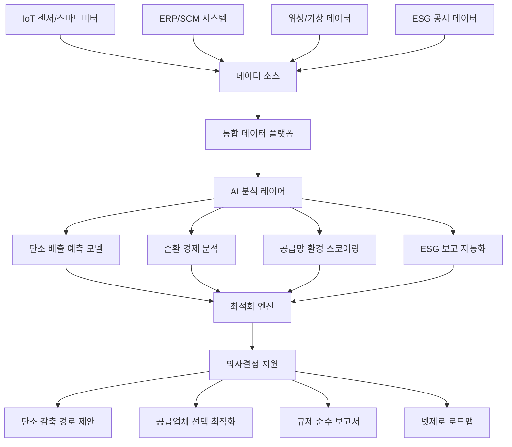
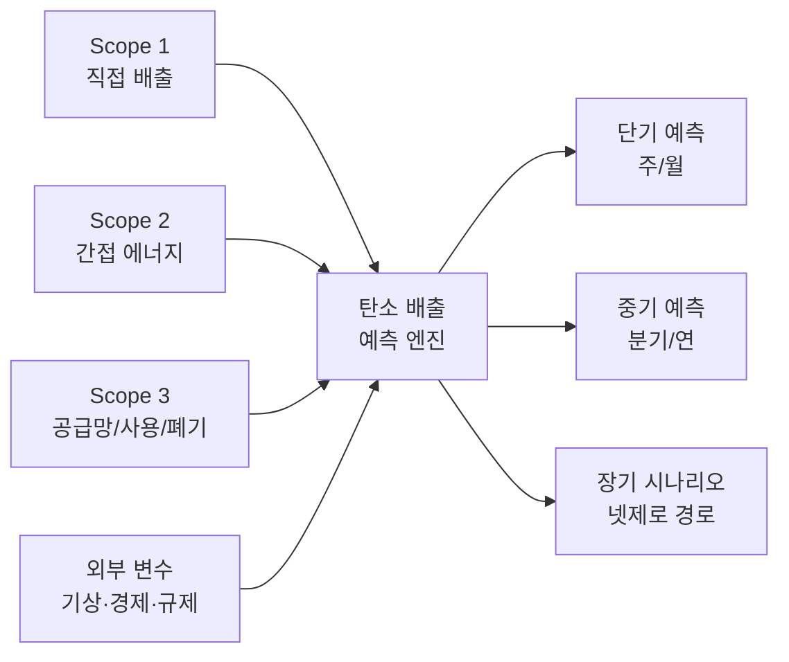
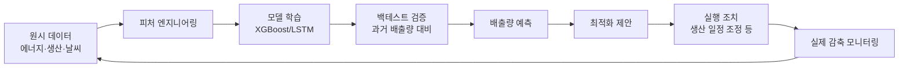

# AI 지속가능성 최적화

## 개요

AI 지속가능성 최적화(AI Sustainability Optimization)는 머신러닝과 데이터 분석을 활용하여 기업 및 공공기관의 환경 목표 달성을 지원하는 응용 분야다. ESG(Environmental, Social, Governance) 보고 자동화, 탄소 배출 예측, 순환 경제(circular economy) 분석, 공급망 환경 영향 평가 등을 포괄한다.

기후 위기 대응과 탄소 중립(carbon neutrality) 목표가 전 세계 기업의 핵심 의제로 부상하면서, AI는 방대한 환경 데이터를 처리하고 최적화 의사결정을 지원하는 핵심 도구로 자리잡았다. 인간이 수작업으로 처리하기 어려운 복잡한 공급망 데이터, 실시간 에너지 사용량, 제품 라이프사이클 분석 등을 AI가 통합 처리함으로써 실질적인 탄소 감축 경로를 도출할 수 있다.

## 핵심 아이디어

지속가능성 최적화 문제의 본질은 **다목적 최적화(multi-objective optimization)** 다. 비용 절감, 탄소 배출 감소, 공급망 회복탄력성 유지라는 상충하는 목표를 동시에 최적화해야 한다. AI는 이 트레이드오프 공간을 탐색하고, 파레토 최적(Pareto-optimal) 해를 제안하는 역할을 한다.

핵심 데이터 흐름은 다음과 같다. 센서, ERP(Enterprise Resource Planning), 외부 데이터(기상, 위성, 규제 데이터베이스)를 통합한 후, 예측 모델과 최적화 알고리즘을 거쳐 의사결정자에게 실행 가능한 인사이트를 제공한다.



위 다이어그램은 데이터 수집부터 의사결정 지원까지의 전체 파이프라인을 보여준다.

## 주요 응용 영역

### ESG 보고 자동화

ESG 보고는 기업이 환경(E), 사회(S), 지배구조(G) 측면의 성과를 투자자와 규제기관에 공시하는 프로세스다. 기존에는 데이터 수집과 보고서 작성에 수백 시간이 소요되었지만, AI는 이 과정을 대폭 자동화한다.

**AI 활용 방식:**
- **자연어 처리(NLP)**: 기업 내부 문서, 계약서, 공급업체 데이터에서 ESG 관련 수치를 자동 추출
- **데이터 정합성 검증**: 다양한 소스에서 수집된 탄소 배출량, 에너지 사용량 데이터의 일관성을 자동 검증
- **규제 매핑**: EU 택소노미(EU Taxonomy), TCFD(Task Force on Climate-related Financial Disclosures), GHG 프로토콜 등 복잡한 규제 프레임워크에 데이터를 자동 매핑
- **보고서 초안 생성**: LLM을 활용하여 정량 데이터를 서술형 ESG 보고서로 변환

실제 사례로 IBM은 자사 ESG 보고 플랫폼에서 AI를 활용해 Scope 1, 2, 3 탄소 배출량 계산을 자동화하고 있다. Microsoft는 Azure Carbon Optimization 서비스를 통해 클라우드 워크로드의 탄소 발자국을 실시간으로 측정하고 보고한다.

### 탄소 배출 예측

탄소 배출 예측(carbon emission forecasting)은 미래 배출량을 사전에 예측하여 선제적 감축 조치를 취할 수 있게 한다.

**모델링 접근법:**

| 접근법 | 적합한 상황 | 대표 모델 |
|--------|------------|----------|
| 시계열 예측 | 에너지 사용량, 생산량 기반 배출 | LSTM, Transformer |
| 회귀 분석 | 날씨, 경제 지표 등 외부 변수 포함 | XGBoost, LightGBM |
| 물리 기반 하이브리드 | 공정 화학 반응 포함 제조 현장 | Physics-Informed Neural Networks |
| 에이전트 기반 시뮬레이션 | 복잡한 공급망 전체 Scope 3 | 강화학습 + 시뮬레이션 |

Scope 3 배출량 예측이 특히 어렵다. Scope 3는 공급망 전체, 제품 사용, 폐기 단계의 간접 배출을 포함하기 때문에 데이터 가시성이 낮고 공급업체 협력이 필요하다.



### 순환 경제 분석

순환 경제(circular economy)는 자원을 선형적으로 소비하고 폐기하는 대신, 재사용(reuse), 재제조(remanufacturing), 재활용(recycling)을 통해 자원 순환을 극대화하는 경제 모델이다.

AI가 지원하는 순환 경제 분석 기능:

**제품 라이프사이클 추적:** IoT 센서와 블록체인을 결합하여 제품의 원재료 조달부터 사용, 회수까지 전 과정을 추적한다. AI는 각 단계의 환경 영향을 계산하고 최적 회수 시점을 예측한다.

**재활용 분류 자동화:** 컴퓨터 비전(computer vision) 모델이 폐기물 스트림에서 재활용 가능 소재를 실시간으로 분류한다. Recycleye, AMP Robotics 등 스타트업이 이 분야를 선도한다.

**역물류 최적화(reverse logistics optimization):** 회수된 제품이나 소재를 최적 경로로 처리 시설에 전달하는 물류를 AI가 최적화한다.

**소재 여권(material passport):** 건물, 제품에 사용된 소재의 조성과 재활용 가능성을 디지털로 기록하여, 해체 시 가치 있는 소재를 선택적으로 회수할 수 있게 한다.

### 공급망 환경 영향 평가

공급망 환경 영향 평가는 기업의 Scope 3 배출량 중 '구매한 상품 및 서비스'에 해당하는 부분을 분석한다. 다국적 공급망에서 수천 개 공급업체의 환경 성과를 평가하는 것은 AI 없이는 사실상 불가능하다.

**AI 활용 접근법:**

1. **공급업체 환경 스코어링**: 공급업체의 ESG 공시, 제3자 평가, 위성 데이터(삼림 벌채, 수질 오염)를 종합하여 환경 리스크 점수를 산출한다.

2. **배출 집약도 추정**: 공급업체가 직접 배출 데이터를 제공하지 않는 경우, 산업 평균 배출 집약도(emission intensity)와 구매 금액을 사용하여 배출량을 추정한다.

3. **공급망 재설계 시뮬레이션**: 특정 공급업체를 저탄소 대안으로 교체할 때의 비용, 탄소 감축 효과, 공급 리스크를 시뮬레이션한다.

4. **실시간 모니터링**: 위성 이미지와 뉴스 분석을 결합하여 공급업체의 환경 사건(유출, 화재, 불법 벌채)을 조기 감지한다.

## 주요 기술 컴포넌트

### 탄소 회계 엔진

탄소 회계(carbon accounting)는 GHG(온실가스) 프로토콜에 따라 Scope 1/2/3 배출량을 측정하고 집계하는 시스템이다.

```python
# 탄소 배출량 계산 예시 (Scope 2 - 시장 기반)
def calculate_scope2_market_based(
    electricity_kwh: float,
    supplier_emission_factor: float,  # kgCO2e/kWh
    residual_mix_factor: float,       # 잔여 믹스 계수
    renewable_energy_certificates: float  # MWh
) -> float:
    """
    시장 기반 접근법으로 Scope 2 배출량 계산
    RE100 인증서 반영 포함
    """
    net_electricity = electricity_kwh - (renewable_energy_certificates * 1000)
    if net_electricity < 0:
        net_electricity = 0
    return net_electricity * supplier_emission_factor
```

### 예측 모델 파이프라인



예측 모델은 단순 예측에서 그치지 않고 최적화 루프와 연결될 때 진짜 가치를 발휘한다. 예측 결과를 실행 조치로 연결하고, 실제 감축 성과를 다시 모델 학습에 반영하는 폐루프(closed loop) 구조가 핵심이다.

### 지식 그래프 기반 공급망 분석

공급망의 복잡한 관계를 지식 그래프(knowledge graph)로 모델링하면 AI가 다단계 공급망을 따라 환경 영향을 추적할 수 있다. 각 노드는 공급업체, 공장, 물류 거점을 나타내며, 엣지에는 거래량, 운송 거리, 탄소 집약도가 부여된다.

GNN(그래프 신경망, Graph Neural Network)을 활용하면 공급망 구조의 변화(공급업체 교체, 경로 변경)가 전체 탄소 발자국에 미치는 영향을 빠르게 예측할 수 있다.

## 실제 사례

### Microsoft - Carbon Negative 전략

Microsoft는 2030년까지 탄소 네거티브(carbon negative) 달성, 2050년까지 창사 이래 배출한 탄소 전량 제거를 목표로 한다. AI 활용 요소:
- Azure 데이터센터의 전력 사용 효율(PUE, Power Usage Effectiveness)을 AI로 실시간 최적화
- 공급업체 3,000여 곳의 Scope 3 배출 데이터를 자동 수집·검증
- 탄소 제거(carbon removal) 포트폴리오 최적화 모델링

### Amazon - Climate Pledge

Amazon은 2040년까지 탄소 중립을 약속했다. 핵심 AI 활용:
- 배송 경로 최적화로 차량 연료 소비와 배출량 감소 (매년 수백만 배송 최적화)
- 포장 최적화 AI로 과잉 포장 제거
- AWS Carbon Footprint Tool을 통한 클라우드 배출 투명성 제공

### Siemens - MindSphere ESG

Siemens의 산업 IoT 플랫폼 MindSphere는 제조 현장의 에너지 소비와 배출량을 실시간으로 수집하고, AI 분석을 통해 생산 공정의 탄소 집약도를 낮추는 최적화 제안을 자동으로 생성한다.

### Pachama - 자연 기반 탄소 상쇄

Pachama는 위성 이미지, LiDAR 데이터, 머신러닝을 결합하여 산림 탄소 흡수량을 정밀하게 측정하고 검증한다. 기업이 구매하는 탄소 상쇄(carbon offset)의 실제 효과를 AI로 투명하게 검증하는 시스템이다.

## 한계와 트레이드오프

### 데이터 가용성과 품질

가장 큰 장벽은 데이터다. Scope 3 배출량 계산에 필요한 공급업체 데이터 중 상당수가 미측정, 추정치, 또는 공개 거부 상태다. 산업 평균 배출 집약도를 사용한 추정은 실제 배출량과 크게 다를 수 있다.

**해결 방향:**
- 업계 표준화(예: GHG 프로토콜 Scope 3 카테고리 15 준수)
- 공급업체 데이터 공유 인센티브 설계
- 위성·원격탐사 데이터로 직접 측정 보완

### AI의 탄소 발자국 역설

AI 학습과 추론 자체가 상당한 에너지를 소비한다. 대규모 언어 모델 학습은 수백 톤의 CO2를 배출할 수 있다. 지속가능성 최적화에 사용하는 AI의 탄소 비용이 달성하는 감축 효과보다 커지는 아이러니가 발생할 수 있다.

**완화 방안:**
- 재생에너지 데이터센터에서 AI 워크로드 실행
- 경량화 모델(distillation, quantization) 우선 사용
- 탄소 집약도가 낮은 시간대에 배치 학습 스케줄링

### 그린워싱(Greenwashing) 위험

AI 기반 ESG 보고 시스템이 실제 환경 성과보다 유리한 수치를 산출하도록 설계되거나, 허점 있는 방법론으로 Scope 3 배출량을 과소 산정하는 경우 AI가 그린워싱을 정교화하는 도구가 될 수 있다.

### 시스템 경계 설정 문제

탄소 발자국 분석에서 어디까지를 포함하는지(system boundary)에 따라 결과가 크게 달라진다. 전기차가 주행 단계에서는 탄소 배출이 없지만 배터리 제조 단계를 포함하면 상당한 배출이 발생하는 것처럼, AI 모델의 분석 결과는 경계 설정에 민감하다.

### 윤리 이슈

- **환경 부담의 전가**: 공급망 최적화가 탄소 집약 공정을 규제가 느슨한 국가의 공급업체에 아웃소싱하는 방식으로 이루어질 경우, 전 지구적 배출량은 줄지 않으면서 지역 환경 불평등이 심화된다.
- **소규모 공급업체 소외**: 데이터 보고 부담을 감당하기 어려운 소규모 공급업체가 대기업 공급망에서 배제될 수 있다.
- **탄소 시장 조작**: AI가 탄소 크레딧 시장에서 가격을 예측하고 투기적으로 거래할 경우, 실질적 감축보다 금융 차익 추구가 우선될 위험이 있다.

## 실무 적용 관점

지속가능성 최적화 시스템 구축 시 권장하는 단계:

1. **기준점 측정(baseline measurement)**: AI 솔루션 도입 전 현재 Scope 1/2/3 배출량을 가능한 한 정확하게 측정한다.

2. **단순한 것부터 시작**: 복잡한 공급망 분석보다 에너지 효율화, 직접 배출 감소처럼 데이터가 명확한 영역에서 먼저 성과를 낸다.

3. **규제 선행 파악**: EU CSRD(Corporate Sustainability Reporting Directive), SEC 기후 공시 규정 등 의무화되는 보고 요구사항을 기반으로 시스템을 설계한다.

4. **내부 탄소 가격제 연계**: AI의 최적화 제안이 실제 의사결정에 반영되려면, 탄소 배출에 내부 비용을 부과하는 내부 탄소 가격(internal carbon price) 메커니즘과 연동되어야 한다.

5. **제3자 검증**: AI 산출 탄소 데이터는 외부 검증 기관의 감사를 받아 신뢰성을 확보한다.

## 관련 문서

- [[ai-climate-modeling]] - 기후 시스템 예측 및 시나리오 분석
- [[ai-energy-grid]] - 에너지 그리드 관리와 재생에너지 통합
- [[ai-supply-chain-optimization]] - 공급망 전반 최적화 전략
- [[time-series-forecasting]] - 탄소 배출 예측에 사용되는 시계열 모델
- [[reinforcement-learning]] - 복잡한 지속가능성 최적화 문제 해법
