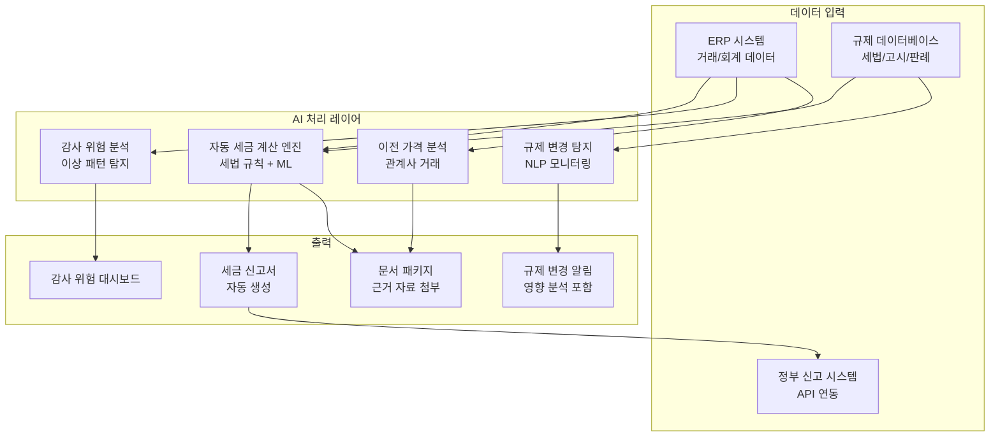
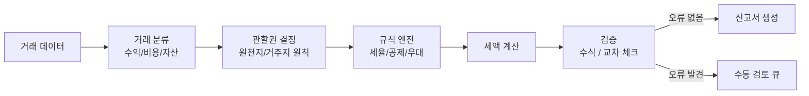
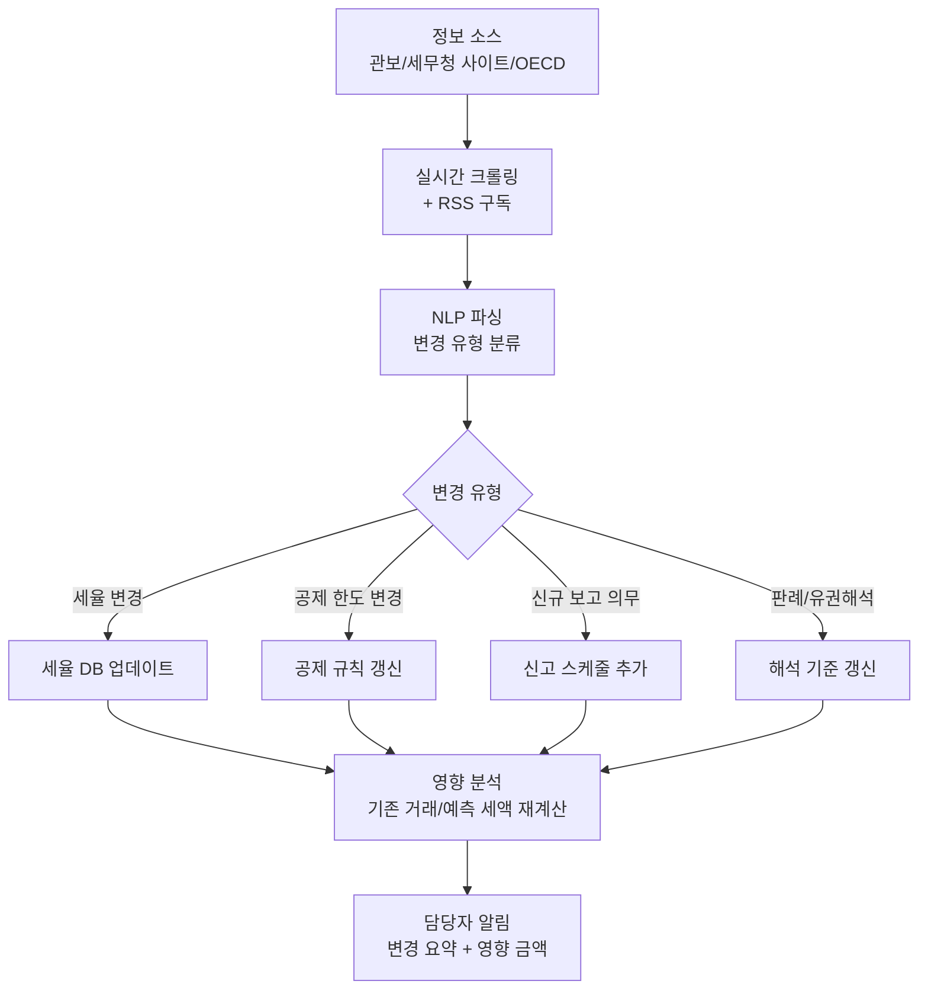
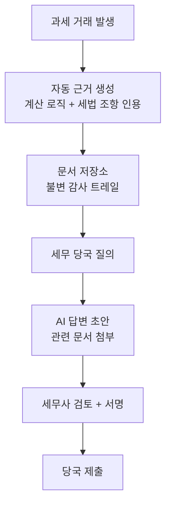

# AI 세무 준수 (AI Tax Compliance)

## 개요

세무 준수(tax compliance)는 법인과 개인이 각국 세법에 따라 세금을 정확하게 계산하고 신고하는 일련의 과정이다. AI는 세 가지 핵심 영역에서 이 과정을 자동화한다: (1) **자동 세금 계산** - 복잡한 세법 규정을 코드로 구현해 오류를 줄인다, (2) **규제 변경 추적** - 각국의 세법 개정을 실시간 모니터링한다, (3) **감사 위험 분석** - 세무 당국이 특정 항목을 심사할 확률을 예측한다.

다국적 기업의 세무 환경은 OECD BEPS (Base Erosion and Profit Shifting) 대응, GLoBE (Global Minimum Tax) 도입, VAT 디지털 서비스 과세 등으로 급격히 복잡해졌다. 수십 개국의 세법을 사람이 완전히 추적하는 것은 비현실적이며, AI 기반 RegTech (Regulatory Technology)가 필수 인프라로 자리 잡고 있다.

## 시스템 아키텍처



## 주요 컴포넌트

### 1. 자동 세금 계산 (Automated Tax Calculation)

세금 계산은 본질적으로 복잡한 조건 분기 규칙 집합이다. AI는 이 규칙을 학습하고, 새로운 거래에 적용하며, 세법 개정 시 규칙을 자동 업데이트한다.



**부가가치세(VAT) 자동화** 예시:
- 디지털 서비스의 소비지 과세 원칙 자동 판정
- B2B/B2C 거래 구분에 따른 세율 차등 적용
- EU OSS (One-Stop Shop) 신고 집계 자동화

```python
from decimal import Decimal
from dataclasses import dataclass

@dataclass
class Transaction:
    seller_country: str
    buyer_country: str
    buyer_type: str  # "business" | "consumer"
    amount: Decimal
    service_category: str

def compute_vat(txn: Transaction) -> dict:
    """EU 디지털 서비스 VAT 계산 (단순화된 예시)"""
    # 소비지 과세: 구매자 국가에서 과세
    if txn.buyer_type == "consumer":
        tax_country = txn.buyer_country
        vat_rates = {"DE": Decimal("0.19"), "FR": Decimal("0.20"), "KR": Decimal("0.10")}
        rate = vat_rates.get(tax_country, Decimal("0.20"))
        vat_amount = txn.amount * rate
        return {
            "tax_country": tax_country,
            "rate": float(rate),
            "vat_amount": float(vat_amount),
            "mechanism": "destination_principle"
        }
    # B2B: 역전 과세(Reverse Charge) 적용
    return {
        "tax_country": txn.buyer_country,
        "rate": 0.0,
        "vat_amount": 0.0,
        "mechanism": "reverse_charge"
    }
```

### 2. 규제 변경 추적 (Regulatory Change Tracking)

각국 세무 당국의 고시, 세법 개정안, 판례, OECD 가이드라인을 NLP로 모니터링하고 영향 분석을 자동화한다.



LLM 기반 세법 변경 요약:
```python
def summarize_tax_change(raw_text: str, jurisdiction: str) -> dict:
    """세법 변경 문서를 구조화된 요약으로 변환"""
    # LLM에 전달할 프롬프트 (실제 구현에서는 API 호출)
    prompt = f"""다음 {jurisdiction} 세법 변경 공지를 분석하여 JSON으로 반환하라.

분석 항목:
- effective_date: 시행일
- tax_type: 세목 (법인세/소득세/부가세 등)
- change_type: 변경 유형 (세율변경/공제변경/신규보고의무/기타)
- summary: 변경 내용 2-3줄 요약
- impact_level: high/medium/low (기업 영향도)
- action_required: 기업이 해야 할 조치

원문:
{raw_text}"""
    # ... LLM API 호출 및 JSON 파싱
    pass
```

### 3. 감사 위험 분석 (Audit Risk Analysis)

세무 당국이 특정 신고 항목을 심사할 확률을 예측하고, 사전 대응 자료를 준비하는 데 AI를 활용한다.

위험 지표:
- **통계적 이상**: 동종 업종 대비 특이한 비용 비율, 세전 이익률 급변
- **신고 일관성**: 전년 대비 주요 항목 급격한 변동
- **관계사 거래**: 이전 가격(transfer pricing) 조정액 규모
- **결손금 이월공제**: 대규모 결손금의 지속적 공제
- **세액공제 집중**: 특정 세액공제의 과도한 적용

```python
import numpy as np
from sklearn.ensemble import IsolationForest

def compute_audit_risk_score(company_features: dict, industry_benchmarks: dict) -> float:
    """감사 위험 점수 계산 (0: 낮음, 1: 높음)"""
    # 동종 업종 대비 편차 계산
    deviations = {}
    for metric, value in company_features.items():
        if metric in industry_benchmarks:
            benchmark = industry_benchmarks[metric]
            z_score = abs(value - benchmark["mean"]) / (benchmark["std"] + 1e-8)
            deviations[metric] = z_score

    # 가중 위험 점수 (항목별 가중치 적용)
    weights = {
        "transfer_pricing_ratio": 0.30,
        "effective_tax_rate_deviation": 0.25,
        "loss_carryforward_usage": 0.20,
        "rd_credit_ratio": 0.15,
        "expense_ratio_deviation": 0.10
    }
    risk_score = sum(
        weights.get(k, 0) * min(v / 3.0, 1.0)  # z-score 3이상 = 최대 위험
        for k, v in deviations.items()
    )
    return float(np.clip(risk_score, 0, 1))
```

### 4. 다국적 세무 통합 (Multinational Tax Integration)

다국적 기업은 각국의 세법 차이를 이용한 세원 잠식(BEPS)을 방지하는 새로운 규제들을 준수해야 한다.

| 규제 | 설명 | AI 활용 |
|------|------|--------|
| OECD Pillar 2 (GLoBE) | 글로벌 최저세율 15% 강제 | 국가별 유효세율(ETR) 자동 계산 |
| 이전 가격(Transfer Pricing) | 관계사 거래 시장 가격 준수 | 비교 가능 거래 데이터 분석 |
| CbCR (Country-by-Country Reporting) | 국가별 수익/세금/직원 수 보고 | 데이터 집계 자동화 |
| DAC6 (EU) | 세금 계획 구조 의무 공개 | 공개 대상 구조 자동 감지 |
| FATCA / CRS | 금융 계좌 정보 자동 교환 | 보고 의무 계좌 식별 |

GLoBE 유효세율 계산 예시:

$\text{ETR}_{\text{국가}} = \frac{\text{조정 세금 비용}}{\text{GloBE 과세 소득}}$

유효세율이 15% 미만이면 모회사 소재국에서 차액(top-up tax)을 추가 납부해야 한다.

### 5. 이상 탐지 (Anomaly Detection) 연계

세무 데이터 내 이상 패턴은 오류 또는 의도적 조세 회피의 신호다.

- 같은 공급업체에 반복적으로 분할 청구된 비용 (비용 한도 회피)
- 회계 기간 말에 집중된 비정상적 거래
- 승인 체계를 우회한 지출

[[ai-anomaly-detection]]에서 다루는 기법(Isolation Forest, Autoencoder)이 세무 이상 탐지에도 직접 적용된다.

## 세무 AI 플랫폼 비교

| 플랫폼 | 주요 기능 | 타겟 고객 |
|--------|---------|---------|
| Thomson Reuters ONESOURCE | 법인세 계산, 이전 가격, CbCR | 대기업 |
| Vertex O Series | 간접세(VAT/GST) 자동화 | ERP 연동 기업 |
| Avalara | 판매세/VAT 거래별 실시간 계산 | 전자상거래 |
| Bloomberg Tax | 세법 리서치 + AI 분석 | 세무 전문가 |
| Sovos | 다국가 VAT 신고 자동화 | 다국적 기업 |

## 감사 대비 문서화 프레임워크



각 세금 계산에 대해 "왜 이 세율이 적용됐는가"를 역추적할 수 있는 감사 트레일(audit trail)이 필수다. AI 계산 엔진은 각 단계에서 참조한 세법 조항을 명시적으로 기록해야 한다.

## 실제 사례

### SAP S/4HANA Tax Management
글로벌 ERP 시스템 SAP에 통합된 세무 모듈이다. 150개국 이상의 VAT/GST 계산, GLoBE Pillar 2 지원, 세무 포지션 관리를 제공한다.

### 인튜이트 TurboTax AI
개인 세금 신고용 AI 어시스턴트다. 자연어 Q&A로 공제 항목을 안내하고, 이전 연도 신고서와 비교해 누락 항목을 탐지한다.

### 삼일/딜로이트 세무 AI 플랫폼
국내 4대 회계법인들이 자체 개발 또는 파트너십을 통해 AI 세무 리뷰 도구를 도입 중이다. 세무 조정 항목의 자동 식별, 조세 불복 유사 사례 검색 등에 활용된다.

## 한계 및 고려사항

### 규제 해석의 모호성
세법은 종종 모호하며 유권해석이 필요하다. AI는 명확한 규정 적용에는 강하지만, 해석 여지가 있는 회색 지대에서는 세무 전문가의 판단이 필수다.

### 계산 오류의 연쇄 효과
AI 계산 엔진의 오류가 수천 건 거래에 일괄 적용되면 피해가 증폭된다. 통계적 샘플링을 통한 사람의 검증이 반드시 필요하다.

### 개인정보 및 데이터 보호
세무 데이터에는 민감한 재무 정보가 포함된다. AI 처리 시 데이터 현지화(data localization) 요건, 세무 비밀 보호 규정을 준수해야 한다.

## 관련 문서

- [[ai-legal-discovery]] - 세무 분쟁에서 전자 디스커버리와의 연계
- [[regulatory-ai]] - AI 시스템의 규제 준수 일반 프레임워크
- [[ai-anomaly-detection]] - 세무 이상 거래 탐지에 적용되는 기법
- [[ai-finance]] - AI 금융 응용 전반 개요
- [[ai-fraud-detection]] - 세무 사기 탐지와의 연계
