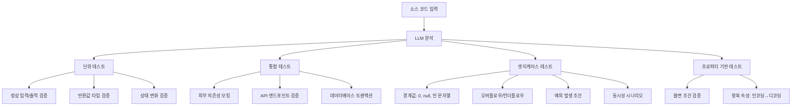
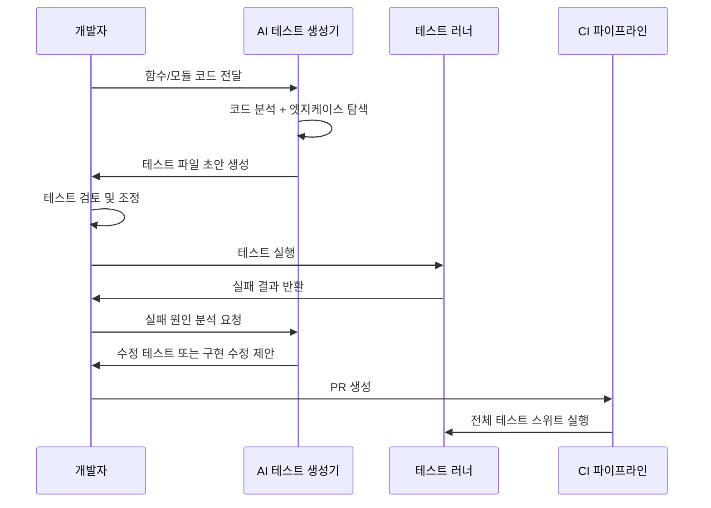

# AI 테스트 자동 생성 (AI Test Generation)

## 개요

AI 테스트 자동 생성은 LLM이 소스 코드를 분석하여 단위 테스트(unit test), 통합 테스트(integration test), 엣지케이스(edge case) 테스트를 자동으로 작성하는 패턴이다. 개발자가 직접 테스트를 작성하는 데 드는 시간과 창의적 에너지를 절약하며, 특히 직관적으로 떠올리기 어려운 경계 조건과 예외 시나리오를 체계적으로 커버하는 데 강점이 있다.

[[tdd-agentic-coding|에이전틱 TDD]] 패턴과 결합하면 구현 전 테스트를 먼저 생성하고 이를 에이전트가 통과하는 코드를 작성하게 하는 "스펙 주도 개발"이 가능해진다. [[first-run-the-tests|테스트 먼저 실행]] 원칙과도 자연스럽게 연결된다.

## 생성 가능한 테스트 유형



## 핵심 접근법

### 1. 함수 시그니처 기반 생성

가장 기본적인 방법이다. LLM에게 함수 시그니처와 독스트링을 제공하면 해당 명세를 검증하는 테스트를 생성한다.

```python
# 입력: 함수 시그니처 + 타입 힌트
def calculate_discount(price: float, user_tier: str, coupon_code: str | None = None) -> float:
    """사용자 등급과 쿠폰에 따라 할인된 최종 가격을 반환한다."""
    ...

# LLM이 자동 생성하는 테스트 (예시)
def test_gold_user_gets_20_percent_discount():
    result = calculate_discount(price=10000, user_tier="gold")
    assert result == 8000.0

def test_coupon_stacks_with_user_discount():
    result = calculate_discount(price=10000, user_tier="gold", coupon_code="EXTRA10")
    assert result <= 8000.0  # 쿠폰 적용으로 추가 할인

def test_negative_price_raises_value_error():
    with pytest.raises(ValueError):
        calculate_discount(price=-1, user_tier="basic")

def test_unknown_tier_raises_key_error():
    with pytest.raises((KeyError, ValueError)):
        calculate_discount(price=10000, user_tier="platinum_ultra")
```

### 2. 기존 코드 역공학 기반 생성

이미 구현된 코드를 분석하여 실제 동작과 일치하는 테스트를 역설계한다. 레거시 코드베이스에 테스트를 소급 적용하는 데 유용하다.

### 3. 버그 재현 테스트 생성

버그 보고서나 스택 트레이스를 LLM에게 제공하면 해당 버그를 재현하는 실패하는 테스트를 먼저 생성하고, 이후 수정으로 테스트가 통과하게 하는 방식으로 활용한다.

### 4. 프로퍼티 기반 테스트

Hypothesis(Python)나 fast-check(JS) 같은 라이브러리와 결합하여, LLM이 불변 속성(invariant)을 정의하고 라이브러리가 자동으로 반례를 탐색하는 형태다.

```python
# LLM이 생성하는 프로퍼티 테스트
from hypothesis import given, strategies as st

@given(st.floats(min_value=0, max_value=1_000_000))
def test_discount_never_exceeds_original_price(price):
    result = calculate_discount(price=price, user_tier="gold")
    assert result <= price  # 할인 후 가격이 원래보다 클 수 없다는 불변 조건
```

## 엣지케이스 생성 전략

LLM은 다음 카테고리의 엣지케이스를 체계적으로 탐색하도록 프롬프트할 수 있다.

| 카테고리 | 예시 |
|---------|------|
| 숫자 경계 | 0, -1, Integer.MAX_VALUE, NaN, Infinity |
| 문자열 | 빈 문자열, 공백만, 매우 긴 문자열, 유니코드 이모지, null |
| 컬렉션 | 빈 리스트, 단일 원소, 중복 원소, 정렬된/역순 |
| 날짜/시간 | 윤년 2월 29일, 타임존 경계, 과거/미래 극단 날짜 |
| 동시성 | 레이스 컨디션, 중복 요청, 타임아웃 |
| 외부 의존성 | 네트워크 실패, 타임아웃, 서버 에러 응답 |

## 파이프라인 통합



## 대표 도구

| 도구 | 언어 지원 | 방식 | 강점 |
|------|---------|------|------|
| CodiumAI | Python, JS/TS | IDE 플러그인 | 동작 분석 기반 의미론적 테스트 |
| Diffblue Cover | Java | 정적 분석 + AI | 기업용, 대규모 레거시 |
| GitHub Copilot | 다언어 | 채팅 + 인라인 | IDE 통합, 자연어 명세 |
| Pynguin | Python | 탐색 기반 | 연구용, 프로퍼티 기반 |
| EvoSuite | Java | 진화 알고리즘 | 커버리지 최대화 |

## 생성 테스트의 품질 평가

AI가 생성한 테스트가 진짜로 유용한지 평가하는 지표:

- **커버리지 증가율**: 생성 전후 라인/브랜치 커버리지 변화
- **뮤테이션 스코어(Mutation Score)**: 의도적으로 버그를 삽입했을 때 테스트가 잡아내는 비율
- **실패 탐지율**: 알려진 버그를 재현하는 테스트의 비율
- **노이즈율**: 항상 통과하거나 의미 없는 어설션이 포함된 테스트의 비율

## 한계

AI 테스트 자동 생성에는 구조적 한계가 있다.

- **비즈니스 규칙의 몰이해**: "프리미엄 사용자는 월 3회만 무료 다운로드"처럼 도메인에 박힌 규칙은 코드만 보고는 파악이 어렵다.
- **외부 시스템 의존**: 실제 데이터베이스, 외부 API와의 통합 테스트에서 올바른 목킹 전략을 선택하기 어렵다.
- **테스트 신뢰성(Flakiness)**: 생성된 테스트가 타이밍이나 환경에 민감하여 간헐적으로 실패할 수 있다.
- **자기 참조 오류**: 잘못된 구현을 기준으로 테스트를 생성하면 버그를 정상으로 검증하는 테스트가 만들어진다.

## 관련 문서

- [[tdd-agentic-coding|에이전틱 TDD]] - 에이전트 기반 테스트 주도 개발
- [[first-run-the-tests|테스트 먼저 실행]] - 테스트 우선 개발 원칙
- [[red-green-tdd|Red-Green TDD]] - 빨강-초록-리팩토링 사이클
- [[coding-agent|코딩 에이전트]] - 테스트 생성 에이전트 기반 기술
