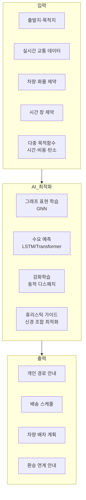
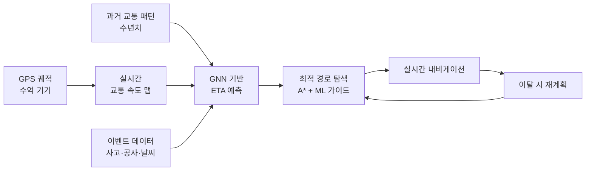
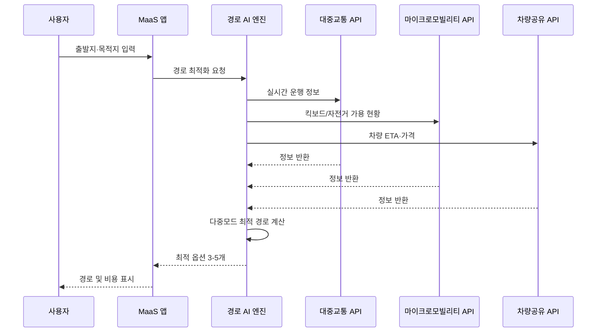
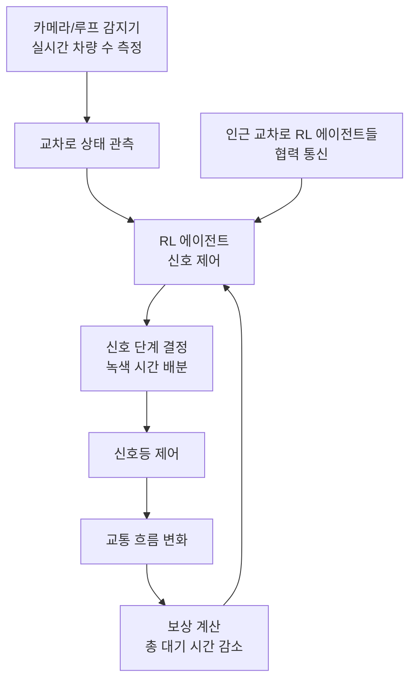

# AI 교통 경로 최적화

## 개요

AI 교통 경로 최적화(AI Transportation Routing)는 머신러닝, 강화학습, 그래프 알고리즘을 활용하여 개인·대중·화물 교통의 경로와 스케줄을 최적화하는 응용 분야다. 실시간 교통 상황 반응, 다중 목적지 최적화, 다중 교통수단 통합, 대규모 배송 네트워크 최적화 등을 포괄한다.

전통적 경로 탐색 알고리즘(Dijkstra, A*)은 정적 그래프에서의 최단 경로를 찾는 데 특화되어 있지만, 실제 교통 환경은 동적이다. 사고, 공사, 날씨, 이벤트, 수요 급증에 따라 최적 경로가 실시간으로 변한다. AI는 이 동적 환경에서의 예측과 적응을 가능하게 한다.

## 핵심 아이디어

교통 경로 최적화 문제는 여러 하위 문제의 결합이다:

- **최단 경로(shortest path)**: 단일 기종점 쌍의 최적 경로
- **외판원 문제(TSP, Traveling Salesman Problem)**: 여러 목적지를 방문하는 최적 순서
- **차량 경로 문제(VRP, Vehicle Routing Problem)**: 여러 차량이 여러 수요지를 효율적으로 커버
- **동적 경로 재계획(dynamic rerouting)**: 실시간 상황 변화에 따른 경로 갱신

이 문제들은 NP-hard 복잡도를 가지므로 대규모 실세계 인스턴스에서 정확한 최적해를 구하는 것은 불가능하다. AI는 좋은 근사해를 빠르게 찾는 데 강점을 발휘한다.

## 주요 응용 영역

### 실시간 경로 안내

실시간 내비게이션은 AI가 가장 널리 사용되는 교통 응용 분야다. 단순 지도 검색을 넘어 AI는 미래 교통 상황을 예측하여 "지금 출발하면 막힐 구간, 20분 후에 출발하면 막히지 않는 구간"을 동적으로 안내한다.

**구글 맵·웨이즈의 AI 기술:**
- 수억 개 기기에서 수집되는 실시간 GPS 궤적 데이터로 도로별 속도 실시간 파악
- ETA(예상 도착 시간) 예측에 Graph Neural Network 활용 — 구글은 2020년 GNN 기반 ETA 모델로 예측 정확도를 50% 향상시켰다고 발표
- 예측 경로 지연(predictive routing): 목적지까지의 예측 교통 상황을 반영하여 현재 최적 경로 탐색

**ETA 예측의 어려움:**
- 도로 교통은 비선형 혼잡 현상(jam wave): 밀도가 임계점을 넘으면 흐름이 갑자기 붕괴
- 공간 종속성: 한 구간의 막힘이 연결 구간으로 전파
- 사건 영향: 사고, 공사, 특별 이벤트 같은 희귀 이벤트가 교통을 크게 변화

### 다중 모드 교통 통합

현대 도시 이동성은 단일 교통수단이 아닌 버스, 지하철, 자전거, 킥보드, 도보의 조합이다. AI는 다중 교통수단(multi-modal)의 최적 조합을 실시간으로 탐색한다.

**MaaS(이동성 서비스, Mobility as a Service) AI:**
- 실시간 대기시간 데이터: 버스 GPS, 지하철 혼잡도, 공유 킥보드/자전거 가용 대수
- 환승 연계 최적화: 지하철 출구에서 버스 정류장까지의 도보 시간과 버스 도착 시간을 연계
- 개인화 경로: 이용자의 선호(빠름, 저렴, 친환경, 걷기 최소화)에 따른 맞춤 경로

**MaaS 통합 플랫폼 구조:**

### 화물 및 배송 최적화

대규모 화물 배송 최적화(last-mile delivery optimization)는 VRP의 복잡한 실세계 버전이다. 수천 개의 배송 주소, 수백 대의 차량, 시간 창(time window) 제약, 용량 제약을 동시에 고려해야 한다.

**차량 경로 문제(VRP) 변형:**

| 변형 | 추가 제약 | 응용 사례 |
|------|-----------|----------|
| CVRP | 차량 용량 제약 | 택배 배송 |
| VRPTW | 시간 창 제약 | 식품 배송 |
| PDVRP | 픽업-배송 쌍 | 음식 배달 |
| EVRP | 전기차 충전 제약 | EV 배송 차량 |
| DVRP | 동적 주문 추가 | 실시간 배달 앱 |

**신경 조합 최적화(Neural Combinatorial Optimization):**
Pointer Network, Attention Model 같은 딥러닝 모델이 VRP의 해를 직접 생성한다. 기존 휴리스틱보다 빠르게, 비슷하거나 더 좋은 근사해를 찾는다. 특히 새로운 인스턴스에 재학습 없이 바로 적용할 수 있다는 장점이 있다.

**실시간 재최적화:**
주문이 실시간으로 추가되고 취소되는 환경에서 경로를 동적으로 재최적화하는 것이 핵심 과제다. 강화학습 에이전트가 새 주문을 어느 차량 경로에 삽입할지 실시간으로 결정한다.

### 도시 교통 시뮬레이션과 신호 최적화

교통 신호 최적화(traffic signal optimization)는 교차로 단위의 신호 주기를 도시 전체 교통 흐름에 맞게 조정한다.

**강화학습 기반 신호 제어:**
각 교차로를 강화학습 에이전트로 모델링한다. 상태(state)는 현재 차량 대기 수와 방향별 흐름, 행동(action)은 신호 단계 전환, 보상(reward)은 전체 대기 시간 감소다. 여러 교차로 에이전트가 협력하는 다중 에이전트 강화학습(MARL, Multi-Agent RL)이 효과적이다.

**DeepMind의 Green Light:**
DeepMind는 구글 맵 데이터와 RL을 결합한 Green Light 시스템으로 교차로 신호 최적화를 통해 교차로에서의 제동(stop-and-go) 횟수를 30% 줄이는 성과를 보고했다.

## 주요 기술 컴포넌트

### 그래프 신경망(GNN) 기반 교통 예측

교통 네트워크는 자연스럽게 그래프로 표현된다. 교차로가 노드, 도로가 엣지, 교통량과 속도가 노드/엣지 피처다. GNN은 이 그래프 구조를 활용하여 공간적 교통 패턴을 효과적으로 학습한다.

**주요 모델:**
- **DCRNN (Diffusion Convolutional Recurrent Neural Network)**: 방향성 그래프 컨볼루션 + seq2seq 예측
- **Graph WaveNet**: 적응형 인접 행렬로 도로 의존성을 자동 학습
- **STGCN (Spatio-Temporal Graph Convolutional Network)**: 공간(그래프) + 시간(1D 컨볼루션) 동시 처리

### 강화학습 기반 동적 디스패치

차량 배차, 신호 제어, 실시간 경로 재배정 등 순차적 의사결정에 강화학습이 적합하다.

**상태 공간 설계가 핵심이다.** 교통 RL에서 상태 표현에 무엇을 포함하느냐가 에이전트 성능을 크게 좌우한다. 국지적 관측만 사용하면 근시안적 결정을 하고, 전역 정보를 모두 포함하면 상태 공간이 폭발적으로 커진다.

**MARL(다중 에이전트 RL) 도전 과제:**
- 비정상성(non-stationarity): 다른 에이전트도 학습 중이므로 환경이 계속 변함
- 부분 관측(partial observability): 각 에이전트는 전체 교통 상황을 보지 못함
- 신용 할당(credit assignment): 협력 보상에서 개별 에이전트의 기여 분리

### 디지털 맵과 HD 맵

경로 최적화 AI의 품질은 지도 데이터 품질에 직결된다.

**일반 맵 vs HD(고정밀) 맵:**
- 일반 내비게이션 맵: 도로 링크, 방향, 제한 속도 포함. 수십 cm 정밀도 불필요
- HD 맵(고정밀 지도): 차선 경계, 신호등 위치, 도로 표식 등을 cm 정밀도로 기록. 자율주행에 필수

HD 맵 생성·갱신에도 AI가 활용된다. 차량 카메라, LiDAR 데이터에서 자동으로 도로 변화를 감지하고 지도를 업데이트하는 자동 맵핑 파이프라인이 핵심 기술이다.

## 실제 사례

### 구글 / 웨이즈

웨이즈(Waze)는 커뮤니티 기반 데이터와 AI를 결합한 실시간 내비게이션의 선구자다. 사용자가 제보하는 사고, 경찰, 도로 위험 정보가 실시간으로 경로 알고리즘에 반영된다. 구글은 웨이즈 인수 후 GNN 기반 ETA 예측을 통합하여 예측 정확도를 크게 높였다.

### Uber - Michelangelo 플랫폼

Uber는 Michelangelo라는 내부 ML 플랫폼에서 수요 예측, 가격 책정, 경로 최적화 모델을 통합 관리한다. 수요 예측 모델은 수분 단위로 도심 각 지점의 수요를 예측하여 사전 포지셔닝을 안내한다.

### Amazon - Last Mile Delivery

Amazon의 배송 최적화 시스템은 수십만 개 배송 지점을 하루 수백만 건 처리한다. 강화학습과 조합 최적화 하이브리드로 배송 경로를 생성하며, 운전자 행동 데이터로 현실적 이동 시간을 학습한다. Amazon은 AI 경로 최적화로 수억 마일의 불필요한 주행을 절감했다고 발표했다.

### DHL - Pathfinder 시스템

DHL의 Pathfinder 플랫폼은 기상, 규제, 수요 데이터를 통합하여 항공·해상·육상 복합 경로를 최적화한다. 아시아-유럽 구간의 다중 모드 경로 최적화로 비용과 탄소 배출을 동시에 절감한다.

### 싱가포르 - ROADS(Real-time Operations and Analytics Dashboard)

싱가포르 LTA(육상교통청)는 ROADS 플랫폼에서 버스 GPS, 교통 카메라, 이지링크 카드 데이터를 통합하여 교통 혼잡을 예측하고 대중교통 운행을 실시간으로 조정한다.

## 한계와 트레이드오프

### 최적화 vs 공정성

AI 경로 최적화는 전체 효율을 극대화하지만, 개인이나 특정 지역이 항상 비효율적 경로를 배정받을 수 있다. 예를 들어, Uber의 가격 서지(surge pricing)는 수요-공급 균형 최적화 관점에서는 합리적이지만 소득이 낮은 이용자를 서비스에서 배제한다.

### 유발 수요(Induced Demand) 문제

AI 경로 최적화가 교통 흐름을 개선하면 운전 편의성이 높아져 더 많은 사람이 차를 이용하게 된다. 최적화로 줄인 혼잡이 새로운 수요 유발로 상쇄될 수 있다.

### 개인정보와 데이터 주도 경로 의존성

정밀한 경로 최적화는 개인 이동 데이터의 대규모 수집을 전제로 한다. 기업이나 정부가 이 데이터를 활용하는 방식에 대한 투명성과 통제권 부여가 필요하다.

### 그리드락(Gridlock) 역설

모든 운전자가 같은 AI 내비게이션을 사용하면, 같은 "최적 우회로"로 동시에 몰려 우회로도 막히는 현상이 발생한다. 이를 예방하려면 협력적 경로 배분(cooperative routing)이 필요하지만, 개별 사용자 최적화와 충돌한다.

### 엣지 케이스와 지식 갱신

도로 공사, 임시 규제, 재난 상황 등 희귀 이벤트에서 AI 경로 시스템은 학습 데이터 부족으로 오류를 범할 수 있다. 인간 운영자의 수동 개입이 여전히 필요하다.

## 실무 적용 관점

1. **계층적 최적화**: 실시간 신호 제어(초~분), 배차 스케줄(시간), 인프라 계획(연)을 분리된 계층으로 최적화한다. 단일 모델로 모든 시간 지평을 다루려고 하면 복잡도가 폭발한다.

2. **현실적 제약 모델링**: 교통 AI 모델이 실제로 유용하려면 드라이버 휴식 시간, 화물 무게 제한, 차량 유형별 도로 제한 같은 실세계 제약을 정확히 모델링해야 한다.

3. **오프라인 시뮬레이션 검증**: 새 알고리즘을 실제 배포 전에 시뮬레이터(SUMO, AnyLogic)에서 충분히 검증한다. 교통 시스템은 오류의 파급 효과가 크다.

4. **하이브리드 접근**: 고전 알고리즘(OR 기법)과 AI를 결합한 하이브리드 접근이 순수 딥러닝보다 설명 가능성과 안정성 면에서 유리한 경우가 많다.

## 관련 문서

- [[ai-autonomous-vehicles]] - 자율주행 차량과 경로 계획의 연계
- [[reinforcement-learning]] - 교통 신호 최적화와 동적 디스패치에 활용되는 RL
- [[ai-warehouse-robotics]] - 창고 내부 경로 최적화와의 연계
- [[ai-urban-planning]] - 도시 교통 인프라 계획과의 연관
- [[time-series-forecasting]] - 교통 수요 예측 모델
