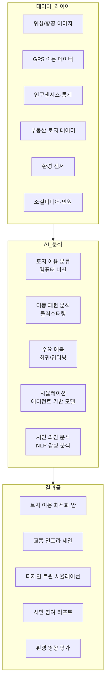
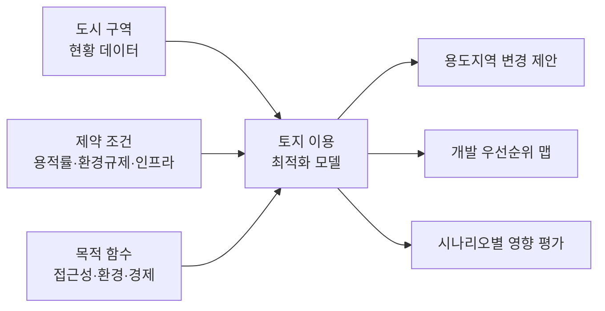
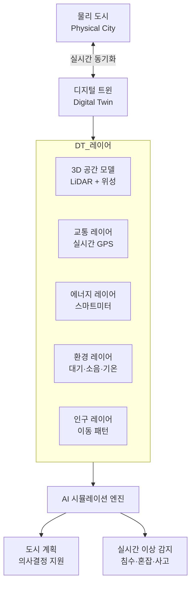

# AI 도시 계획

## 개요

AI 도시 계획(AI Urban Planning)은 인공지능과 데이터 분석을 활용하여 도시의 공간 구성, 교통 인프라, 토지 이용, 주거·상업·공원 분포를 최적화하는 응용 분야다. 급격한 도시화(urbanization), 기후 변화 적응, 인구 구조 변화에 대응하면서도 주민 삶의 질을 향상시키는 복잡한 다목적 최적화 문제를 AI가 지원한다.

도시 계획은 전통적으로 수십 년의 경력을 가진 전문가들의 직관과 경험에 의존했다. AI는 위성 이미지, 스마트폰 이동 데이터, 소셜미디어 지역 감성, 부동산 거래 데이터, 에너지 사용 패턴 등 방대한 도시 데이터를 통합 분석하여 더 근거 있고 빠른 의사결정을 가능하게 한다.

## 핵심 아이디어

도시 계획의 핵심 긴장은 **효율성(efficiency)과 형평성(equity)의 트레이드오프**다. 교통 흐름을 최적화하면 특정 지역이 소외될 수 있고, 개발 밀도를 높이면 임대료가 상승하여 기존 주민이 내몰릴 수 있다. AI는 이러한 복잡한 상호작용을 시뮬레이션하고 다양한 시나리오의 영향을 사전에 평가하게 해준다.



위 다이어그램은 AI 도시 계획의 데이터 수집부터 최종 계획 결과물까지의 전체 흐름을 보여준다.

## 주요 응용 영역

### 토지 이용 최적화

토지 이용(land use) 패턴을 이해하고 최적화하는 것은 도시 계획의 핵심이다. AI는 위성 이미지와 지도 데이터를 분석하여 현재 토지 이용 현황을 자동으로 분류하고, 미래 최적 토지 이용 방안을 제안한다.

**컴퓨터 비전 기반 토지 이용 분류:**
- ResNet, SegFormer 같은 이미지 분류·세그멘테이션 모델로 위성 이미지에서 주거지, 상업지구, 공업지대, 공원, 농지를 자동 분류
- 변화 탐지(change detection): 시계열 위성 이미지 비교로 무허가 개발, 불법 건축 자동 감지
- 접근성 지수 산출: AI가 교통, 교육, 의료, 공원 접근성을 지역별로 점수화하여 소외 지역 식별

**토지 이용 최적화 모델:**

혼합 용도 개발(mixed-use development)의 효과를 AI 시뮬레이션으로 평가한다. 주거·상업·업무 시설의 혼합 비율에 따른 교통 발생량, 소음 수준, 경제 활력, 에너지 소비를 동시에 예측한다.



### 교통 흐름 분석 및 예측

교통(transportation)은 도시 계획에서 가장 복잡한 요소 중 하나다. AI는 실시간 교통 데이터를 분석하여 혼잡 패턴을 이해하고, 인프라 변화의 교통 영향을 예측한다.

**교통 수요 모델링:**
- **사중 모델(four-step model)의 AI 고도화**: 통행 발생(trip generation) → 통행 분포(distribution) → 교통수단 분담(modal split) → 네트워크 배분(route assignment) 각 단계를 ML 모델로 대체하거나 보완
- **딥러닝 기반 OD 행렬 추정**: 기지국 데이터, GPS 궤적, 스마트카드 데이터를 활용하여 기종점(OD, Origin-Destination) 행렬을 실시간으로 추정
- **GNN 기반 교통 예측**: 도로 네트워크를 그래프로 표현하고 GNN(그래프 신경망)으로 각 링크의 속도와 통행량을 예측 (DCRNN, STGCN 등)

**신규 인프라의 교통 영향 예측:**

새 지하철 노선, 자전거도로 확충, 도로 다이어트(lane reduction) 같은 변화가 전체 교통 네트워크에 미치는 영향을 사전에 시뮬레이션한다. 유발 수요(induced demand) 효과도 모델에 포함하는 것이 중요하다.

### 디지털 트윈 도시

도시 디지털 트윈(digital twin)은 물리적 도시의 실시간 디지털 복제본이다. 센서, 위성, 카메라 데이터로 실시간 업데이트되며, AI 시뮬레이션을 통해 정책 변화의 영향을 가상으로 실험할 수 있다.

**디지털 트윈의 층위 구조:**



**실제 사례:**
- 싱가포르의 Virtual Singapore: 국가 전체를 3D 디지털 트윈으로 구현하여 태양광 패널 설치 가능 면적 분석, 피난로 시뮬레이션 등에 활용
- 헬싱키의 Helsinki 3D: 도시 전체 3D 모델에 에너지 소비, 교통, 인구 데이터를 통합하여 탄소 중립 계획 수립에 활용

### 시민 참여 도구

전통적 도시 계획 공청회는 소수의 목소리 큰 시민만 참여하는 경향이 있었다. AI 기반 시민 참여 도구는 더 넓은 시민의 의견을 수집하고 분석한다.

**AI 시민 참여 방법:**
- **대화형 설문 챗봇**: LLM 기반 챗봇이 시민의 의견을 자연스러운 대화로 수집하고 구조화된 데이터로 변환
- **소셜미디어 감성 분석**: 지역별 주민 불만과 우선순위를 SNS 데이터에서 자동 추출
- **3D 시각화 플랫폼**: 시민이 VR/AR에서 계획안을 직접 경험하고 피드백을 제공할 수 있는 인터페이스
- **의견 클러스터링**: NLP로 수천 개의 시민 의견을 주제별로 자동 분류하여 계획가들이 신속히 파악

**언어 장벽 해소:** 다국어 LLM을 통해 이민자나 소수 언어 사용 주민도 모국어로 참여할 수 있다.

## 주요 기술 컴포넌트

### 에이전트 기반 도시 시뮬레이션

에이전트 기반 모델(ABM, Agent-Based Model)은 개별 시민, 차량, 기업을 에이전트로 모델링하고 그 상호작용에서 도시 현상이 어떻게 창발(emergent)하는지 시뮬레이션한다.

ML과 ABM의 결합은 강력한 도시 시뮬레이션 도구를 만든다. ML이 개별 에이전트의 행동 패턴(예: 교통수단 선택, 이사 결정)을 실제 데이터로 보정하면, ABM 시뮬레이션의 현실성이 크게 향상된다.

**대표적 오픈소스 도구:**
- MATSim: 교통 에이전트 시뮬레이션, ML 보정 가능
- UrbanSim: 토지 이용-교통 통합 시뮬레이션
- SUMO: 미시 교통 시뮬레이션

### 공간 분석과 GIS AI

지리정보시스템(GIS, Geographic Information System)과 AI의 결합이 공간 분석의 정확성과 속도를 획기적으로 높였다.

**지오딥러닝(Geo-Deep Learning):**
- 위성 이미지에서 도로, 건물, 식생을 자동 추출하는 세그멘테이션 모델
- 인구 이동 패턴의 공간 군집 분석
- 도시 취약 지역(폭염 취약, 침수 위험, 범죄 집중) 지도화

```python
# 위성 이미지 기반 토지 이용 분류 예시 (간략화)
from torchvision.models.segmentation import deeplabv3_resnet50
import torch

def classify_land_use(satellite_image: torch.Tensor) -> torch.Tensor:
    """
    위성 이미지에서 토지 이용 클래스를 픽셀 단위로 분류
    반환: (H, W) 형태의 클래스 맵
    (0:배경, 1:주거, 2:상업, 3:공업, 4:녹지, 5:수역)
    """
    model = deeplabv3_resnet50(num_classes=6)
    model.eval()
    with torch.no_grad():
        output = model(satellite_image.unsqueeze(0))["out"]
    return output.argmax(dim=1).squeeze(0)
```

### 기후 회복탄력성 분석

기후 변화로 인한 홍수, 폭염, 폭풍 위험이 높아지면서, 도시 계획에 기후 위험 분석이 필수가 됐다.

**AI 기후 위험 맵핑:**
- **홍수 모델링**: 디지털 고도 모델(DEM)과 강수 예측을 결합한 홍수 범람 시뮬레이션
- **도시 열섬 분석**: 위성 열화상 + 녹지 분포 데이터로 폭염 취약 지역 식별
- **해수면 상승 시나리오**: IPCC 시나리오별 해안 도시 침수 예상 구역 시뮬레이션

## 실제 사례

### 싱가포르 - Urban Redevelopment Authority(URA)

싱가포르 URA는 AI와 빅데이터를 도시 계획에 적극 활용한다. Virtual Singapore 플랫폼은 건물, 나무, 지하 시설까지 포함한 국가 전체 디지털 트윈을 구현했다. 태양광 패널 설치 가능 면적 자동 계산, 피난로 시뮬레이션, 5G 기지국 최적 위치 분석 등에 활용된다.

### 로테르담(Rotterdam) - 기후 적응 계획

네덜란드 로테르담은 도시 디지털 트윈을 활용하여 기후 변화 적응 계획을 수립한다. 폭우 시 침수 시뮬레이션으로 물광장(water plaza), 녹색 지붕, 지하 저류지의 최적 위치를 결정했다.

### 바르셀로나 - 슈퍼블록

바르셀로나의 슈퍼블록(Superblock) 프로젝트는 AI 교통 시뮬레이션을 활용하여 소형 도로 블록을 보행자·자전거 공간으로 전환할 때의 교통 영향을 사전에 분석했다. AI 시뮬레이션으로 우려했던 교통 혼잡 증가가 실제로는 크지 않음을 확인하고 계획을 실행했다.

### 아랍에미리트 - Masdar City

아부다비의 Masdar City는 처음부터 AI와 데이터 기반 도시 계획으로 설계된 스마트 시티다. 자율주행 대중교통, 신재생에너지, AI 기반 에너지 관리가 통합되어 있다. 도시 운영 데이터를 실시간으로 수집하여 다음 계획 단계에 반영하는 학습 루프를 갖는다.

## 한계와 트레이드오프

### 데이터 편향과 공정성

AI가 학습하는 역사적 도시 데이터에는 과거의 불평등과 차별이 내포되어 있다. 예를 들어, 특정 인종이나 저소득층이 밀집한 지역이 역사적으로 인프라 투자를 적게 받았다면, AI 모델은 이를 "정상 패턴"으로 학습하고 현상 유지를 재현하거나 심화시킬 수 있다.

**미국의 예:** 알고리즘 기반 부동산 가치 평가가 역사적으로 차별받은 지역에 불리하게 작동하는 "알고리즘 레드라이닝(algorithmic redlining)" 우려가 제기된다.

### 프라이버시와 감시 딜레마

정밀한 도시 AI 시스템은 시민 이동을 상시 추적한다. 교통 최적화와 치안 향상을 위한 데이터 수집이 권위주의적 감시 인프라로 전용될 위험이 있다.

중국 일부 도시에서 AI 신용 시스템과 연계된 도시 감시 체계는 도시 AI의 잠재적 남용 사례로 자주 인용된다.

### 모델의 예측 불확실성

수십 년에 걸친 도시 발전 경로를 AI가 예측하는 것은 근본적으로 불확실하다. 기술 변화(자율주행 보급), 인구 구조 변화, 경제 충격(팬데믹) 등 모델이 학습하지 못한 요인들이 실제 발전 경로를 뒤바꿀 수 있다.

**2020년 팬데믹의 교훈:** 원격근무 확산으로 오피스 수요가 급감하고 교외 주거 수요가 급증했다. 코로나 이전의 도시 계획 AI 모델 대부분은 이를 예측하지 못했다.

### 전문가-AI 협업의 어려움

AI 도시 계획 도구가 제안하는 최적화 결과가 도시 계획 전문가의 직관이나 지역 맥락 지식과 충돌할 때, 어느 쪽을 우선해야 하는지 판단이 어렵다. AI가 정량화하기 어려운 "장소성(sense of place)", "커뮤니티 유대" 같은 가치를 무시할 위험이 있다.

### 디지털 격차

AI 기반 시민 참여 도구는 스마트폰과 인터넷 접근이 없는 고령자, 저소득층, 장애인을 배제할 수 있다. 디지털 도구와 오프라인 참여 방식을 병행하는 것이 중요하다.

## 실무 적용 관점

AI 도시 계획 시스템 도입 시 권장 접근법:

1. **점진적 도입**: 전체 계획 프로세스를 AI로 대체하기보다 특정 문제(교통 분석, 위성 이미지 분류 등)에서 시작하여 신뢰를 쌓는다.

2. **다학제 팀 구성**: AI 엔지니어, 도시 계획가, 사회학자, 법조인이 함께 시스템을 설계해야 데이터 편향과 공정성 문제를 예방할 수 있다.

3. **오픈 데이터와 투명성**: AI 도시 계획 모델의 입력 데이터와 산출 결과를 공개하여 시민이 검증하고 이의를 제기할 수 있어야 한다.

4. **형평성 지표 명시**: 교통 접근성, 녹지 분포, 서비스 접근성의 소득·인종별 형평성 지표를 최적화 목적 함수에 명시적으로 포함한다.

5. **레거시 시스템 통합**: 기존 GIS, 부동산 데이터베이스, 교통 관리 시스템과 AI 플랫폼의 통합이 기술 못지않게 중요한 과제다.

## 관련 문서

- [[ai-transportation-routing]] - 도시 교통 경로 최적화 세부 방법론
- [[ai-architecture-design]] - AI를 활용한 건축·도시 설계
- [[digital-twin]] - 도시 디지털 트윈 구현 기술
- [[time-series-forecasting]] - 교통 수요 예측 모델
- [[ai-sustainability-optimization]] - 탄소 중립 도시 계획과 ESG
