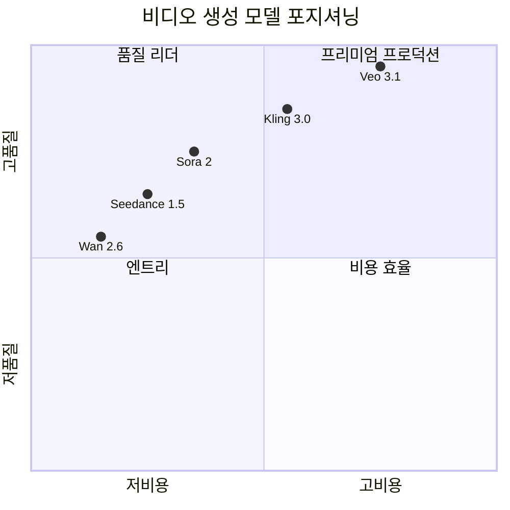

## 개요

AI 비디오 생성은 2026년 들어 네이티브 4K 해상도와 동기화된 오디오 생성이 표준으로 자리잡으며 상업적 활용 단계에 본격 진입했다. [[ai-image-generation|AI 이미지 생성]]과 [[ai-audio-voice-cloning|AI 오디오·음성 합성]]이 통합되는 멀티미디어 AI의 완성 단계이다. Google Veo 3.1이 네이티브 4K + 48kHz 동기 오디오로 시네마틱 품질을 선도하고, Kling 3.0이 4K@60fps 모션 제어에서 강점을 보이는 가운데, OpenAI Sora는 2026.04.26 서비스 종료를 앞두고 있다. 네이티브 오디오 생성이 기본 기능으로 표준화된 것이 이 세대의 가장 큰 변화이다. [[ai-design-tools|AI 디자인 도구]]와의 통합으로 완전한 콘텐츠 제작 파이프라인이 가능해진다.

## 핵심 개념

**네이티브 오디오 동기화**: 별도 오디오 생성 파이프라인 없이 비디오 생성 시 대사, 효과음, 배경음을 자동으로 동기화하여 생성한다. Veo 3.1은 48kHz 오디오를 지원한다.

**레퍼런스 비디오 모션 컨트롤**: 참조 영상의 움직임 패턴을 분석하여 새로운 비디오에 전이하는 기술. Kling이 이 영역에서 선도적이다.

**반복적 클립 확장(Iterative Extension)**: 짧은 클립을 이어붙여 긴 영상을 생성하는 방식. Kling은 최대 3분 영상까지 확장 가능하다.

**Diffusion Transformer 아키텍처**: Veo 3.1이 채택한 아키텍처로, 시공간(spatio-temporal) 패치를 처리하여 시간적 일관성을 유지하면서 고해상도 비디오를 생성한다.

## 현황 (2026)

| 모델 | 최대 해상도 | 최대 길이 | 네이티브 오디오 | 비용 (초당) | 특화 |
|------|-----------|----------|-------------|-----------|------|
| Veo 3.1 | 4K | 8초 | 48kHz 대사 동기화 | $0.05-$0.40 | 시네마틱 품질 |
| Kling 2.6 Pro/3.0 | 1080p | 3분(확장) | 립싱크 지원 | $0.22+ | 모션 제어/물리 시뮬레이션 |
| Sora 2 | 1080p | 15초 | 지원 | $0.08-$0.12 | 물리 정확도 |
| Seedance 1.5 Pro | 1080p | 12초 | 다국어 립싱크 | ~$0.05/5초 | 캐릭터 디렉션/시네마틱 카메라 |
| Wan 2.6 (Alibaba) | 1080p | 10초 | 부분 지원 | ~$0.05 | 오픈소스/저비용 |
| LTXV 2 | 4K | 15+초 | 동기화 오디오 | - | 4K 네이티브 |
| MiniMax Hailuo 2.3 | 768p | 6초 | - | - | 30초 미만 빠른 생성 |
| Luma Ray 2/Flash 2 | 1080p | 9초 | - | - | 빠른 반복 작업 |

### 주요 동향

- **Veo 3.1**: MovieGenBench 및 VBench(I2V)에서 1위. 2026.03 Lite 티어 출시로 접근성 확대 (Lite: 720p)
- **Kling**: 레퍼런스 비디오 기반 캐릭터 디렉션, 인체 물리 시뮬레이션 우위. 시네마틱 카메라 제어(달리, 트래킹, 줌)
- **Seedance 1.5 Pro**: ByteDance 제작. 60초 미만 터라운드 타임으로 빠른 생성. 다국어 립싱크 특화
- **Wan 2.6**: 오픈소스 모델(1.3B-14B 파라미터). 로컬 배포 시 16GB+ VRAM 필요. 멀티샷 내러티브 연속성 강점
- **Sora**: 2026.04.26 종료 예정, 서드파티 API로만 접근 가능
- API 배포가 소비자 직접 플랫폼을 대체하는 주요 유통 채널로 부상

## 기술 비교

## 기술 아키텍처 비교

### Diffusion Transformer (DiT) 기반 모델

Veo 3.1이 채택한 Diffusion Transformer 아키텍처는 비디오를 시공간 패치(spatio-temporal patch)로 분할하여 처리한다. 기존 U-Net 기반 확산 모델과 달리 Transformer의 자기 어텐션(self-attention)으로 프레임 간 시간적 일관성을 유지한다. 이 접근법은 이미지 생성에서 검증된 DiT(Diffusion Transformer)를 비디오 도메인으로 확장한 것이다.

### 모션 제어 기술

Kling의 모션 컨트롤은 레퍼런스 비디오에서 움직임 패턴을 추출하고, 이를 새로운 피사체에 전이(transfer)하는 방식이다. 특히 인체 물리 시뮬레이션에서 다른 모델 대비 아티팩트가 적으며, 시네마틱 카메라 컨트롤(달리, 트래킹, 줌)을 프롬프트 수준에서 지정할 수 있다.

### 오디오 동기화 파이프라인

네이티브 오디오 생성은 비디오와 오디오를 별도 파이프라인으로 생성한 뒤 후처리로 동기화하는 기존 방식과 근본적으로 다르다. Veo 3.1은 비디오 프레임 생성과 동시에 48kHz 오디오(대사, 효과음, 배경음)를 생성하며, 립싱크와 사운드 이벤트의 시간적 정합이 생성 단계에서 이루어진다. Seedance 1.5 Pro는 다국어 립싱크에 특화되어 있다.

## 배포 및 API 생태계

2026년의 주요 변화는 소비자 직접 플랫폼(ChatGPT 기반 Sora 등)에서 API 기반 배포로의 전환이다. AIMLAPI 같은 통합 API 게이트웨이가 여러 모델(Veo, Kling, Sora)에 대한 단일 엔드포인트를 제공하며, 엔드포인트 전환만으로 모델을 교체할 수 있다. 이는 비디오 생성을 기존 프로덕션 워크플로에 프로그래밍 방식으로 통합하는 것을 가능하게 한다.

## 전망/과제

**품질 vs. 길이 트레이드오프**: 현재 최고 품질 모델도 단일 생성은 8-15초 수준이며, 장편 콘텐츠 생성은 반복 확장에 의존한다. Kling의 반복 확장은 3분까지 가능하지만, 클립 간 시각적 일관성 유지가 핵심 과제이다.

**저작권과 학습 데이터**: 비디오 생성 모델의 학습 데이터 출처에 대한 법적 논란이 지속되고 있으며, [[deepfake-detection-c2pa]]와 같은 콘텐츠 인증 기술의 중요성이 높아지고 있다.

**비용 구조**: 4K 네이티브 생성은 초당 $0.40까지 소요되어 대규모 상업 활용에는 비용 최적화가 필요하다. Lite 티어(720p, $0.05/초)나 오픈소스 모델(Wan 2.6, ~$0.05/초)이 비용 민감 시나리오의 대안이다.

**오픈소스 모델의 부상**: Wan 2.6(Alibaba)이 1.3B-14B 파라미터 범위의 로컬 배포 가능 모델을 공개하면서, 비디오 생성 도구의 민주화가 진행 중이다. 14B 모델 로컬 배포에 16GB+ VRAM이 필요하며, 멀티샷 내러티브 연속성과 이미지-투-비디오(패럴랙스 효과)에서 강점을 보인다.

## 관련 문서

- [[ai-image-generation]] - AI 이미지 생성 기술
- [[ai-audio-voice-cloning]] - AI 오디오 및 음성 복제
- [[deepfake-detection-c2pa]] - 딥페이크 탐지 및 콘텐츠 인증
