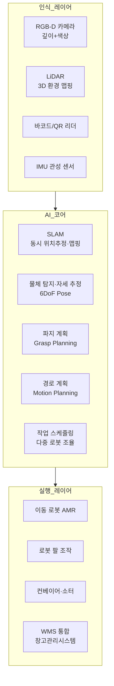
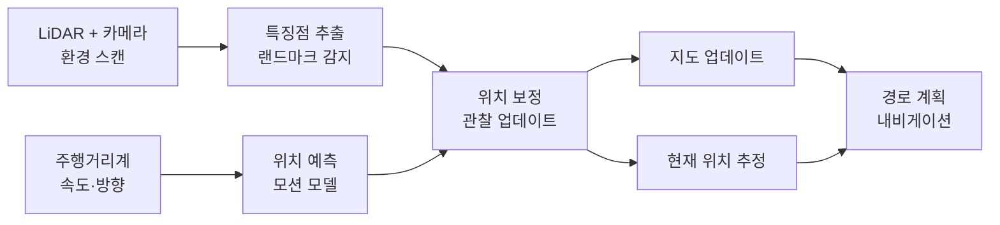

# AI 창고 로보틱스

## 개요

AI 창고 로보틱스(AI Warehouse Robotics)는 물류 창고와 유통 센터에서 상품 입고, 이동, 피킹(picking), 포장, 출하 과정을 자동화하는 로봇 시스템과 AI 기술을 다루는 분야다. 전자상거래 폭발적 성장, 인건비 상승, 빠른 배송 요구로 인해 창고 자동화 수요가 급증했으며, AI가 로봇의 지능을 결정하는 핵심 요소가 됐다.

전통적인 창고 로봇은 미리 프로그래밍된 경로를 반복하는 수준이었다. AI가 결합된 현대 창고 로봇은 불규칙한 물품, 동적으로 변하는 창고 레이아웃, 다른 로봇·인간과의 실시간 협력을 처리할 수 있다.

## 핵심 아이디어

창고 로보틱스 AI는 세 가지 핵심 능력의 결합이다:

1. **공간 인식(spatial awareness)**: 창고 내 자신의 위치와 주변 환경을 정확히 파악
2. **물체 조작(object manipulation)**: 다양한 형태·크기·무게의 물품을 정확하게 파악하고 집기
3. **작업 조율(task coordination)**: 여러 로봇과 인간 작업자가 효율적으로 협력하여 전체 처리량 극대화



## 주요 응용 영역

### 자율이동로봇(AMR) 내비게이션

자율이동로봇(AMR, Autonomous Mobile Robot)은 AGV(자동유도차량, Automated Guided Vehicle)의 진화 형태다. AGV가 바닥에 설치된 자기 테이프나 QR 코드를 따라 고정 경로로만 이동하는 반면, AMR은 AI를 이용해 임의의 경로를 자율 주행한다.

**SLAM(동시 위치추정 및 맵핑):**
SLAM(Simultaneous Localization and Mapping)은 AMR이 창고 환경을 처음 탐색하면서 동시에 지도를 생성하고 그 지도에서 자신의 위치를 추정하는 알고리즘이다.



**시각 SLAM(Visual SLAM):**
LiDAR 없이 카메라만으로 SLAM을 수행한다. ORB-SLAM, LSD-SLAM, 딥러닝 기반 시각 SLAM이 있다. 비용 측면에서 유리하나 조명 변화와 빠른 이동에 취약하다.

**창고 특화 과제:**
- 동적 장애물: 인간 작업자, 지게차, 다른 로봇
- 반복적 환경: 동일한 선반이 반복되는 창고에서의 위치 혼동(perceptual aliasing)
- 화물 이동으로 인한 환경 변화: 선반 재배치, 통로 막힘

### 동적 피킹(Dynamic Picking)

피킹은 선반에서 특정 상품을 집어 주문에 맞게 분류하는 작업이다. 수천 종류의 상품을 정확히 집어야 하므로 로봇 피킹이 가장 어려운 창고 자동화 과제 중 하나다.

**파지 계획(Grasp Planning):**
로봇이 물체를 집으려면 어떤 각도로, 어떤 위치를 어떻게 잡을지(파지 자세, grasp pose)를 계획해야 한다.

- **분석적 방법**: 물체의 3D 모델에서 기하학적으로 안정적인 파지 자세를 계산
- **데이터 기반 학습**: 수백만 번의 실제 또는 시뮬레이션 파지 시도에서 성공 패턴을 학습 (GQ-CNN, Contact-GraspNet 등)
- **6DoF 자세 추정**: 물체의 3D 위치와 방향(6 degrees of freedom)을 정확히 추정한 뒤 파지 계획

**쓰레기통 피킹(Bin Picking):**
혼잡하게 쌓인 물체들 중에서 특정 물체를 집는 것은 물체가 겹쳐 있고 자세를 모르는 상태라 특히 어렵다.

```python
# 그래스프 품질 추정 예시 (간략화)
import numpy as np
from typing import List

def score_grasp_candidates(
    point_cloud: np.ndarray,    # (N, 3) 포인트 클라우드
    grasp_poses: List[np.ndarray],  # 후보 파지 자세들
    quality_model,  # 사전 학습된 파지 품질 예측 모델
) -> np.ndarray:
    """
    후보 파지 자세들에 대해 성공 확률을 추정
    반환: (len(grasp_poses),) 형태의 품질 점수
    """
    features = extract_grasp_features(point_cloud, grasp_poses)
    scores = quality_model.predict(features)
    return scores
```

**Bin Picking AI 발전:**
Amazon은 Sparrow 로봇을 2022년 공개했다. 컴퓨터 비전으로 수백만 종 상품을 인식하고 적절한 파지 자세를 실시간으로 결정한다. 2023년에는 Cardinal 로봇팔이 무거운 패키지를 스스로 분류하는 시스템을 공개했다.

### 다중 로봇 협력(Multi-Robot Coordination)

대형 창고에는 수십~수백 대의 AMR이 동시에 작동한다. 충돌 없이 효율적으로 협력하는 것이 핵심 과제다.

**충돌 없는 경로 계획(MAPF, Multi-Agent Path Finding):**
각 로봇이 목적지로 가는 경로를 충돌 없이 동시에 계획하는 문제다. CBS(Conflict-Based Search), ECBS 같은 알고리즘이 최적 또는 최적에 가까운 해를 찾는다.

**분산 vs 중앙집중 조율:**

| 방식 | 장점 | 단점 |
|------|------|------|
| 중앙집중 | 전역 최적화, 일관성 | 단일 실패점, 확장성 한계 |
| 분산 | 확장성, 내결함성 | 국지적 최적, 협력 복잡 |
| 계층적 | 절충안 | 구현 복잡 |

Amazon Robotics(Kiva 인수)의 기반이 된 Kiva 시스템은 중앙 서버가 수백 대 로봇의 경로를 조율하는 중앙집중 방식이다. 셀 기반 그리드를 사용하여 충돌 가능성을 최소화한다.

**강화학습 기반 분산 협력:**
각 로봇을 RL 에이전트로 모델링하고, 전체 처리량을 보상으로 협력 행동을 학습한다. 중앙 서버 없이도 분산 방식으로 효율적인 협력이 가능하다.

### 재고 관리와 상품 위치 최적화

AI가 재고의 위치 배치를 최적화하면 피킹 거리와 시간을 줄일 수 있다.

**슬로팅 최적화(Slotting Optimization):**
자주 주문되는 상품을 피킹 효율이 높은 위치(골든 존: 허리 높이, 동선 중심)에 배치하고, 함께 주문되는 상품을 인접 배치한다. AI가 주문 패턴을 분석하여 주기적으로 최적 배치를 재계산한다.

**재고 가시성(Inventory Visibility):**
드론이나 AMR에 장착된 카메라로 선반을 자동 스캔하여 재고 수준을 실시간 파악한다. 오차인식(miscounting), 오배치 상품을 자동으로 감지한다. Gather AI, Corvus One 같은 스타트업이 창고 내 자율 재고 드론을 상업화했다.

## 주요 기술 컴포넌트

### 로봇 기초 모델(Robotics Foundation Models)

LLM이 언어에서 이룬 것처럼, 로보틱스에서도 다양한 작업에 범용으로 사용할 수 있는 기초 모델 개발이 진행 중이다.

**RT-2 (Google DeepMind):**
비전-언어 모델(VLM)을 로봇 제어에 직접 적용한 실험적 모델이다. 언어로 지시를 받아 로봇 팔 동작을 생성하며, 시각-언어-행동의 통합 학습을 시도한다.

**ACT (Action Chunking with Transformers):**
모방 학습(imitation learning)에 Transformer를 적용하여 인간 시연 데이터에서 효율적으로 조작 기술을 학습한다.

**기초 모델의 창고 적용 기대 효과:**
- 새 상품 유형에 대한 zero-shot 피킹 능력
- 언어로 새 작업을 지시하면 즉시 수행
- 이전 작업 경험을 새 작업으로 전이(transfer learning)

### 시뮬레이션 기반 학습(Sim-to-Real Transfer)

실제 물체를 사용한 로봇 학습은 시간과 비용이 많이 든다. NVIDIA Isaac Sim, MuJoCo, PyBullet 같은 물리 시뮬레이터에서 로봇을 학습시키고 실제 로봇에 적용(sim-to-real transfer)하는 접근이 표준이 됐다.

**도메인 랜덜라이제이션(Domain Randomization):**
시뮬레이션 환경의 조명, 물체 텍스처, 물리 파라미터를 무작위로 변환하여 학습시키면, 모델이 다양한 실세계 조건에 강인해진다.

**시뮬레이션 갭(Simulation Gap):**
시뮬레이터가 아무리 정교해도 실세계의 접촉 역학, 소재 특성, 전기 노이즈를 완벽히 재현할 수 없다. 이 갭을 메우는 도메인 적응(domain adaptation) 기법이 활발히 연구된다.

### WMS(창고관리시스템)와 AI 통합

AI 로봇의 성능은 WMS(Warehouse Management System)와의 통합에 크게 의존한다. WMS는 재고 위치, 주문 정보, 작업자 배치를 관리하는 두뇌 역할을 한다.

**AI-WMS 통합의 핵심:**
- 실시간 양방향 데이터: 로봇 상태를 WMS에 전송, WMS 작업 지시를 로봇에 즉시 전달
- 예측 지능: AI가 주문 패턴을 예측하여 WMS가 사전에 재고를 준비
- 예외 처리: 로봇이 처리 불가한 상황(손상된 상품, 비정상 포장)을 인간 작업자에게 자동 에스컬레이션

## 실제 사례

### Amazon Robotics

Amazon은 창고 로보틱스 분야의 선두주자다. 2012년 Kiva Systems를 7억 7,500만 달러에 인수한 이후 독자적인 로봇 생태계를 구축했다.

**Amazon 창고 로봇 포트폴리오:**
- **Proteus**: AMR, 안전하게 인간과 공존하며 카트를 이동
- **Sparrow**: 다양한 상품을 집고 분류하는 로봇팔
- **Cardinal**: 무거운 패키지를 자동 분류하는 로봇팔
- **Bert/Ernie**: QR 코드 기반 컨테이너 이동 AMR
- **Scout**: 소형 배송 로봇 (시험 운영)

Amazon은 2023년 기준 75만 대 이상의 로봇을 전 세계 창고에 배치했다.

### Berkshire Grey

Berkshire Grey는 AI 기반 피킹·분류 로봇 솔루션을 제공한다. 다양한 물체를 처리할 수 있는 범용 피킹 로봇으로 소매·물류·식품 창고에 배치됐다. 2021년 SPAC으로 상장했다.

### Symbotic

소매 유통 회사 C&S Wholesale을 모기업으로 분사한 Symbotic은 AI 기반 창고 자동화 플랫폼을 개발한다. Walmart와 대규모 계약을 체결하여 Walmart의 여러 물류 센터를 자동화했다.

### Ocado - 영국 식품 물류

영국 온라인 슈퍼마켓 Ocado는 고밀도 그리드(grid) 창고 시스템을 개발했다. 수천 대의 소형 AMR이 3D 그리드 위를 달리며 상품을 이동한다. Ocado Technology는 이 기술을 다른 소매업체에 라이선싱한다.

### Mujin - 일본 창고 자동화

일본 Mujin은 비전 기반 로봇 제어 플랫폼을 개발한다. 사전에 물체 CAD 모델 없이도 포인트 클라우드만으로 파지 계획을 실시간 생성하는 기술로 일본과 아시아 물류 시장에서 성장했다.

## 한계와 트레이드오프

### 물체 다양성과 엣지 케이스

창고에는 수백만 종의 상품이 있으며, 각각 다른 형태, 소재, 무게, 포장 상태를 가진다. AI 파지 시스템이 처음 보는 상품 유형이나 손상된 포장에서 실패하는 경우가 여전히 빈번하다.

**긴 꼬리 문제(long-tail problem):** 자주 처리하는 상위 상품에서는 성공률이 높지만, 드물게 처리하는 특수 상품에서 실패율이 높아진다.

### 로봇 유연성 vs 처리량 트레이드오프

범용 AI 로봇은 다양한 작업을 처리할 수 있지만, 특정 작업 전용 기계(예: 전용 소터, 컨베이어)보다 처리량이 낮다. 완전 자동화보다 인간-로봇 협력(cobot) 방식이 실용적인 영역이 여전히 많다.

### 시스템 통합 복잡성

기존 창고에 로봇을 추가하는 레트로핏(retrofit)은 녹지 창고(greenfield)보다 훨씬 복잡하다. 레거시 WMS, 기존 컨베이어, 인간 작업자 동선과 로봇을 통합하는 과정에서 예상치 못한 문제가 빈번히 발생한다.

### 고장 시 취약성

창고 자동화 시스템은 서로 연결된 로봇과 소프트웨어의 복잡한 체인으로 구성된다. 핵심 컴포넌트의 고장이 전체 처리 흐름을 중단시킬 수 있다. 폴백(fallback) 절차와 수동 전환 계획이 필수다.

### 고용 영향

창고 자동화는 단기적으로 단순 반복 작업(피킹, 분류)의 고용을 감소시킨다. 새로운 기술(로봇 유지보수, AI 운영, 예외 처리 감독)이 등장하지만 단순 작업에서 전환에 시간이 필요하다. 이 사회적 트레이드오프는 기업의 자동화 속도와 재교육 투자 수준에 달려 있다.

### 에너지 소비

대규모 로봇 창고는 상당한 전력을 소비한다. 로봇 충전, 냉각, 컨베이어 가동의 에너지 비용과 탄소 발자국을 고려해야 한다.

## 실무 적용 관점

창고 로보틱스 도입 시 권장 접근법:

1. **ROI 기반 우선순위화**: 모든 공정을 동시에 자동화하기보다 처리량이 많고 반복도가 높은 공정에서 시작하여 빠른 ROI를 확보한다.

2. **인간-로봇 협력(HRC) 설계**: 완전 자동화보다 인간과 로봇이 각자의 강점을 살리는 협력 설계가 현실적으로 유연하다. 로봇이 이동을 담당하고 인간이 복잡한 조작을 담당하는 구조 등.

3. **WMS 현대화 선행**: AI 로봇의 성능은 WMS 데이터 품질에 크게 의존한다. 로봇 도입 전에 WMS의 재고 데이터 정확성을 높이는 것이 선행 조건이다.

4. **단계적 확장**: 파일럿 구역에서 시작하여 성능을 검증하고 점진적으로 확장한다. 전체 창고 동시 전환은 운영 리스크가 크다.

5. **공급업체 종속성 관리**: 특정 로봇 플랫폼에 전적으로 의존하면 협상력이 약해진다. 개방형 API, 표준 인터페이스를 요구하고 유연한 계약을 확보한다.

## 관련 문서

- [[robotics-foundation-models]] - 범용 로봇 기초 모델과 전이 학습
- [[slam]] - SLAM 알고리즘 상세 기술
- [[ai-supply-chain-optimization]] - 창고 로보틱스와 공급망 전체 최적화 연계
- [[ai-quality-inspection]] - 창고 내 상품 품질 검사 자동화
- [[ai-transportation-routing]] - 창고-배송 최적화 통합
