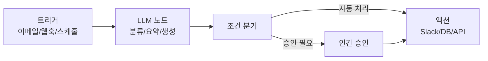

# AI 워크플로우 자동화

저코드/노코드 도구로 비즈니스 프로세스를 AI 에이전트가 자율 처리하는 엔터프라이즈 자동화 패턴. [[n8n-dify|n8n]]과 [[dify|Dify]]가 2026년 대표 오픈소스 스택.

## 주요 플랫폼 비교

| 플랫폼 | 특성 | LLM 통합 |
|--------|------|---------|
| [[n8n-dify\|n8n]] | 범용 자동화, 400+ 커넥터 | AI 노드 추가 |
| [[dify\|Dify]] | LLM 앱 특화 | 네이티브 RAG+에이전트 |
| Flowise | 비주얼 LLM 체인 | LangChain 기반 |
| Zapier AI | SaaS 자동화 | ChatGPT 통합 |

## 관련 문서

- [[n8n-dify]] -- n8n + Dify
- [[dify]] -- Dify
- [[agent-workflow-patterns]] -- 에이전트 워크플로우 패턴
