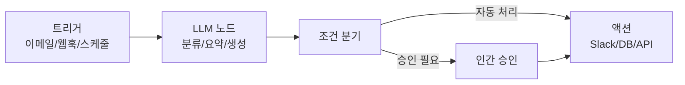
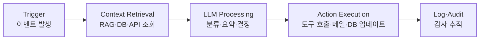

# AI 워크플로우 자동화

저코드/노코드 도구로 비즈니스 프로세스를 LLM·AI 에이전트가 자율 처리하는 엔터프라이즈 자동화 패턴. 전통적 RPA(Robotic Process Automation)가 규칙 기반 화면 조작에 그쳤다면, AI 워크플로우 자동화는 **LLM의 자연어 이해**를 트리거-액션 사이에 끼워 넣어 비정형 입력(이메일, 음성, 문서)도 처리한다. [[n8n-dify|n8n]]과 [[dify|Dify]]가 2026년 대표 오픈소스 스택이며, SaaS 진영에서는 Zapier AI / Microsoft Power Automate Copilot / Workato가 자리잡았다.

## 핵심 패턴: Trigger → Context → LLM → Action

전형적인 AI 워크플로우는 4단계 파이프라인으로 환원된다.

- **Trigger**: 새 메일 수신, 폼 제출, 시간 스케줄, 외부 시스템 웹훅
- **Context Retrieval**: 사내 문서 검색([[agentic-rag]]), CRM 레코드 조회, 캘린더 확인
- **LLM Processing**: 요약, 분류, 의도 추출, 다음 행동 결정. 단순 호출에서 시작해 복잡한 [[multi-agent-orchestration]]으로 확장 가능
- **Action Execution**: Slack/Email 발송, Notion/Jira 레코드 생성, ERP API 호출, 보고서 생성

## 주요 플랫폼 비교

| 플랫폼 | 라이선스 | 핵심 강점 | LLM 통합 방식 |
|--------|----------|-----------|---------------|
| [[n8n-dify\|n8n]] | Fair-code (self-hostable) | 400+ 커넥터, 네이티브 AI Agent 노드 | LangChain 기반 클러스터 노드 + AI Transform |
| [[dify\|Dify]] | Apache 2.0 | LLM 앱·에이전트 빌더 통합 | RAG + 에이전트 + 워크플로우 일체형 |
| **Flowise** | Apache 2.0 | 비주얼 LLM 체인 빌더 | LangChain 기반, 노드형 체인 구성 |
| **Make.com** (Integromat) | SaaS | 시나리오 단위 직관적 UI | OpenAI/Anthropic 모듈 |
| **Zapier AI** | SaaS | 7,000+ 앱 연동 + Zapier Agents | ChatGPT, Claude 모듈, AI by Zapier |
| **Microsoft Power Automate Copilot** | SaaS (M365) | M365/Dynamics 깊은 통합 | Azure OpenAI + Copilot Studio |
| **Workato** | 엔터프라이즈 SaaS | Recipe + AI 모듈, 거버넌스 | Workato AI, RAG 코파일럿 |

## n8n의 AI 노드 구성 (참고 사례)

n8n 공식 문서에 따르면 LangChain 기반 클러스터 노드가 다음과 같이 분류된다.

- **AI Agent**: Conversational, OpenAI Functions, ReAct, SQL Agent 등 다양한 에이전트 타입
- **LLM 통합**: OpenAI, Anthropic, Google Gemini, Azure OpenAI, Mistral, Groq
- **Chains**: Basic LLM Chain, Q&A Chain, Summarization Chain, Information Extractor, Text Classifier, Sentiment Analysis
- **Vector Store**: Pinecone, Qdrant, Chroma, Milvus, MongoDB Atlas, PGVector
- **Retrievers**: Vector Store Retriever, MultiQuery, Contextual Compression
- **Memory**: Chat Memory Manager, Simple Memory, Redis/MongoDB/Postgres Chat Memory
- **Tools**: Calculator, Custom Code Tool, SerpApi, Wikipedia, Wolfram|Alpha

이 구성은 [[langchain]] 추상화를 워크플로우 캔버스에 1:1 매핑한 결과로, 코드를 작성하지 않고도 RAG + 에이전트를 조립할 수 있게 한다.

## 대표 사용 사례

### 1. 이메일 자동 분류·답변
- Trigger: 새 메일 수신
- Context: 과거 메일 스레드 + 사내 FAQ 벡터 DB
- LLM: 카테고리 분류 + 답변 초안 생성
- Action: 카테고리별 라벨링, 단순 문의는 자동 회신, 복잡 건은 담당자 큐로 라우팅

### 2. 회의 요약 → 캘린더·태스크 등록
- Trigger: Zoom/Google Meet 녹취 종료
- Context: 회의 제목, 참석자
- LLM: 요약, 액션 아이템 추출
- Action: Slack에 요약 게시 + Notion 태스크 생성 + 후속 회의 캘린더 등록

### 3. CRM 자동 업데이트
- Trigger: 영업 통화 종료(Gong/Chorus 트랜스크립트)
- Context: 기존 Salesforce 레코드
- LLM: 통화 내용에서 단계 변경, 의사결정자 추출
- Action: Salesforce Opportunity 단계 업데이트, 다음 단계 제안

### 4. 인보이스/계약 처리
- Trigger: PDF 업로드(이메일 첨부 또는 SFTP)
- Context: 발주서 매칭, 거래처 마스터
- LLM: OCR + 필드 추출 + 일치 검증
- Action: ERP 등록, 불일치 시 담당자에게 차이 리포트

### 5. 고객 지원 1차 분류
- Trigger: 신규 티켓
- Context: 제품 메뉴얼 + 과거 티켓
- LLM: 의도 분류 + 해결 가능성 판단
- Action: 셀프서브 답변 / 적절한 팀 큐로 자동 라우팅

## 한계와 위험 요소

- **복잡 의사결정 한계**: 분기가 많은 도메인 로직(예: 다단계 신용심사)은 LLM 단독으로는 일관성 보장이 어렵다. 룰 엔진 + LLM 하이브리드가 현실적
- **예외 처리**: API 실패, 타임아웃, 부분 실패 시 보상 트랜잭션이 명시적으로 설계되어야 함. 그렇지 않으면 부분 처리된 상태가 유지되어 부작용 발생
- **감사 추적(audit trail)**: AI가 자동 처리한 결과의 책임 추적이 어려움. 모든 LLM 호출 입출력 + 액션 결과 로깅 필수 ([[opentelemetry-genai-semconv]])
- **Hallucination → 부작용**: 잘못된 LLM 출력이 곧 외부 시스템 변경(이메일 발송, DB 업데이트)으로 이어질 수 있어 destructive action에는 휴먼 게이트 필요
- **권한 누수**: 워크플로우가 가진 광범위한 토큰/API 키가 프롬프트 인젝션으로 오용될 수 있음. [[ai-agent-security]] 원칙(최소 권한, 도구별 스코프 제한) 필수
- **비용 폭주**: 대량 트리거(수만 건/일) × LLM API 호출 → 비용 통제. 캐싱·배치·소형 모델 라우팅 전략 필요 ([[agent-cost-optimization]])

## 향후 진화 방향

- **에이전트 기반 워크플로우**: 정해진 DAG 대신 [[multi-agent-orchestration]] 구조로 에이전트가 동적으로 다음 단계 결정. n8n AI Agent / Zapier Agents가 초기 형태
- **Human-in-the-loop 게이트**: 위험 행동(거액 승인, 외부 발신)은 명시적 휴먼 컨펌 노드를 끼워 넣는 패턴이 표준화 중
- **조직 지식 그래프 통합**: 단순 RAG를 넘어, 조직의 캘린더·문서·CRM이 통합된 지식 그래프 위에서 [[agentic-rag]] 검색을 수행
- **자가 진화**: 운영 로그를 기반으로 LLM이 워크플로우 정의를 제안·갱신하는 메타 자동화 (실용 단계는 아직)

## 관련 문서

- [[n8n-dify]] -- n8n + Dify
- [[dify]] -- Dify
- [[agent-workflow-patterns]] -- 에이전트 워크플로우 패턴
- [[multi-agent-orchestration]] -- 멀티 에이전트 오케스트레이션
- [[agentic-rag]] -- 에이전틱 RAG
- [[ai-agent-security]] -- AI 에이전트 보안
- [[agent-cost-optimization]] -- 에이전트 비용 최적화
- [[opentelemetry-genai-semconv]] -- OpenTelemetry GenAI 시맨틱 컨벤션
- [[ai-data-pipeline-automation]] -- 데이터 파이프라인 자동화 (자매 개념)
