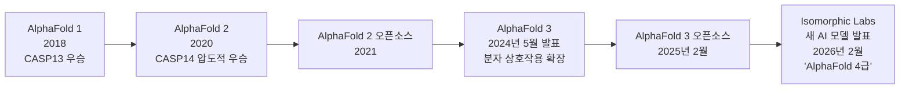
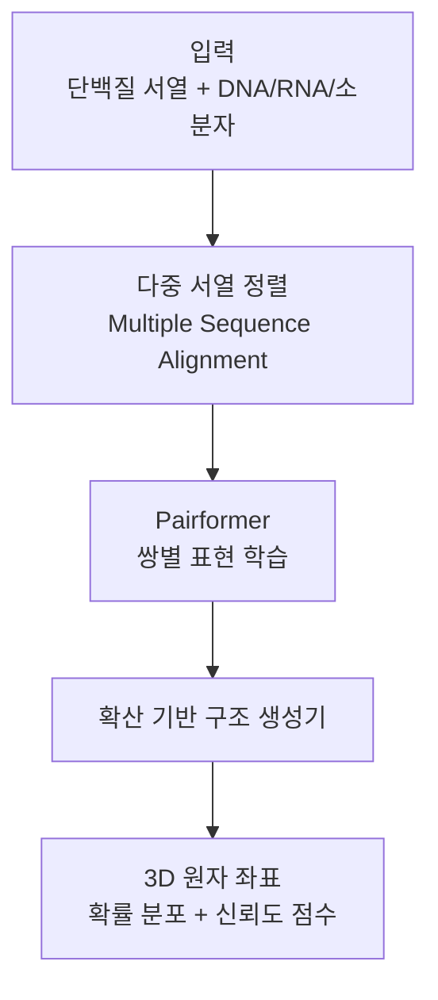

# AlphaFold 3 및 Isomorphic Labs 신약 개발 응용

이 페이지는 Google DeepMind와 Isomorphic Labs의 AlphaFold 3 연구 및 상업적 신약 개발 응용을 요약한다. AlphaFold 3는 단백질 구조 예측을 넘어 분자 상호작용 전반으로 확장한 획기적인 모델이며, Isomorphic Labs는 이를 실제 신약 개발 파이프라인에 통합하고 있다. [[ai-drug-discovery-2026]] 분야의 대표적 사례이며, [[gemini-models]] 등 Google의 대규모 AI 역량이 생명과학에 적용되는 경로를 보여준다.

---

## 타임라인 개요

---

## AlphaFold 3: 핵심 확장

### AlphaFold 2 대비 차이

AlphaFold 2는 **단백질 구조 예측** 전용이었다. AlphaFold 3는 예측 대상을 다음으로 확장했다.

| 예측 대상 | AlphaFold 2 | AlphaFold 3 |
|----------|-------------|-------------|
| 단백질 구조 | 지원 | 지원 |
| DNA/RNA 구조 | - | 지원 |
| 소분자(Small molecule) | - | 지원 |
| 단백질-단백질 상호작용 | 제한적 | 지원 |
| 단백질-DNA 상호작용 | - | 지원 |
| 단백질-소분자 결합 | - | 지원 |

신약 개발에서 가장 중요한 것은 **약물(소분자)이 타겟 단백질에 어떻게 결합하는지** 예측이다. AlphaFold 3는 이를 직접 예측함으로써 신약 후보 물질 스크리닝 속도를 획기적으로 높인다.

### 정확도 향상

기존 도구(Glide, AutoDock 등) 대비 **분자 상호작용 예측 정확도 50% 이상 향상**이 주요 성과로 발표됐다. 이는 실험실 테스트가 필요한 후보 물질 수를 줄이는 직접적 비용 절감으로 이어진다.

---

## AlphaFold 3 아키텍처 개요

AlphaFold 3는 AlphaFold 2의 Evoformer 블록을 확장한 **Pairformer** 아키텍처를 사용하며, 확산 모델(diffusion model) 계열 구조 생성기(structure generator)를 조합했다. [교차검증 필요 - 아키텍처 상세는 Nature 논문 원문 확인 권장]

확산 모델 기반 구조 생성기 덕분에 단일 최적 구조 대신 **여러 가능한 구조 앙상블**을 생성할 수 있다. 실제 분자는 정적이 아닌 동적 구조를 가지므로, 이 앙상블이 더 현실적인 예측을 제공한다.

---

## 오픈소스 공개 (2025년 2월)

AlphaFold 3는 2025년 2월 오픈소스로 공개됐다. 단, AlphaFold 2와 다르게 몇 가지 제한이 있다.

- **상업적 사용 제한**: 비상업적 연구 목적만 자유롭게 사용 [교차검증 필요 - 라이선스 상세]
- **모델 가중치 접근**: 별도 신청 필요
- **AlphaFold Server**: 웹 인터페이스로 누구나 무료 예측 실행 가능

이 공개로 학계 연구자들이 AlphaFold 3를 자체 파이프라인에 통합하여 [[ai-drug-discovery-2026]] 분야 연구를 가속화하고 있다.

---

## Isomorphic Labs: 상업적 신약 개발

Isomorphic Labs는 2021년 DeepMind에서 분리된 독립 신약 개발 회사다. AlphaFold 기술을 핵심 자산으로 사용하되, 실제 의약품 개발이 목표다.

### 주요 현황 (2026년 4월 기준)

| 항목 | 내용 |
|------|------|
| 투자 유치 | $600M+ (Series A/B 누적) |
| 파트너십 | 다수 빅파마(제약사) 협업 진행 중 [교차검증 필요 - 구체 파트너 공개 여부] |
| 핵심 플랫폼 | AlphaFold 3 기반 구조 예측 + 자체 ML 모델 |
| 개발 단계 | 전임상(pre-clinical) 후보 물질 다수 탐색 중 |

### 신약 개발 파이프라인에서의 AlphaFold 3 역할

전통적으로 "타겟 발굴 → 리드 화합물 선정"에만 수 년이 걸렸다. AlphaFold 3 + ML 스크리닝 조합으로 이 단계를 수 개월로 압축하는 것이 Isomorphic Labs의 주요 주장이다.

---

## 2026년 2월: "AlphaFold 4급" 새 모델

2026년 2월, Isomorphic Labs가 **AlphaFold 3를 크게 능가하는 새 AI 모델**을 발표해 과학계의 주목을 받았다. Nature지에서도 이를 주요 뉴스로 다뤘다.

공개된 정보가 제한적이나, 다음 방향으로 개선됐을 것으로 분석된다:

- 더 큰 분자 복합체(large molecular complexes) 예측
- 동적 구조 변화(conformational change) 예측 강화
- 신약 설계용 생성(generative) 기능 - 구조 예측뿐 아니라 새 분자 직접 설계
- 다단백질 어셈블리(multi-protein assembly) 정확도 향상

[교차검증 필요 - "AlphaFold 4급" 모델의 공식 이름, 논문, 사양은 Isomorphic Labs 공식 발표에서 확인 필요]

---

## 과학적·경제적 영향

### 단백질 구조 예측 분야 변화

AlphaFold 2 발표 이후 전 세계 구조 생물학자 커뮤니티는 실험 기반 구조 결정(X선 결정학, 냉동전자현미경)의 역할 재정립이 불가피해졌다. AlphaFold 3는 이를 분자 상호작용 전반으로 확장해 구조 기반 신약 설계(SBDD, Structure-Based Drug Design) 전체를 AI 중심으로 재편하고 있다.

### 비용 절감

신약 개발 평균 비용은 10억 달러 이상, 기간은 10년 이상이다. AlphaFold 3 기반 가상 스크리닝이 초기 단계 비용을 줄이면 전체 파이프라인 경제성이 크게 개선된다. Isomorphic Labs는 이를 통해 빅파마 대비 훨씬 빠르고 저렴하게 후보 물질을 탐색한다고 주장한다.

---

## 한계 및 비판

- **실험 검증 필수**: AlphaFold 3 예측이 아무리 정확해도 최종 임상 효능은 실험으로만 확인 가능
- **결합 친화도 예측의 한계**: 구조 예측이 정확해도 결합 강도(Kd) 예측은 별도 모델이 필요
- **독성 예측 미포함**: ADMET(흡수, 분포, 대사, 배출, 독성) 예측은 AlphaFold 3 범위 밖
- **단백질 유연성 완전 반영 한계**: 정적 구조 예측 중심으로 동적 컨포메이션 변화 완전 포착 어려움

---

## 관련 문서

- [[ai-drug-discovery-2026]] - AI 기반 신약 개발 일반 개념
- [[gemini-models]] - DeepMind AI 역량의 더 넓은 맥락
