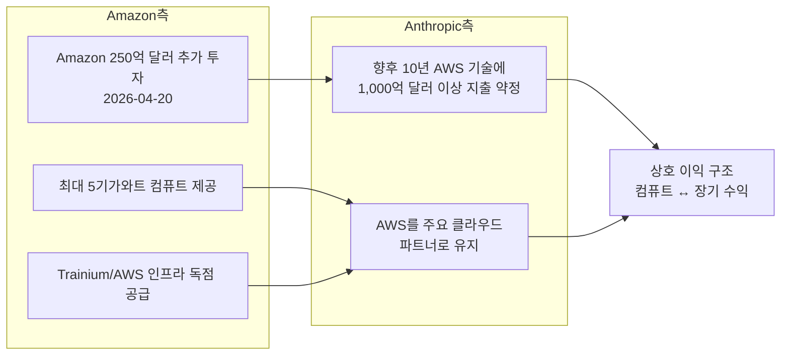
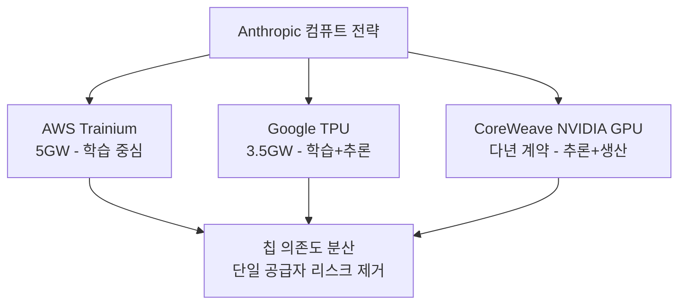

# Amazon-Anthropic 5기가와트 컴퓨트 확장 계약 (2026년 4월)

## 사건 개요

2026년 4월 20일, Amazon이 Anthropic에 **추가 250억 달러를 투자**하고 **최대 5기가와트(GW) 컴퓨트**를 제공하는 역대급 계약을 체결했다. 동시에 Anthropic은 향후 10년간 Trainium 등 AWS 기술에 **1,000억 달러 이상을 지출**하겠다는 상호 약정을 했다. 이 발표는 나흘 뒤 Google의 400억 달러 투자 발표([[google-40b-anthropic-investment]])를 촉발하는 도화선이 됐다.

위 다이어그램은 Amazon-Anthropic 계약의 상호 이익 구조를 보여준다. Amazon은 컴퓨트와 자본을, Anthropic은 장기 AWS 지출 약정을 교환하는 형태다.

---

## 계약 핵심 내용

### 투자 규모

| 항목 | 규모 | 비고 |
|------|------|------|
| Amazon 추가 투자 | 250억 달러 | 기존 투자에 더한 신규 라운드 |
| 컴퓨트 공급 규모 | 최대 5기가와트 | 역대 AI 컴퓨트 단일 계약 최대 규모 |
| Anthropic 10년 AWS 지출 약정 | 1,000억 달러 이상 | 장기 파트너십 확약 |

### 5기가와트가 의미하는 규모

5기가와트(5GW)는 맥락 없이는 이해하기 어려운 수치다. 비교해보면:

- 미국 일반 가정 약 300만 가구 전력 소비에 해당
- xAI Colossus 슈퍼컴퓨터 전체 용량(2GW)의 2.5배
- Google의 Anthropic 대상 TPU 공급 규모(3.5GW)보다 큰 수치
- OpenAI-NVIDIA 10GW 파트너십의 절반 수준

AI 컴퓨트가 기가와트 단위로 측정되기 시작했다는 사실 자체가 AI 인프라의 산업화를 상징한다.

### Amazon Trainium 칩 중심 구성

계약의 핵심 하드웨어는 Amazon이 자체 설계한 **Trainium** 시리즈 칩이다:

- **Trainium2**: 2026년 현재 AWS AI 학습 워크로드의 핵심 가속기
- NVIDIA GPU 대비 학습 비용 절감 주장 (AWS 공식 수치로는 최대 40%)
- HBM3e 메모리 탑재, 거대 모델 분산 학습 지원
- AWS Inferentia 시리즈와 함께 추론 스택 완성

---

## 계약의 전략적 의미

### Amazon 입장: AWS를 AI 클라우드 1위로

Amazon이 이 규모의 투자와 컴퓨트 공급을 약정하는 이유는 명확하다:

1. **AWS 점유율 방어**: Azure(Microsoft-OpenAI)와의 AI 클라우드 경쟁에서 Claude를 무기로 활용
2. **자체 칩 생태계 입증**: Trainium이 NVIDIA H100/A100 대안으로 통한다는 레퍼런스 확보
3. **장기 수익 확보**: 1,000억 달러 이상의 Anthropic 지출 약정 = 10년치 AWS 매출 선보장
4. **엔터프라이즈 판매 시너지**: Amazon Bedrock을 통한 기업 고객 Claude API 제공 강화

### Anthropic 입장: 칩 다각화 전략 완성

이 계약 이후 Anthropic의 AI 가속기([[ai-accelerators]]) 포트폴리오는 사실상 완성됐다:

단일 칩 공급자(NVIDIA)에 의존하는 구조에서 벗어나 세 개의 독립적 컴퓨트 파트너를 확보했다. 이는 공급망 리스크 분산과 협상력 유지에 핵심적이다.

---

## 타임라인 맥락

### 2026년 4월 AI 인프라 계약 연쇄

| 날짜 | 사건 | 규모 |
|------|------|------|
| 4월 6일 | Anthropic-Google-Broadcom TPU 3.5GW 계약 | 3.5GW |
| 4월 10일 | CoreWeave-Anthropic GPU 클라우드 다년 계약 | 미공개 |
| 4월 20일 | **Amazon-Anthropic 250억 달러 + 5GW 계약** | 250억 달러, 5GW |
| 4월 24일 | Google Alphabet 400억 달러 투자 발표 | 400억 달러 |

4월 한 달 동안 Anthropic이 체결한 컴퓨트 관련 계약 총합은 **8.5GW 이상**으로, 이는 현존하는 어떤 단일 AI 기업보다도 큰 규모다.

---

## 1,000억 달러 지출 약정의 의미

Anthropic의 10년간 1,000억 달러 AWS 지출 약정은 역방향에서 봐야 한다:

- **투자 금액(250억 달러)의 4배**를 다시 Amazon에게 돌려주는 구조
- 순 현금 유입은 250억 달러지만, 순 컴퓨트 비용 지출은 1,000억 달러
- 이는 Anthropic이 향후 10년간 매년 평균 100억 달러의 AWS 비용을 지불해야 한다는 의미
- 역설적으로, 이 규모의 약정이 가능한 것은 연매출 300억 달러 수준의 성장이 지속될 것이라는 자신감을 반영

---

## [[claude-models]]에 미치는 영향

5GW 컴퓨트는 Anthropic이 다음 세대 모델 개발에 투입할 수 있는 연산 자원을 대폭 확대한다:

- **긴 사전학습 런**: 조 단위 파라미터 모델의 전체 학습이 가능해짐
- **합성 데이터 생성**: 대규모 합성 데이터 파이프라인 운용
- **RLHF/DPO 반복 싸이클 가속**: 인간 피드백 기반 학습의 처리량 대폭 향상
- **추론 서빙 확장**: 사용자 수 증가에 따른 API 서빙 인프라 확충

---

## 관련 문서

- [[claude-models]] - Anthropic 모델 시리즈 개요
- [[ai-accelerators]] - AI 가속기 및 컴퓨트 인프라 개요
- [[google-40b-anthropic-investment]] - Google 400억 달러 투자 (4월 24일)
- [[anthropic-30b-revenue-milestone]] - Anthropic 300억 달러 매출 마일스톤
- [[ai-economic-impact]] - AI의 거시경제적 영향
