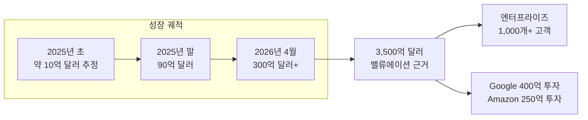
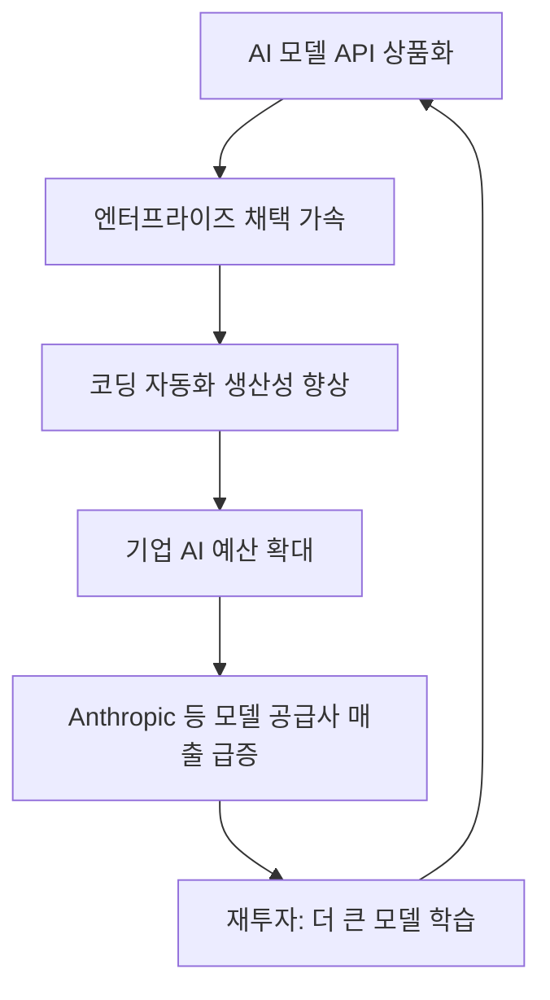

# Anthropic 연매출 런레이트 300억 달러 돌파 마일스톤 (2026년 4월)

## 사건 개요

2026년 4월 기준, Anthropic의 연매출 런레이트(ARR, Annualized Revenue Run Rate)가 **300억 달러를 돌파**했다. 2025년 말 기준 90억 달러였던 런레이트가 불과 4-5개월 만에 3.3배 이상 성장한 이 수치는 AI 산업 역사상 유례없는 기업 성장 속도로 기록됐다. 이 지표는 Google의 400억 달러 투자 발표([[google-40b-anthropic-investment]])와 Amazon의 250억 달러 계약([[amazon-anthropic-5gw-compute]]) 맥락에서 공개됐다.

위 다이어그램은 Anthropic의 런레이트 성장 궤적과 이를 뒷받침하는 요인을 보여준다.

---

## 핵심 수치

| 지표 | 수치 | 출처 시점 |
|------|------|----------|
| 연매출 런레이트 | 300억 달러 이상 | 2026년 4월 |
| 직전 런레이트 | 90억 달러 | 2025년 말 |
| 성장 배율 | 3.3배 이상 | 4-5개월 기간 |
| 엔터프라이즈 고객 수 | 1,000개 이상 | 연간 100만 달러 이상 지출 |
| 기업 밸류에이션 | 3,500억 달러 | 2026년 4월 투자 라운드 기준 |
| P/S 배수 | 약 11.7x | 밸류에이션 / ARR |

### "런레이트"의 의미

런레이트(run rate)는 최근 특정 기간의 매출을 연 단위로 환산한 추정치다. 예를 들어:

- 2026년 3월 단월 매출이 25억 달러였다면 → 연 런레이트 300억 달러
- 실제 연간 누적 매출과는 다를 수 있음 (특히 성장 중인 기업은 런레이트 > 실적)
- 투자자들은 "지금 이 속도가 지속된다면"을 가정한 기업 가치 평가 지표로 활용

---

## 성장 동력 분석

### 엔터프라이즈 고객 확산

연간 100만 달러 이상 지출하는 기업 고객 1,000개 이상은 단순한 숫자가 아니라 엔터프라이즈 제품 시장 적합성(PMF)을 검증하는 강력한 신호다:

- **단위 경제학**: 1,000개 기업 × 평균 100만 달러 이상 = 최소 10억 달러의 안정적 기반
- **확장성**: 1,000개 고객이 존재한다는 것은 세일즈 모션(enterprise sales motion)이 작동하고 있음을 의미
- **스위칭 비용**: 대규모 엔터프라이즈 고객은 한번 도입하면 교체 비용이 높아 이탈률 낮음

### Claude Code와 개발자 생태계

[[claude-code]] 는 Anthropic 매출 급증의 핵심 드라이버로 작용하고 있다:

- Max/Team 플랜 구독 유도: 코딩 에이전트 기능은 Pro 대비 높은 가격의 Max 플랜 필요
- 기업 내 개발자 팀 단위 도입이 엔터프라이즈 계약으로 자연스럽게 연결
- NEC 3만 명 전사 배포([[nec-anthropic-japan-partnership]]) 같은 대형 기업 계약 촉발

### API 에코시스템 성숙

Anthropic 경제지수 보고서(2026년 3월)에 따르면:

- 코딩/수학 직무(Computer & Mathematical) 사용이 35% 비중으로 압도적 1위
- 상위 10개 O*NET 태스크 집중도가 24%→19%로 분산 중 (다양한 용도로 확산 중)
- 이는 코딩 이외 분야로 사용처가 넓어지며 매출 기반이 다각화됨을 의미

---

## [[ai-economic-impact]] 관점에서의 해석

### AI 산업 경제 구조 변화

Anthropic의 300억 달러 런레이트는 AI 소프트웨어 산업 전체의 경제 구조 변화를 상징한다:

이 선순환 구조가 작동하기 시작했음을 보여주는 지표다.

### 수익성 문제

주의할 점은, 런레이트 300억 달러가 곧 수익성을 보장하지 않는다는 것이다:

- 프론티어 모델 학습 비용: 단일 학습 런에 수억~수십억 달러 소모
- 인프라 비용: AWS, Google Cloud, CoreWeave 합산 서빙 비용 극히 높음
- 인력 비용: AI 연구자 연봉 수백만 달러 수준
- 10년간 AWS 1,000억 달러 지출 약정: 매년 평균 100억 달러

Anthropic이 실제로 흑자를 달성하려면 현재 성장률을 훨씬 더 오래 유지해야 할 가능성이 높다.

---

## 경쟁 맥락

### OpenAI와의 비교

2026년 초 기준 OpenAI의 연매출은 약 100억 달러 수준으로 알려졌다. Anthropic이 300억 달러를 달성했다면 이는 주목할 만한 역전이지만, 몇 가지 주의사항이 있다:

- OpenAI는 ChatGPT 소비자 구독과 API를 모두 포함하는 반면, Anthropic은 API/엔터프라이즈 중심
- 두 회사 모두 "런레이트" 지표이므로 회계 기준이 다를 수 있음
- GPT-5.5 출시([[gpt-5-5-launch]])가 OpenAI 매출 재반등을 유도할 가능성 있음

### AI 소프트웨어 시장 전체

300억 달러 런레이트는 단순히 Anthropic만의 성공이 아니라:

- AI API 소프트웨어 시장이 예상보다 훨씬 빠르게 성장하고 있음을 증명
- 기업들의 AI 예산이 "실험"에서 "핵심 비용"으로 전환됐음을 시사
- 모델 공급사(Anthropic, OpenAI, Google DeepMind) 외에도 벡터DB, 평가, 오케스트레이션 스택 전반의 시장 확대를 의미

---

## 향후 전망

### 성장 유지 조건

300억 달러 런레이트 이후 성장이 지속되려면:

1. **Claude 5 이상 모델 경쟁력 유지**: GPT-5.5, Gemini 3 대비 우위 확인 필요
2. **엔터프라이즈 계약 갱신율**: 기존 1,000개+ 고객의 이탈 없이 확대
3. **새로운 용도 개척**: 코딩 이외 헬스케어, 법률, 금융 등 버티컬 침투
4. **클로드 에코시스템 구축**: Claude Code, Claude Design 등 자체 도구 생태계를 통한 락인

### IPO 시나리오

3,500억 달러 밸류에이션과 300억 달러 런레이트 달성은 IPO를 위한 기준점 마련에 가깝다. 일반적으로 소프트웨어 회사는 IPO 시 P/S 멀티플 10-15x가 적용되는데, 현재 수치는 그 범위 내다.

---

## 관련 문서

- [[claude-models]] - Anthropic 모델 시리즈 개요
- [[ai-economic-impact]] - AI의 거시경제적 영향
- [[google-40b-anthropic-investment]] - Google 400억 달러 투자 발표
- [[amazon-anthropic-5gw-compute]] - Amazon 250억 달러 + 5GW 컴퓨트 계약
- [[claude-code]] - Claude Code 에이전틱 코딩 도구
