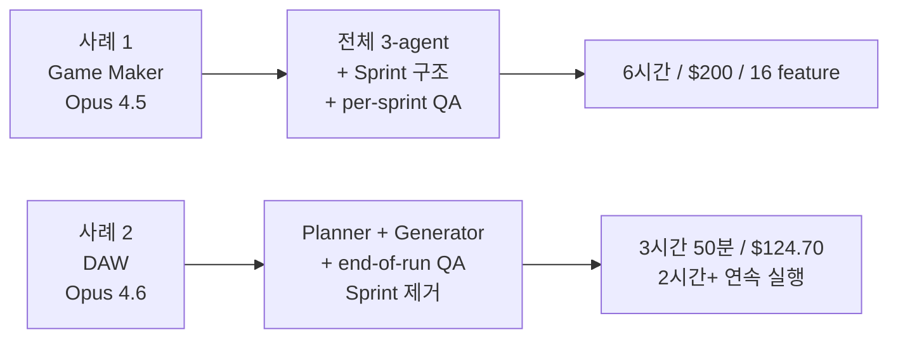

# Anthropic Full-Stack Harness Case Study

Anthropic의 Prithvi Rajasekaran이 [[anthropic harness design|Harness Design for Long-Running Application Development]]에서 공개한 두 개의 풀 스택 빌드 케이스. **Retro Game Maker (Opus 4.5)** 와 **Digital Audio Workstation (Opus 4.6)** 를 같은 3-agent 하네스 계보로 연속 실험한 결과.

두 사례는 같은 저자·같은 방법론·다른 모델이라는 조건에서 하네스의 load-bearing 컴포넌트가 어떻게 이동했는지 드러낸다.

## 사례 1: Retro Game Maker (2026 초, Opus 4.5)

### 프롬프트

> "Create a 2D retro game maker with features including a level editor, sprite editor, entity behaviors, and a playable test mode."

### 실험 설계

Solo agent baseline vs Full 3-agent harness의 1:1 비교.

### 결과 — 숫자

| 항목 | Solo Agent | Full Harness |
|---|---|---|
| 소요 시간 | **20분** | **6시간** |
| 비용 | **$9** | **$200** |
| 비용 배율 | 1x | **20배+** |
| Sprint 수 | N/A | **10** |
| Feature 수 | 최초 입력 그대로 | **16개로 확장** |

### Solo Run — 표면은 OK, 코어는 망가짐

초기 인상은 "기능적"이었다:
- 레벨 에디터, sprite 에디터, entity 편집기 UI 존재
- 버튼을 누르면 응답

그러나 다음 문제가 드러났다:

- **공간 낭비**: fixed-height 패널로 화면 공간을 비효율적으로 사용
- **경직된 워크플로우**: sprite·entity를 레벨 채우기 전에 먼저 만들어야 함. UI가 이 순서를 안내하지 않음
- **치명적 실패**: "the actual game was broken. My entities appeared on screen but nothing responded to input."
- **Silent failure**: 엔티티 정의와 게임 런타임 사이 와이어링이 끊겨 있었고 **표면에는 아무 단서도 없었다**

### Full Harness Run — Planner의 Scope 확장

Planner가 한 문장을 **16 feature, 10 sprint** 로 확장:
- Sprite animation systems
- Behavior templates
- Sound/music
- AI-assisted sprite designer
- AI-assisted level designer
- Shareable game exports
- ... 외 10개

Planner가 **frontend design skill**에 접근해 앱의 visual design language를 스펙 단계에서 미리 정의했다.

### Full Harness Run — 결과

- **Polish**: 캔버스가 viewport 전체 사용, 패널이 합리적 크기, 일관된 visual identity
- **Sprite editor**: "richer and more fully featured, with cleaner tool palettes, a better color picker, and more usable zoom controls"
- **결정적 차이**: 게임이 실제로 작동
  - 엔티티 이동 가능
  - 점프·충돌 기본 작동 (약간의 물리 오버랩 버그 존재)
  - Core gameplay가 solo run에서는 불가능했던 것
- **보너스 AI 통합**: Planner의 지시 덕분에 "built-in Claude integration that let me generate different parts of the game through prompting" — 앱 자체가 LLM feature를 내장

### Evaluator Tuning — 초기에 Claude는 "a poor QA agent"

첫 몇 번의 시도에서 Claude의 evaluator는 다음과 같이 동작했다:

1. 정당한 이슈를 식별
2. 그런 다음 "talk itself into deciding they weren't a big deal and approve the work anyway"
3. 표면 happy path만 확인
4. Edge case는 probe 안 함

**튜닝 과정**:
- 실패한 QA 로그를 저자가 직접 읽음
- 저자 판단과 evaluator 판단의 divergence 기록
- QA 프롬프트를 iterative하게 갱신
- "several rounds of development before the evaluator was grading in a way that I found reasonable"

튜닝 후 evaluator의 실제 findings 예시:

1. **Rectangle fill tool 오류** (tile editor):
   > "Tool only places tiles at drag start/end points instead of filling the region. `fillRectangle` function exists but isn't triggered properly on mouseUp."

2. **Delete key handler 버그**:
   > "Condition requires both `selection` and `selectedEntityId` to be set, but clicking an entity only sets `selectedEntityId`. Condition should be `selection || (selectedEntityId && activeLayer === 'entity')`."

3. **FastAPI route 순서 버그**:
   > "`PUT /frames/reorder` route defined after `/{frame_id}` routes. FastAPI matches 'reorder' as a frame_id integer and returns 422: 'unable to parse string as an integer.'"

### 잔존 한계

- Small layout issues
- Interactions that felt unintuitive in places
- Undiscovered bugs in more deeply nested features

그러나 **코어 기능이 돌아간다는 점**에서 solo 대비 "the lift was obvious".

---

## 사례 2: Digital Audio Workstation (Opus 4.6)

### 배경 — 하네스 단순화

Opus 4.6 릴리스 후 저자는 [[load-bearing harness|load-bearing test]]를 수행하며 하네스를 단순화. 변경점:

- **Sprint 구조 완전 제거** — Opus 4.6가 "sustains agentic tasks for longer"
- **Planner 유지** — 없으면 generator가 under-scope
- **Evaluator 유지** — 단, per-sprint 채점 → 단일 end-of-run 패스로 이동

### 프롬프트

> "Build a fully featured DAW in the browser using the Web Audio API."

### 실행 로그 — 3 Round 구성

| Phase | Duration | Cost |
|---|---|---|
| Planner | 4.7 min | $0.46 |
| Build Round 1 | 2 hr 7 min | $71.08 |
| QA Round 1 | 8.8 min | $3.24 |
| Build Round 2 | 1 hr 2 min | $36.89 |
| QA Round 2 | 6.8 min | $3.09 |
| Build Round 3 | 10.9 min | $5.88 |
| QA Round 3 | 9.6 min | $4.06 |
| **Total** | **3 hr 50 min** | **$124.70** |

주목할 점: Build Round 1이 **2시간 7분 동안 coherent하게 실행**. Opus 4.5 시절 sprint 없이는 불가능했던 규모.

### QA Findings (Round 1)

Evaluator의 Round 1 피드백 발췌:

> "This is a strong app with excellent design fidelity, solid AI agent, and good backend. The main failure point is Feature Completeness—while the app looks impressive and the AI integration works well, several core DAW features are display-only without interactive depth: clips can't be dragged/moved on the timeline, there are no instrument UI panels (synth knobs, drum pads), and no visual effect editors (EQ curves, compressor meters). These aren't edge cases—they're the core interactions that make a DAW usable."

핵심 관찰:
- 시각 품질은 "excellent design fidelity"
- AI 에이전트도 잘 작동
- **Core interaction depth 부재**: 타임라인 클립 드래그 없음, 악기 UI 패널 없음, 시각화된 effect editor 없음

### QA Findings (Round 2)

- Audio recording: "still stub-only (button toggles but no mic capture)"
- Clip resize by edge drag 미구현
- Clip split 미구현
- Effect visualizations: "numeric sliders, not graphical (no EQ curve)"

### 최종 결과

- **All core pieces**: working arrangement view, mixer, transport
- **Integrated AI agent의 자율 시연**:
  - Tempo 설정
  - Key 선택
  - Melody 녹음
  - Drum 트랙 구성
  - Mixer level 조정
  - Reverb 추가
  - End-to-end 간단한 production 생성
- **Core composition primitives 기능**

### 잔존 gap

두 라운드의 QA에서도 **interaction depth 부족** 이 완전히 해소되지 못함. "display-only without interactive depth" 피드백이 라운드를 거쳐도 부분적으로만 해결됨. 이는 모델의 baseline capability 경계가 여전히 특정 영역에 있다는 신호.

---

## 두 사례 대조

| 차원 | Game Maker (4.5) | DAW (4.6) |
|---|---|---|
| 모델 | Opus 4.5 | Opus 4.6 |
| 하네스 | 3-agent + sprint + per-sprint QA | Planner + Generator + end-of-run QA |
| 시간 | 6시간 | 3시간 50분 |
| 비용 | $200 | $124.70 |
| 연속 실행 최대 | Sprint 단위 (~30분) | 2시간+ |
| Evaluator 부담 | 매 sprint | 1회 + 2회 재시도 |
| 결과 품질 | 코어 gameplay 작동, 잔 버그 | Arrangement/mixer 작동, interaction depth 부족 |

## 교훈

### Game Maker에서 얻은 것

1. **Solo vs harness 차이는 표면이 아니라 코어에서 드러난다** — solo run이 "looks functional"하지만 핵심 게임 로직이 silent failure
2. **Planner의 scope expansion이 제품 품질을 결정** — 1 문장이 16 feature로 확장되는 과정이 아닌 것과 다른 것의 차이
3. **Evaluator tuning은 자체로 작업** — few rounds of development 필요. 로그 리뷰가 핵심
4. **Multiple AI integration bonus** — planner에 "AI feature 엮기"를 지시하면 앱 자체가 LLM-native가 됨

### DAW에서 얻은 것

1. **모델 capability가 sprint 구조를 없앴다** — 4.6은 2시간 이상 coherent 작업 유지
2. **Planner는 여전히 load-bearing** — capability 올라갔어도 under-scope 문제 해결 안 됨
3. **Evaluator는 end-of-run으로 이동해도 가치 유지** — interaction depth 같은 고난도 feature는 여전히 evaluator가 포착
4. **여전히 못 하는 것이 있다** — interactive depth 부족은 라운드 반복에도 완전 해소 안 됨. 이는 다음 모델이 공략할 경계

### 공통 교훈

> 하네스 디자인은 "완성"되는 것이 아니다. 모델이 나올 때마다 load-bearing 컴포넌트가 재편되고, 단순화로 얻은 여유분은 더 어려운 태스크를 노리는 데 재투자된다.

## 관련 문서

- [[anthropic harness design]] — 이 사례들의 출처인 원 글 요약
- [[harness engineering]] — 이 사례들이 속한 패러다임
- [[generator-evaluator architecture]] — 양 사례의 공통 기반 아키텍처
- [[load-bearing harness]] — Opus 4.5 → 4.6 단순화의 메타 원칙
- [[sprint contracts]] — Game Maker에서는 load-bearing, DAW에서는 제거된 컴포넌트
- [[context anxiety]] — 두 모델 간 이 문제의 임계점이 어떻게 이동했는지
- [[self-evaluation bias]] — Evaluator가 초기에 "poor QA agent"였던 이유
