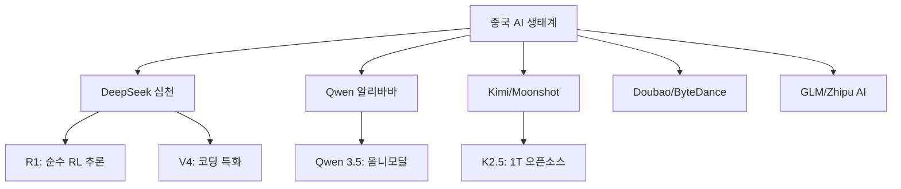

# 중국 AI 생태계

2025-2026년 글로벌 AI 사용량의 30%를 차지하게 된 중국 오픈소스 AI의 급성장과 지정학적 함의. [[deepseek-v4|DeepSeek]], [[qwen-3-5-omni|Qwen]], Kimi, Doubao 등이 프론티어 모델에 근접하며 "중국 AI = 저비용 카피캣"이라는 인식을 뒤집고 있다.

## 주요 플레이어

| 모델 | 개발사 | 특징 |
|------|--------|------|
| DeepSeek-R1 | DeepSeek | $6M으로 GPT-4급 추론, 완전 오픈소스 |
| Qwen 3.5 | 알리바바 | HF 7억 다운로드, 113언어 음성 |
| Kimi K2.5 | Moonshot | 1T 파라미터 멀티모달 에이전트 |
| Doubao | ByteDance | 중국 최대 사용자 수 AI 앱 |

## DeepSeek 임팩트

DeepSeek-R1의 등장은 업계 패러다임을 전환시켰다:
- **비용 효율**: $6M 학습 비용으로 수억 달러 투자 모델에 필적
- **오픈소스 전략**: 가중치, 학습 방법론까지 완전 공개
- **GRPO**: 보상 모델 없는 그룹 상대 정책 최적화로 추론 능력 활성화

## 지정학적 긴장

- 미국 AI 칩 수출 규제 (Blackwell/Rubin) vs 중국 자체 칩 개발
- [[compute-governance|컴퓨트 거버넌스]]의 글로벌 분열
- 오픈소스를 통한 기술 우회 전략

## 관련 문서
- [[ai-supply-chain-risk]] -- AI 공급망 리스크 (AI Supply Chain Risk)

- [[deepseek-v4]] -- DeepSeek V4
- [[qwen-3-5-omni]] -- Qwen 3.5 Omni
- [[open-weights-movement]] -- 오픈 웨이트 운동
- [[compute-governance]] -- 컴퓨트 거버넌스
- [[open-source-vs-proprietary-ai]] -- 오픈소스 vs 독점 AI
