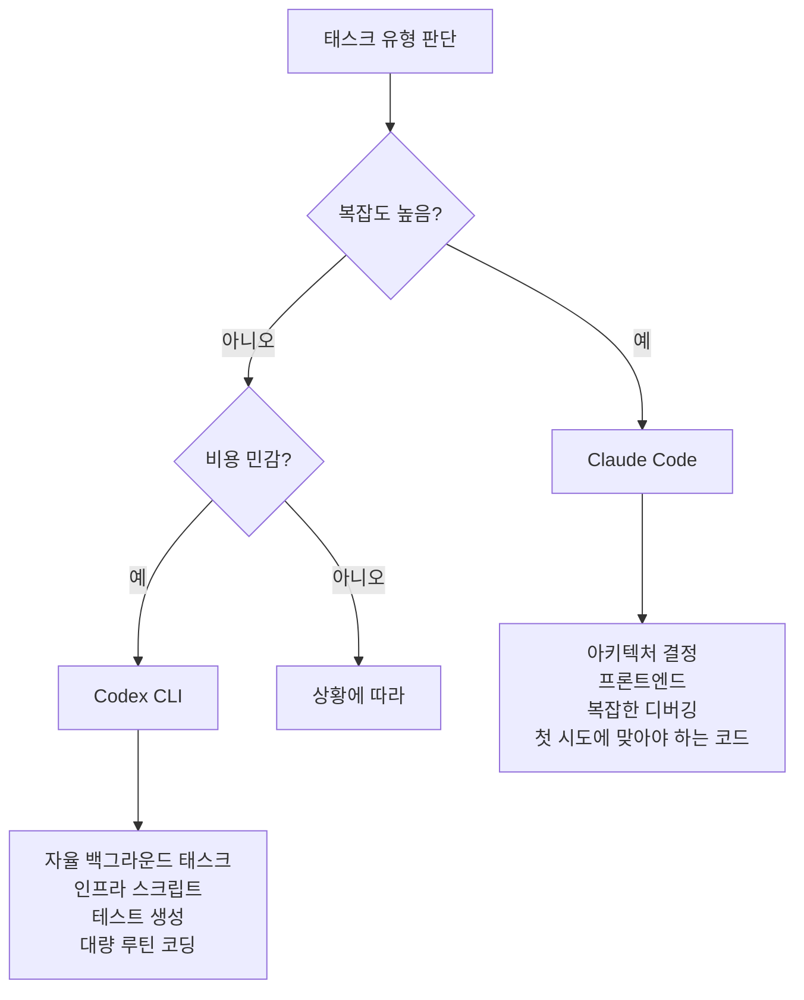

# Claude Code vs Codex CLI 실전 비교 (2026-04)

시니어 엔지니어가 80K 라인 Python/TypeScript 프로젝트에서 [[claude-code|Claude Code]] ~100시간, [[codex-cli|Codex CLI]] ~20시간 사용 후의 비교. Reddit 500+ 개발자 커뮤니티 의견 종합.

## 근본적 차이

| 관점 | Claude Code | Codex CLI |
|------|-----------|-----------|
| 상호작용 | **협업형** -- 대화하며 함께 추론 | **자율형** -- 지시 후 결과 대기 |
| 코드 품질 | 시니어 아키텍트 수준 -- 엣지 케이스 인지, 구조적 | 실용적이지만 세밀함은 떨어짐 |
| 토큰 사용 | 태스크당 ~4x 많음 | 효율적 |
| 일일 비용 | 평균 ~$6/일 (API), $100/월 Max 티어 필요 | Pro $20/월로 충분한 경우 많음 |

## 벤치마크 (2026-04 기준)

| 벤치마크 | Claude Code | Codex CLI |
|----------|-----------|-----------|
| SWE-bench | **72.5%** | ~49% |
| HumanEval | **92%** | 90.2% |

Claude Code가 복잡한 실세계 태스크(SWE-bench)에서 압도적이며, 단순 코드 생성(HumanEval)에서도 소폭 우위.

## 현실적 사용 전략

500+ 개발자 커뮤니티에서 수렴한 "가장 현명한 전략":

### Claude Code 적합 영역

- 아키텍처 설계 및 의사결정
- 프론트엔드 작업 (UI/UX 판단 필요)
- 복잡한 디버깅 (다단계 추론)
- 첫 시도에 정확해야 하는 코드

### Codex CLI 적합 영역

- 자율적 백그라운드 태스크
- 인프라/DevOps 스크립트
- 테스트 생성 (볼륨 중심)
- 고빈도 루틴 코딩

## 비용 현실

- Claude Code $20/월 Pro로는 심각한 일일 개발 불가 -> $100 Max 필요
- Codex CLI는 예산 제약 시 더 현명한 시작점
- 복잡한 멀티스텝 추론이 필요한 대규모 코드베이스에서는 Claude의 품질이 비용을 정당화

## 관련 문서

- [[claude-code]] -- Claude Code 엔티티
- [[codex-cli]] -- Codex CLI 엔티티
- [[coding-agents-landscape]] -- 코딩 에이전트 지형도
- [[how-coding-agents-work]] -- 코딩 에이전트 동작 원리
- [[agent-benchmark-comparison-2026-04]] -- 에이전트 벤치마크 비교
