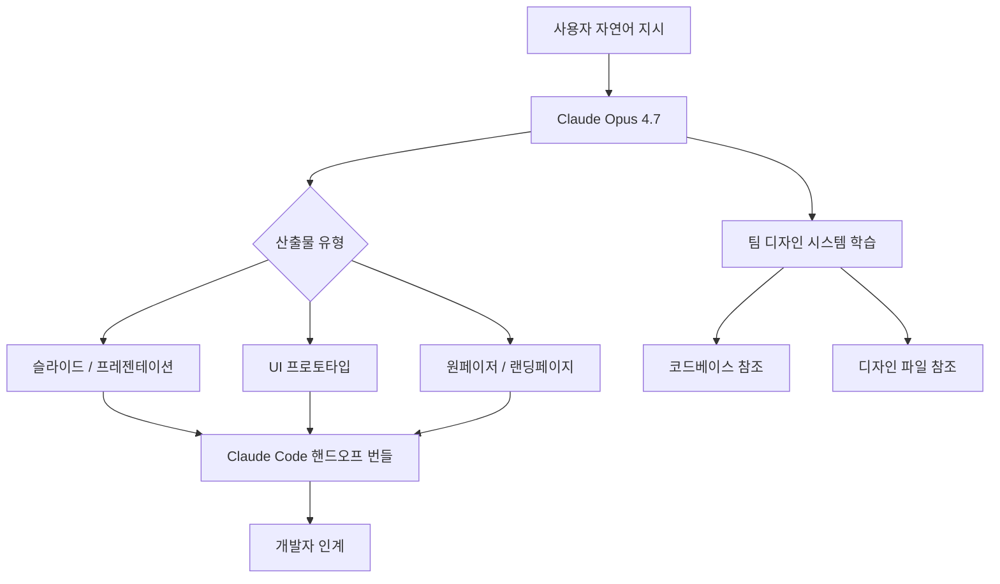

# Claude Design 공식 출시: 자연어로 시각 산출물 생성

Claude Design은 2026년 4월 17일 Anthropic Labs가 출시한 실험적 디자인 자동화 도구다. 자연어 지시만으로 슬라이드, UI 프로토타입, 원페이저 등 시각 산출물을 생성하며, 팀 디자인 시스템과의 통합 및 [[claude-code]]로의 핸드오프(handoff)를 지원한다. 출시 직후 Figma 주가가 7% 이상 하락했다.

## 제품 개요

위 다이어그램은 Claude Design의 입력-처리-출력 흐름을 나타낸다. 사용자의 자연어 지시가 Opus 4.7을 통해 다양한 시각 산출물로 변환되고, 최종적으로 [[claude-code]]를 통해 개발자에게 전달된다.

## 핵심 기능

### 자연어 기반 시각 생성
슬라이드 덱, UI 와이어프레임, 마케팅 원페이저 등을 자연어로 생성한다. 디자인 전문 지식 없이도 "대시보드 레이아웃, 어두운 테마, 왼쪽에 사이드바"와 같은 설명으로 즉시 결과물을 얻을 수 있다.

### 팀 디자인 시스템 학습
기존 코드베이스 또는 디자인 파일을 참조해 팀의 브랜드 가이드라인, 컴포넌트 라이브러리, 색상 팔레트, 타이포그래피 규칙을 학습한다. 이를 통해 생성된 산출물이 기존 제품과 일관된 외관을 유지한다.

> "Claude Design learns your team's design system from your codebase and design files, ensuring brand consistency across every output." - Anthropic Labs 출시 발표

### Claude Code 핸드오프 번들
생성된 디자인을 [[claude-code]]가 바로 구현할 수 있는 핸드오프 번들로 내보낸다. 디자인-개발 갭을 줄이는 핵심 기능으로, 기존 Figma 플러그인이나 Zeplin 같은 도구를 대체할 가능성이 있다.

## 접근 방식

### 지원 구독 플랜
리서치 프리뷰(Research Preview) 단계로 출시됐으며, 아래 플랜 구독자가 접근 가능하다:

| 플랜 | 접근 여부 |
|------|----------|
| Pro | 지원 |
| Max | 지원 |
| Team | 지원 |
| Enterprise | 지원 |
| Free | 미지원 (리서치 프리뷰) |

### Anthropic Labs 실험 제품
Claude Design은 Anthropic Labs 소속 실험 제품으로, 정식 제품화 전 사용자 피드백을 수집하는 단계다. 인터페이스와 기능은 변경될 수 있다.

## 시장 영향

Claude Design 출시 당일 Figma 주가가 7% 이상 하락했다. 이는 시장이 Claude Design을 Figma의 잠재적 경쟁자로 인식했음을 보여준다. [[ai-design-tools]] 생태계에서 LLM 네이티브 디자인 도구가 기존 벡터 편집기 기반 도구를 대체할 가능성에 대한 투자자들의 우려가 반영된 결과다.

그러나 현재 단계에서 Claude Design은 완성된 Figma 대체제라기보다, 초기 프로토타이핑과 디자인-개발 핸드오프 자동화에 특화된 보조 도구에 가깝다.

## 기술 기반

Claude Design의 시각 생성 엔진은 [[claude-opus-4-7-release]]의 향상된 비전 해상도(3.75MP)와 코딩 능력을 기반으로 동작한다. 모델이 UI 컴포넌트를 이해하고 코드로 변환하는 능력이 이 제품의 핵심 차별점이다.

## [[ai-design-tools]]와의 비교

| 도구 | 접근법 | 디자인 시스템 통합 | 코드 출력 |
|------|--------|-------------------|----------|
| Claude Design | 자연어 → 시각 | 코드베이스/파일 학습 | 네이티브 핸드오프 |
| Figma | 벡터 편집기 | 플러그인 기반 | Dev Mode |
| Framer | 컴포넌트 편집기 | 제한적 | React 출력 |
| v0.dev | 프롬프트 → React | 없음 | TSX 출력 |

## 향후 과제

리서치 프리뷰 단계에서 검증이 필요한 주요 항목:
1. **복잡한 인터랙션 패턴** 처리 능력 (모달, 드래그앤드롭 등)
2. **대규모 디자인 시스템** 일관성 유지
3. **에러 복구 흐름** (접근성, 반응형 대응)
4. Figma 플러그인과의 **상호운용성**

## 관련 문서

- [[claude-models]]
- [[ai-design-tools]]
- [[claude-code]]
- [[claude-opus-4-7-release]]
