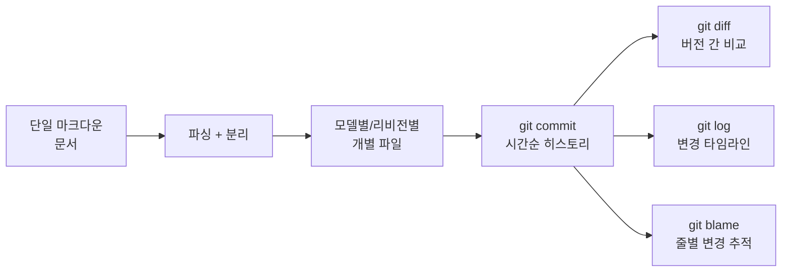

# Claude 시스템 프롬프트를 git 타임라인으로 추적하기

## 개요

Simon Willison이 Anthropic의 공개 Claude 시스템 프롬프트를 **git 저장소 기반 연구 도구**로 변환한 사례 연구(2026년 4월). 단일 마크다운 문서를 모델별/리비전별 파일로 분리하고, git의 버전 관리 기능으로 프롬프트 진화를 추적한다.

## 동기와 배경

Anthropic은 Claude의 시스템 프롬프트를 공개적으로 게시한다. 하지만 단일 문서 형태로는:
- 버전 간 차이를 파악하기 어려움
- 특정 변경의 시점과 맥락을 추적할 수 없음
- 모델별 프롬프트 비교가 불편함

## 방법론

### 1. 구조 변환

단일 마크다운 문서를 granular 파일 구조로 분해:
- 모델별(Opus, Sonnet, Haiku) 디렉토리
- 패밀리별(4.5, 4.6, 4.7) 서브디렉토리
- 리비전별 개별 파일

### 2. git 타임라인 생성

Claude Code를 사용하여 변환을 자동화:
- 각 리비전에 해당하는 시점의 **가짜 커밋 날짜**를 설정
- 실제 시간 순서대로 git 히스토리가 형성됨
- 표준 git 명령어로 탐색 가능

### 3. 분석 활용

단일 마크다운을 git 히스토리로 변환하면, diff/log/blame 같은 표준 도구로 프롬프트 진화를 체계적으로 분석할 수 있다.

## 발견한 인사이트

- Claude Opus 4.6과 4.7 사이의 **구체적 시스템 프롬프트 차이**를 식별
- 시간에 따른 프롬프트 길이 변화 추세 관찰
- 특정 기능(도구 사용, 안전 지침)의 진화 경로 추적

## 적용 가능한 패턴

이 접근법은 다른 ���락에서도 재사용 가능하다:

| 대상 | 적용 방법 |
|------|-----------|
| API 문서 변경 추적 | 버전별 문서를 git 커밋으로 |
| 라이선스/ToS 변경 모니터링 | 스냅샷을 시간순 커밋으로 |
| 모델 카드(model card) 비교 | 모델별 카드를 diff로 비교 |
| 프롬프트 엔지���어링 이력 | 프로덕션 프롬프트의 A/B 테스트 히스토리 |

## 사용된 도구

- **Claude Code**: 마크다운 파싱과 파일 생성 자동화
- **git**: 버전 관리, diff, log, blame
- **표준 Unix 도구**: 파일 조작

## 관련 문서

- [[prompt-engineering|프롬프트 엔지니어링]] -- 프롬프트 설계 원칙과 기법
- [[컨텍스트 엔지니어링]] -- 에이전트를 위한 컨��스트 설계
- [[Claude Code]] -- Anthropic의 CLI 코딩 도구
