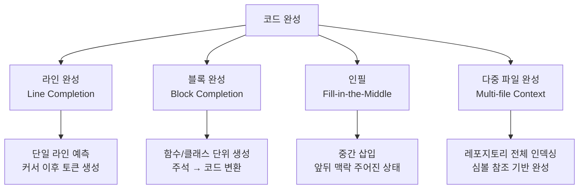
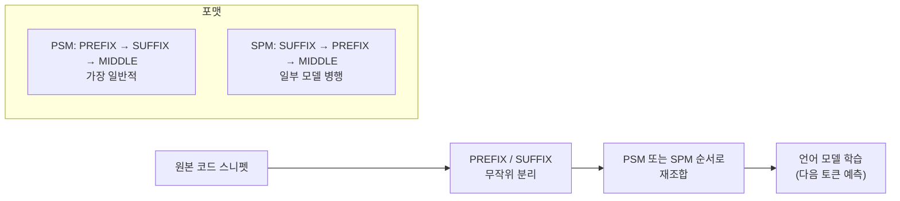
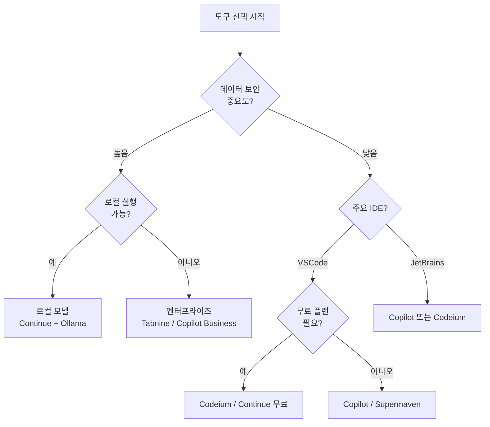
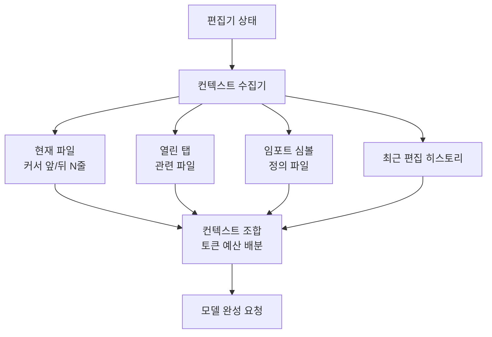

# 코드 완성 (Code Completion)

코드 완성(code completion)은 LLM이 현재 편집 중인 코드 파일의 맥락을 읽고 다음에 올 코드를 예측해 제안하는 기능이다. 단순 자동완성에서 시작해 블록 단위 생성, 파일 전체 인필(in-fill)까지 발전하며, 현대 소프트웨어 개발에서 가장 널리 쓰이는 AI 지원 형태가 됐다.

## 코드 완성의 분류



위 분류는 커서 위치와 제공되는 맥락의 범위에 따른 구분이다. 현대 도구들은 네 가지를 모두 지원하는 방향으로 진화하고 있다.

### 라인 완성 (Line Completion)

가장 기본 형태. 커서 이후의 코드를 한 줄 단위로 예측한다. 레이턴시가 낮아야 하므로 소형 모델이나 스펙디코딩(speculative decoding) 기법을 함께 사용하는 경우가 많다.

- 수십~수백 ms 이내 응답이 사용자 경험의 핵심
- Tab 키 하나로 수락, 방향키로 부분 수락

### 블록 완성 (Block Completion)

함수 시그니처나 주석이 주어졌을 때 함수 본문 전체를 생성한다. 복잡도가 높아 더 큰 모델이 필요하며 응답 시간도 더 길다. 흔히 Ghost Text 방식으로 반투명하게 보여준다.

### 인필 (Fill-in-the-Middle, FIM)

앞(prefix)과 뒤(suffix) 모두를 맥락으로 주고 빠진 중간 부분을 생성하는 방식이다. 리팩토링이나 코드 수정 시 가장 자연스럽다.

```
[PREFIX] 앞 코드
<fim_hole>         ← 채워야 할 구멍
[SUFFIX] 뒤 코드
```

FIM 학습을 위해 데이터를 특수 처리한다(아래 학습 섹션 참조).

### 다중 파일 완성

레포지토리 전체를 인덱싱해 현재 파일 외의 심볼, 임포트, API 사용 패턴을 참조하는 방식이다. [[github-copilot]]이 VSCode 확장을 통해 열린 탭 정보를 가져오는 것이 대표적이다.

---

## FIM 학습 기법

FIM 사전학습은 일반 텍스트에서 무작위로 span을 뚫어 구멍을 만들고, 모델이 앞뒤 맥락을 보고 중간을 채우도록 훈련한다.



- **PSM (Prefix-Suffix-Middle)**: `<PRE>prefix<SUF>suffix<MID>middle` 형식. Starcoder, Code Llama 등이 사용
- **SPM (Suffix-Prefix-Middle)**: 일부 연구에서 양쪽 포맷을 혼합 훈련시키면 성능이 올라간다고 보고
- **스팬 비율**: 보통 원본 코드의 5~25%를 구멍으로 처리

학습 시 FIM 샘플의 비율을 50% 내외로 설정하고, 나머지는 일반 자동회귀(left-to-right) 방식으로 학습한다. 이렇게 하면 일반 코드 생성 능력과 인필 능력을 동시에 갖출 수 있다.

---

## 평가 벤치마크

### HumanEval

OpenAI가 2021년 발표한 164개 프로그래밍 문제 집합. 각 문제는 함수 시그니처 + docstring 형태로 주어지며, 자동화된 단위 테스트로 정답을 판정한다.

- 지표: `pass@k` - k개 생성 샘플 중 하나라도 테스트를 통과하면 1점
- $pass@k = 1 - \frac{\binom{n-c}{k}}{\binom{n}{k}}$ (n=전체 샘플, c=통과 샘플 수)
- 2024년 기준 최상위 모델 90%+, 초기 Codex 약 28%

### MBPP (Mostly Basic Python Problems)

구글이 공개한 974개 Python 문제. HumanEval보다 난이도 낮고 문제 다양성 높음.

- 입력/출력 예시 3개 + 자연어 설명 형태
- 평가 방식은 동일하게 테스트 통과 여부

### 기타 벤치마크

| 벤치마크 | 특징 | 문제 수 |
|----------|------|---------|
| HumanEval+ | HumanEval 테스트 강화 버전 (EvalPlus) | 164 |
| MBPP+ | MBPP 테스트 강화 버전 | 378 |
| SWE-Bench | 실제 GitHub 이슈 해결 | 2,294 |
| SWE-Bench Verified | 인간 검증된 서브셋 | 500 |
| CrossCodeEval | 다중 파일 맥락 필요 | 1,083 |
| RepoBench | 레포지토리 수준 인필 | - |

SWE-Bench는 함수 완성이 아닌 실제 버그 수정 능력을 측정하므로, 코드 완성보다는 에이전트 능력에 가까운 평가로 분류된다.

---

## 주요 도구 비교

| 도구 | 베이스 모델 | IDE 지원 | 특징 |
|------|------------|---------|------|
| [[github-copilot]] | GPT-4o + 전용 모델 | VSCode, JetBrains, Vim 등 | GitHub Actions 연동, PR 리뷰 |
| [[tabnine-completion]] | 자체 + 서드파티 | 다수 IDE | 로컬 모델 옵션, 엔터프라이즈 데이터 격리 |
| [[supermaven-fast-completion]] | Mistral 계열 + 전용 | VSCode, JetBrains | 1M 토큰 컨텍스트 창, 극저지연 |
| [[codeium-completion]] | 전용 소형 모델 | 70+ IDE | 무료 플랜, FIM 특화 |
| Continue.dev | 로컬/원격 자유 선택 | VSCode, JetBrains | 오픈소스, 자체 모델 연결 가능 |
| Cursor | Claude + GPT-4o | VSCode fork | Composer 기능, 멀티파일 편집 |

### 선택 기준



---

## 실무 코드 예시

### 1. OpenAI API로 직접 코드 완성 구현

```python
from openai import OpenAI

client = OpenAI()

def complete_code(prefix: str, suffix: str = "") -> str:
    """FIM 방식 코드 완성 - prefix와 suffix를 주고 중간을 채운다."""
    if suffix:
        # 인필 모드: 앞뒤 맥락 모두 제공
        prompt = f"<|fim_prefix|>{prefix}<|fim_suffix|>{suffix}<|fim_middle|>"
    else:
        # 일반 완성 모드
        prompt = prefix

    response = client.completions.create(
        model="gpt-3.5-turbo-instruct",
        prompt=prompt,
        max_tokens=256,
        temperature=0.2,
        stop=["<|fim_middle|>", "<|endoftext|>"],
    )
    return response.choices[0].text
```

### 2. pass@k 계산

```python
from math import comb

def pass_at_k(n: int, c: int, k: int) -> float:
    """
    HumanEval pass@k 계산.

    Args:
        n: 총 생성 샘플 수
        c: 테스트 통과한 샘플 수
        k: 평가 시 선택하는 샘플 수
    Returns:
        적어도 하나가 통과할 확률
    """
    if n - c < k:
        return 1.0
    return 1.0 - comb(n - c, k) / comb(n, k)

# 예시: 10개 생성 중 3개 통과, pass@1 계산
score = pass_at_k(n=10, c=3, k=1)
print(f"pass@1 = {score:.3f}")  # 0.300
```

### 3. 코드 완성 품질 자동 평가 루프

```python
import subprocess
import tempfile
from pathlib import Path

def evaluate_completion(problem: dict, completion: str) -> bool:
    """
    생성된 코드가 테스트를 통과하는지 확인.

    Args:
        problem: {"prompt": str, "test": str} 구조
        completion: 모델이 생성한 코드
    Returns:
        True if all tests pass
    """
    code = problem["prompt"] + completion + "\n" + problem["test"]

    with tempfile.NamedTemporaryFile(suffix=".py", mode="w", delete=False) as f:
        f.write(code)
        tmp_path = Path(f.name)

    try:
        result = subprocess.run(
            ["python", str(tmp_path)],
            capture_output=True,
            text=True,
            timeout=10,
        )
        return result.returncode == 0
    except subprocess.TimeoutExpired:
        return False
    finally:
        tmp_path.unlink(missing_ok=True)
```

---

## 레이턴시와 사용자 경험

코드 완성의 핵심 지표는 모델 정확도만이 아니다. 사용자가 인지하는 "좋은 도구"는 레이턴시와 수락률(acceptance rate)의 균형에서 결정된다.

| 지표 | 설명 | 목표 |
|------|------|------|
| 첫 토큰 지연(TTFT) | 완성 제안이 나타나는 시간 | < 200ms |
| 수락률 | 제안을 Tab으로 수락한 비율 | 25~35% 이상 |
| 디버그 없는 수락 비율 | 수락 후 수정 없이 쓰인 비율 | 높을수록 좋음 |
| 일일 완성 횟수 | 활성 개발자당 얼마나 자주 쓰는가 | 사용 습관 측정 |

**지연 최적화 전략**:
- 소형 드래프트 모델로 먼저 제안하고, 사용자가 잠시 멈추면 대형 모델로 교체 (캐스케이드)
- 스펙디코딩(speculative decoding): 소형 모델이 여러 토큰 드래프트 → 대형 모델이 한 번에 검증
- 클라이언트 사이드 캐싱: 같은 prefix는 재요청하지 않음

---

## 컨텍스트 수집 전략

모델에 어떤 정보를 프롬프트에 넣을지 결정하는 것이 핵심이다.



- **BM25 기반 검색**: 현재 커서 주변 토큰으로 레포 내 유사 코드 검색
- **AST 파싱**: 함수/클래스 경계를 파악해 의미 있는 단위로 자름
- **최근성 가중치**: 최근에 편집한 파일일수록 컨텍스트에 포함될 확률 높임

---

## 코드 완성 vs 코드 생성

두 용어는 혼용되지만 구분이 필요하다.

| 항목 | 코드 완성 | 코드 생성 |
|------|---------|---------|
| 트리거 | 편집 중 자동/단축키 | 명시적 요청 (채팅, 슬래시) |
| 맥락 | 현재 파일 + 주변 | 자연어 설명 + 선택적 파일 |
| 출력 크기 | 수 줄~수십 줄 | 파일~멀티파일 |
| 레이턴시 | 수백 ms 이하 | 수 초~수십 초 허용 |
| 평가 지표 | pass@k, 수락률 | SWE-Bench, 기능 테스트 |

---

## 왜 중요한가

코드 완성은 AI 활용 중 ROI가 가장 명확히 측정된 영역 중 하나다. GitHub의 연구에서 Copilot 사용자는 그렇지 않은 개발자 대비 특정 작업을 55% 빠르게 완료한다고 보고했다. 반복적인 보일러플레이트 코드, API 사용 패턴 재현, 단위 테스트 생성에서 특히 효과가 두드러진다.

반면 복잡한 비즈니스 로직 설계, 아키텍처 결정, 보안 취약점 파악 같은 영역에서는 완성도가 낮고 잘못된 코드가 수락될 위험도 있다. 수락률을 높이는 것만이 목표가 아니라 **"올바른 코드의 수락률"** 을 높이는 방향으로 평가 체계를 설계해야 한다.

---

## 관련 문서

- [[github-copilot]] - GitHub Copilot 엔티티 페이지
- [[tabnine-completion]] - Tabnine 코드 완성 도구
- [[supermaven-fast-completion]] - 1M 컨텍스트 기반 고속 완성
- [[codeium-completion]] - 무료 코드 완성 도구
- [[code-generation-llm]] - LLM 기반 코드 생성 일반론
- [[speculative-decoding]] - 레이턴시 최적화 기법
- [[function-calling]] - LLM 함수 호출과 도구 사용
