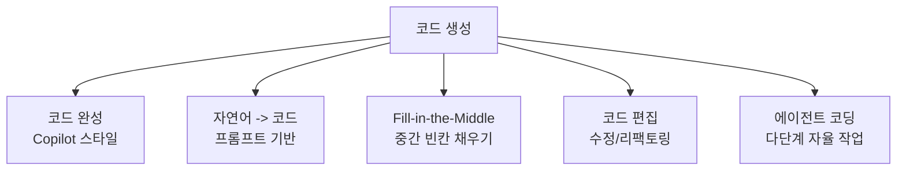

# LLM 코드 생성

LLM을 사용해 자연어 명세나 부분 코드에서 **프로그래밍 코드를 자동 생성**하는 기법. [[coding-agent|코딩 에이전트]]의 핵심 능력이며, [[humaneval|HumanEval]]/MBPP로 평가한다.

## 코드 생성 패러다임

## 주요 코드 LLM

| 모델 | 개발사 | 특징 |
|------|--------|------|
| Codex | OpenAI | GPT-3 코드 파인튜닝, GitHub Copilot 원동력 |
| StarCoder 2 | BigCode | 619개 언어, 3.3-15.5B, [[fill-in-the-middle\|FIM]] 지원 |
| DeepSeek-Coder | DeepSeek | 코드 특화, V2에서 MoE |
| Code Llama | Meta | Llama 2 코드 파인튜닝, 100K 컨텍스트 |
| Qwen2.5-Coder | Alibaba | 오픈소스 코드 SOTA |

## 평가

- **[[humaneval-mbpp\|HumanEval/MBPP]]**: 함수 수준 생성, pass@k
- **SWE-bench**: 실제 GitHub 이슈 해결
- **[[livecodebench\|LiveCodeBench]]**: 동적 오염 방지

## [[ai-coding-agent-era|코딩 에이전트]]와의 관계

단순 코드 생성이 "한 함수 만들기"라면, 코딩 에이전트는 "파일 탐색 -> 이해 -> 수정 -> 테스트 -> 커밋"의 전체 워크플로를 자율 수행한다.

## 관련 문서
- [[neural-program-synthesis]] -- 신경 프로그램 합성 (Neural Program Synthesis)

- [[coding-agent]] -- 코딩 에이전트
- [[ai-coding-agent-era]] -- AI 코딩 에이전트 시대
- [[humaneval-mbpp]] -- HumanEval/MBPP
- [[fill-in-the-middle]] -- Fill-in-the-Middle
