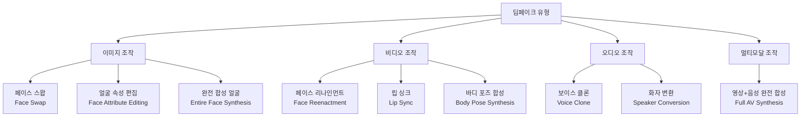
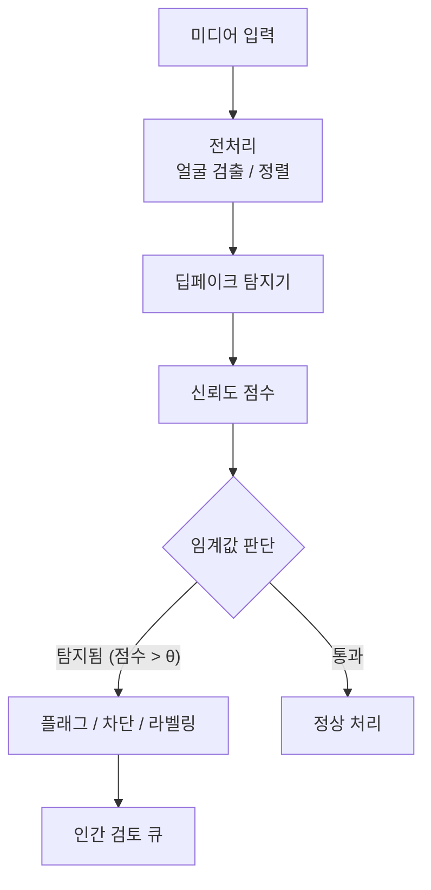

# 딥페이크 탐지 (Deepfake Detection)

## 개요

딥페이크(Deepfake)는 딥러닝 기반 생성 모델(GAN, 확산 모델, 오토인코더)로 조작된 미디어 콘텐츠를 총칭한다. 특정인의 얼굴을 다른 사람에게 이식하는 페이스 스왑(face swap), 표정·입술을 조작하는 페이스 리나인먼트(face reenactment), 완전히 새로운 얼굴을 합성하는 완전 합성(entirely synthetic face), 음성을 복제하는 보이스 클론(voice clone) 등이 포함된다.

딥페이크 탐지(Deepfake Detection)는 이러한 조작된 미디어를 자동으로 식별하는 컴퓨터 비전 및 디지털 포렌식 기술이다. 딥페이크의 생성 품질이 급격히 향상되면서, 탐지 기술과 생성 기술 사이에 군비 경쟁(arms race) 구도가 형성되고 있다.

## 딥페이크의 유형



---

## 탐지 접근법

### 1. CNN 기반 이진 분류

가장 직접적인 접근법. 진짜/가짜 레이블로 학습된 CNN이 입력 이미지/비디오 프레임을 분류한다.

- **ResNet, EfficientNet**: 사전 학습 특성 추출기로 파인튜닝
- **Xception**: FaceForensics++ 벤치마크에서 표준으로 사용된 아키텍처
- **ViT (Vision Transformer)**: 전역적 패턴 학습에 유리, 최근 고성능 방법에 채택

**한계**: 특정 생성 방법으로 훈련하면, 다른 생성 방법(unseen generators)에는 일반화가 매우 약함.

### 2. 주파수 도메인 분석

딥페이크 생성 모델은 특정 주파수 패턴을 남기는 경향이 있다:
- **GAN 업샘플링 아티팩트**: 주기적 패턴이 주파수 스펙트럼에 격자 형태로 나타남
- **DCT 분석**: JPEG 압축 히스토리와 조작 영역 불일치
- **F3Net**: 주파수 특성과 지역 특성을 혼합하여 미세한 아티팩트 탐지

```python
import numpy as np
from scipy.fft import fft2, fftshift

def frequency_artifact_analysis(image):
    """
    이미지의 주파수 스펙트럼에서 딥페이크 아티팩트 분석
    """
    gray = image.mean(axis=-1)
    f_transform = fft2(gray)
    f_shifted = fftshift(f_transform)
    magnitude_spectrum = np.log(np.abs(f_shifted) + 1)
    
    # 격자 패턴 유무 확인 (GAN 업샘플링 아티팩트)
    # 실제 구현에서는 학습된 분류기로 판별
    return magnitude_spectrum
```

### 3. 얼굴 생체 신호 기반 탐지

딥페이크 비디오는 생체 신호(physiological signal)를 정확하게 재현하지 못한다는 점을 활용한다.

**rPPG (Remote Photoplethysmography)**:
- 피부색의 미세한 변화로 심박수를 원격 측정
- 진짜 얼굴은 심박에 따른 색상 변화가 일관됨
- 딥페이크는 이 미세 신호를 보존하지 못하여 일관성 결여

**눈 깜빡임 패턴**:
- 딥페이크 초기에는 눈 깜빡임 빈도나 패턴이 비자연적이었음
- 현재 고급 딥페이크는 이 단서를 해결하였으나, 여전히 미세 안구 운동(saccade) 패턴에서 불일치 탐지 가능

**얼굴 랜드마크 일관성**:
- 눈, 코, 입, 귀의 기하학적 일관성과 시간적 안정성 분석
- 진짜 얼굴은 3D 구조의 투영이므로 일관된 기하학적 제약을 따름

### 4. 시간적 일관성 분석 (비디오)

단일 프레임 탐지는 고품질 딥페이크에 취약하다. 시간 축을 활용한 접근:

- **광학 흐름(Optical Flow)**: 연속 프레임 간 픽셀 이동 패턴. 딥페이크에서는 얼굴 경계의 흐름이 부자연스러운 경우가 있음
- **재귀 신경망(RNN/LSTM)**: 시퀀스 특성을 학습하여 시간적 불일치 탐지
- **3D CNN**: 시공간 특성을 동시에 처리

### 5. 멀티모달 탐지 (오디오-비디오)

음성과 영상의 불일치를 탐지:
- **입술 동기화 분석**: 음소(phoneme)와 입술 모양의 시간적 대응 확인
- **음성과 얼굴 감정의 일치성**: 감정 표현이 음성 내용과 일치하는지
- **오디오 품질 불일치**: 배경 노이즈, 방 음향이 영상과 다른 경우

---

## 주요 벤치마크

### FaceForensics++ (FF++)

Roessler et al. (2019)이 구축한 표준 딥페이크 탐지 벤치마크. 1,000개 실제 비디오에 4가지 조작 방법(Deepfakes, Face2Face, FaceSwap, NeuralTextures)을 적용.

- **C0**: 압축 없음
- **C23**: 약한 압축 (실제 소셜 미디어 배포 시나리오)
- **C40**: 강한 압축

C40 조건에서 탐지 성능이 급격히 하락하므로, 실제 배포 환경에서의 한계를 드러낸다.

| 방법 | FF++ C23 AUC | FF++ C40 AUC |
|------|------------|------------|
| Xception | 99.7% | 95.5% |
| F3Net | 99.8% | 97.5% |
| CLIP 기반 방법 (2024) | 99.9% | 98.8% |

### 기타 주요 데이터셋

| 데이터셋 | 규모 | 특징 |
|---------|------|------|
| DFDC (Facebook) | 100K+ 클립 | 다양한 생성 방법, 실제 배포 조건 |
| Celeb-DF v2 | 590 실제 + 5,639 딥페이크 | 고품질 딥페이크 |
| DFW (Deepfake in the Wild) | 야생 수집 | 실제 소셜 미디어 딥페이크 |
| WildDeepfake | 3,805 얼굴 시퀀스 | 야생 환경 다양성 |

---

## 오디오 딥페이크 탐지

### 스펙트로그램 분석

음성 클론 탐지는 텍스트-음성 합성(TTS)과 음성 변환(VC) 모두를 대상으로 한다.

- **멜 스펙트로그램 특성**: 합성 음성은 특정 주파수 대역에서 과도하게 매끄럽거나 부자연스러운 패턴
- **위상 정보**: 자연 음성의 위상 패턴은 합성 음성보다 복잡하고 비정규적
- **MFCC(Mel-Frequency Cepstral Coefficients)**: 전통적 음성 특성으로 조작 탐지

### ASVspoof 챌린지

오디오 딥페이크 탐지의 표준 벤치마크. ASVspoof 2021에서는 LA(Logical Access), PA(Physical Access), DF(DeepFake) 세 트랙으로 구성된다.


---

## 범용적 탐지의 도전

### 일반화 문제 (Generalization)

특정 딥페이크 생성기로 훈련된 탐지기는 새로운 생성기에 대한 탐지 성능이 급격히 저하된다. 이를 "closed-set" 대 "open-set" 문제라 한다.

**해결 접근법**:
- **도메인 적응(Domain Adaptation)**: 타겟 도메인의 레이블 없는 데이터로 탐지기 적응
- **메타 학습(Meta-Learning)**: 새로운 생성기에 빠르게 적응하는 모델 학습
- **이상 탐지(Anomaly Detection)**: 실제 얼굴 분포에서 벗어나는 경우를 탐지 (생성기에 독립적)
- **기초 모델 활용**: CLIP, DINO 등 대규모 사전 학습 표현을 프로브로 활용

### 적대적 공격 (Adversarial Attacks)

딥페이크 생성 과정에서 탐지기를 속이는 적대적 교란을 삽입하는 공격:
- 탐지기의 결정 경계에서 멀어지도록 딥페이크를 정제
- 탐지기에 접근 없는 블랙박스 공격도 가능 (전이 가능성)

---

## 실제 배포 고려사항

### 탐지 파이프라인



### 실무 이슈

- **처리 속도 vs 정확도**: 실시간 스트리밍 환경에서는 수십 ms 내 탐지 필요
- **오탐율(False Positive)**: 영화 합성, 미디어 아트 등 합법적 합성 콘텐츠 오분류 위험
- **컴퓨팅 비용**: 대규모 플랫폼에서 모든 업로드 콘텐츠 스캔은 막대한 비용
- **법적 책임**: 탐지 결과에 기반한 콘텐츠 제거가 잘못된 경우의 책임 소재
- **우회 가능성**: 오픈소스 생성 모델로 탐지기 맞춤형 딥페이크 생성 가능

---

## 상용 및 오픈소스 솔루션

| 도구 | 제공사 | 접근 방식 |
|------|------|---------|
| Microsoft Video Authenticator | Microsoft | 신뢰도 점수 시각화 |
| Deepware Scanner | Deepware | 소비자용 딥페이크 검사 |
| FotoForensics | 독립 | 이미지 오류 수준 분석 |
| Sensity AI | Sensity | 엔터프라이즈 딥페이크 탐지 API |
| DeepFaceLab Detection | 오픈소스 | 연구용 탐지 도구 |

---

## 연구 동향 (2024-2026)

- **기초 모델 기반 탐지**: CLIP 등 대규모 사전 학습 모델의 표현을 딥페이크 탐지에 활용. 제로샷(zero-shot) 일반화 능력이 주목
- **확산 모델 생성 콘텐츠 탐지**: GAN 기반 탐지기가 확산 모델 딥페이크에는 잘 작동하지 않아 새로운 접근법 연구 중
- **멀티모달 탐지**: 영상과 음성을 동시에 분석하는 통합 탐지 시스템
- **설명 가능한 탐지**: 어느 영역이 왜 딥페이크인지 근거 제시 (Grad-CAM, LIME 활용)
- **연합 탐지**: 플랫폼 간 데이터 공유 없이 탐지 모델을 공동 개선하는 [[federated-learning]] 적용

---

## 관련 문서

- [[ai-content-detection]] - AI 생성 콘텐츠 탐지 전반 (텍스트, 이미지 포함)
- [[ai-content-moderation]] - 유해 콘텐츠 필터링 정책 및 시스템
- [[ai-watermarking]] - 생성 콘텐츠에 식별 신호 삽입
- [[gans]] - 딥페이크 생성에 주로 사용되는 생성적 적대 신경망
- [[privacy-preserving-ml]] - 생체 데이터 처리에서의 프라이버시 고려

---

## 참고 자료

- Rossler, A. et al. (2019). "FaceForensics++: Learning to Detect Manipulated Facial Images." ICCV 2019.
- Zhao, T. et al. (2021). "Multi-attentional Deepfake Detection." CVPR 2021.
- Cozzolino, D. et al. (2024). "Raising the Bar of AI-generated Image Detection with CLIP." CVPR 2024 Workshop.
- Yi, Z. et al. (2024). "Audio Deepfake Detection: A Survey." arXiv 2024.
