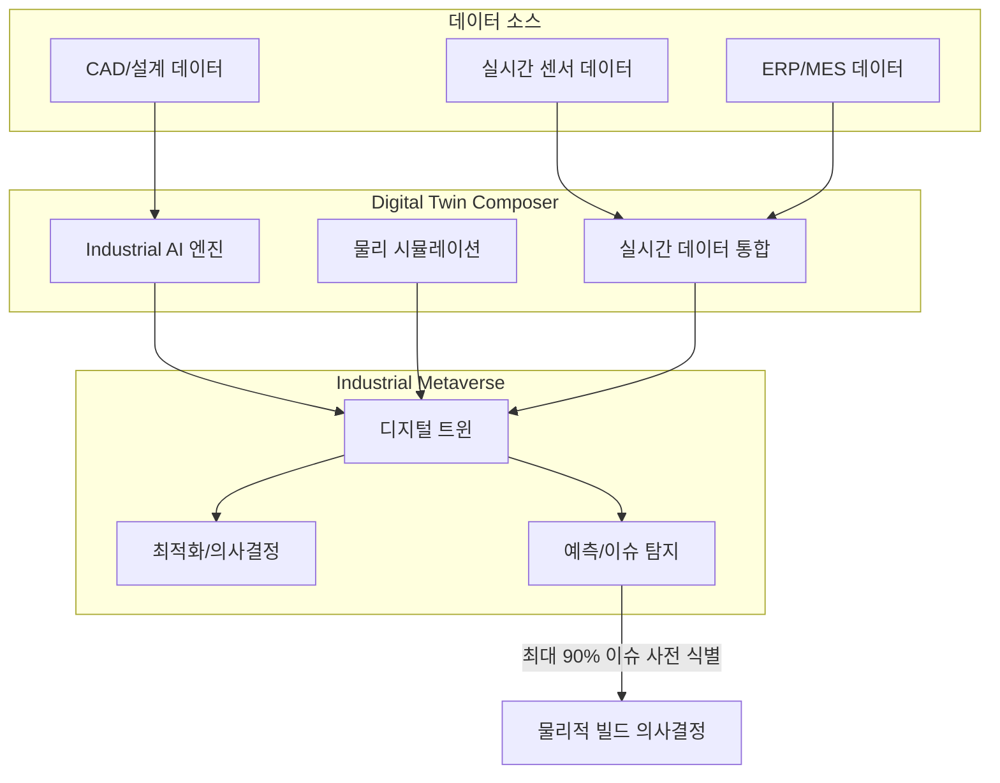

# Siemens Digital Twin Composer

## 개요

Siemens가 CES 2026에서 발표한 Digital Twin Composer는 Industrial Metaverse 환경을 대규모로 구축하는 소프트웨어 솔루션이다. **Industrial AI + 시뮬레이션 + 실시간 물리 데이터**를 결합하여 물리적 빌드 전에 가상으로 의사결정을 내릴 수 있게 한다.

핵심 가치 제안: 물리적 빌드 전 잠재적 이슈의 **최대 90%를 사전 식별**하여 설계 사이클을 가속하고 Capex를 절감한다.

## 핵심 기능

- **Industrial Metaverse** 환경 대규모 구축
- Industrial AI + 시뮬레이션 + **실시간 물리 데이터** 통합
- 설계 사이클 가속, Capex 절감
- 물리적 빌드 전 잠재적 이슈의 **최대 90% 식별**

## 아키텍처

위 다이어그램은 Digital Twin Composer의 데이터 흐름을 보여준다. 센서, 설계, ERP 데이터가 AI와 시뮬레이션을 거쳐 Industrial Metaverse의 디지털 트윈으로 통합되고, 이를 기반으로 이슈 탐지 및 최적화 의사결정이 이루어진다.

## 사용 사례

| 고객/분야 | 적용 내용 |
|-----------|-----------|
| PepsiCo | 미국 제조/창고 시설의 디지털 전환 |
| 자율 제조 | 양자 최적화와 결합한 자율 공장 |
| 자동차 | 소프트웨어 정의 차량 (PAVE360) |
| 바이오/제약 | 신약 발견 (Dotmatics 인수 통합) |

## 2026년 디지털 트윈 트렌드

| 트렌드 | 설명 |
|--------|------|
| 정적 -> 지능형 | 정적 가상 복제에서 **AI 기반 지능형 시스템**으로 전환 |
| 자산 -> 엔터프라이즈 | 개별 자산 트윈에서 비즈니스 프로세스, 공급망, 고객 여정 트윈으로 확장 |
| 초저지연 제어 | sub-10ms 연결로 **클로즈드 루프 제어** (로봇 모션 플래닝, 적응형 QC) |

## 시장 맥락

Digital Twin Composer는 Siemens의 산업 AI 전략의 핵심이다. CES 2026에서의 발표는 디지털 트윈이 더 이상 시각화 도구가 아니라 **AI 기반 의사결정 플랫폼**으로 진화했음을 보여준다.

NVIDIA Omniverse와의 협업(Siemens-NVIDIA 파트너십), Dotmatics 인수를 통한 바이오 분야 확장 등 Industrial Metaverse 생태계를 공격적으로 구축 중이다.

## 관련 문서

- [[ai-manufacturing]] -- AI 제조/디지털 트윈 시장 전반
- [[ai-robotics-physical-ai]] -- Physical AI 및 자율 제조
