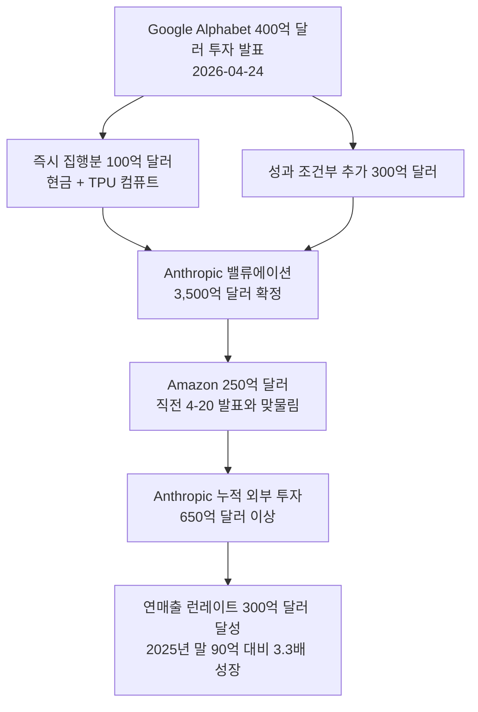

# Google Alphabet, Anthropic에 최대 400억 달러 투자 (2026년 4월)

## 사건 개요

2026년 4월 24일, Alphabet(Google 모회사)이 Anthropic에 **최대 400억 달러**를 투자한다고 발표했다. 이는 AI 산업 역사상 단일 기업에 대한 최대 규모 투자 사례 중 하나로, 투자 발표 직전 Amazon도 250억 달러 추가 투자를 선언한 직후라 AI 인프라 패권 경쟁이 가속화됐음을 상징하는 사건이다.

위 다이어그램은 Google과 Amazon 투자가 어떻게 Anthropic의 밸류에이션과 성장 서사를 뒷받침하는지 보여준다.

---

## 투자 구조

### 즉시 집행분 (100억 달러)

- **형태**: 현금 + Google Cloud TPU 컴퓨트 크레딧 복합 구성
- **목적**: Anthropic의 모델 학습 및 서빙 인프라 확보
- Google은 이미 Anthropic의 주요 클라우드 파트너로, TPU를 사전 공급 중

### 성과 조건부 추가 (300억 달러)

- 구체 성과 조건은 비공개
- 일반적으로 이런 구조는 매출 마일스톤, 기술 이정표, 거버넌스 조건 등을 포함
- 총합 400억 달러는 "최대값(up to)"으로, 조건 미충족 시 실제 집행액은 적을 수 있음

### 복합 투자 형태 (현금 + 컴퓨트)

Google의 투자 방식은 Microsoft-OpenAI 모델과 유사하게 **현금+클라우드 크레딧 복합 구조**를 취했다. 이는:

1. Google Cloud 수익 확보 (Anthropic이 TPU를 사용할수록 구글 매출 발생)
2. 독점 기술 접근권 확보
3. 실질적 클라우드 전환 비용 감소 (경쟁사 플랫폼 이탈 방지)

라는 세 가지 이점을 동시에 추구하는 구조다.

---

## 투자 배경 및 맥락

### Anthropic의 폭발적 성장

| 지표 | 수치 | 비고 |
|------|------|------|
| 연매출 런레이트 (2026년 4월) | 300억 달러 이상 | CNBC 보도 기준 |
| 연매출 런레이트 (2025년 말) | 90억 달러 | 불과 4-5개월 전 |
| 연간 100만 달러 이상 지출 기업 고객 | 1,000개 이상 | 엔터프라이즈 확산 증거 |
| 밸류에이션 | 3,500억 달러 | 이번 라운드 기준 |
| 총 누적 투자 수령액 | 650억 달러 이상 | Google+Amazon만 합산 |

### Amazon-Anthropic 250억 달러 투자 (4월 20일)

Google 발표 나흘 전인 4월 20일, Amazon도 Anthropic에 추가 250억 달러 투자와 5기가와트(GW) 컴퓨트 공급 계약을 발표했다. 이 두 발표의 연속성은 우연이 아닌 경쟁 구도를 반영한다:

- Amazon이 발표 → Google이 더 큰 규모로 응수
- AI 인프라 패권을 둔 빅테크 간 "Anthropic 확보 경쟁" 가시화

자세한 내용은 [[amazon-anthropic-5gw-compute]] 참조.

### AI 컴퓨트 전쟁 구도

2026년 4월 현재 AI 인프라 투자 경쟁은 단순한 재무 투자를 넘어 전략적 컴퓨트 확보 전쟁으로 진화했다:

- **Microsoft**: OpenAI에 130억 달러 이상 투자, Azure 독점 공급
- **Google**: Anthropic에 400억 달러 투자, TPU 공급 + Google Cloud
- **Amazon**: Anthropic에 250억 달러 + 5GW 컴퓨트, Trainium 칩 공급
- **NVIDIA**: OpenAI와 10GW 파트너십

각 플레이어는 AI 클라우드 컴퓨트 수요를 자사 인프라로 끌어오기 위해 투자를 경쟁적으로 늘리고 있다.

---

## 시장 반응

### Figma 주가 하락

Google 투자 발표 당일, 동시에 공개된 [[claude-design]] 관련 뉴스(Anthropic Labs의 시각 결과물 생성 도구)가 Figma의 시장 포지션을 위협한다는 우려로 Figma 주가가 7% 이상 하락했다.

### AI 버블 논쟁 재점화

3,500억 달러 밸류에이션에 대해 AI 버블 가능성을 지적하는 시각도 존재한다. [[ai-economic-impact]] 관련 맥락에서 보면:

- Anthropic의 매출 성장률(4-5개월 만에 90억 → 300억 달러)은 전례 없는 속도
- 반면 수익성(순이익)은 공개되지 않았으며, 모델 학습 비용이 극히 높은 구조
- 3,500억 달러 밸류에이션은 현재 매출의 약 11.7배 수준 (성장 기대치 반영)

---

## 전략적 함의

### Google 입장

1. **검색 방어**: AI 검색(Perplexity, ChatGPT Search)으로부터 핵심 사업 방어
2. **클라우드 경쟁력**: AWS와의 AI 클라우드 경쟁에서 Anthropic 모델 활용
3. **기술 독점 방지**: Anthropic이 경쟁사 클라우드로 완전히 이전하는 시나리오 차단
4. **Google DeepMind와의 병렬 전략**: 자체 Gemini 개발 + 외부 Claude 투자로 리스크 분산

### Anthropic 입장

1. **컴퓨트 확보**: 모델 학습에 필요한 막대한 GPU/TPU 비용 선조달
2. **밸류에이션 레버리지**: 향후 IPO 또는 추가 라운드를 위한 기반 마련
3. **독립성 유지**: 단일 투자자(Microsoft-OpenAI 구조) 대신 복수 파트너 확보로 협상력 유지
4. **글로벌 확장**: NEC 파트너십 등 지역 파트너 전략에 자금 투입

---

## [[ai-economic-impact]] 관점

이 투자는 AI 산업의 경제적 구조 변화를 상징한다:

- **자본 집약화 가속**: 프론티어 AI 개발이 수백억 달러 수준의 투자를 요구하는 구조로 진화
- **빅테크 과점 강화**: Google, Amazon, Microsoft가 프론티어 AI의 핵심 인프라 제공자로 고착화
- **스타트업-대기업 공생 모델**: Anthropic 같은 AI 전문 스타트업이 빅테크 인프라에 의존하는 새로운 생태계 형성
- **국가 전략 자원화**: AI 컴퓨트 인프라가 지정학적 자산으로 인식되기 시작

---

## [[claude-models]] 연관성

투자금은 직접적으로 다음 세대 Claude 모델 개발에 투입될 전망이다:

- 현재 Claude Opus 4.7(2026년 4월 출시)의 후속 모델 학습 비용
- 더 긴 컨텍스트 윈도우, 멀티모달 능력, 에이전틱 기능 강화를 위한 연산 확보
- Google TPU 최적화를 통한 추론 비용 절감 연구

---

## 후속 관찰 포인트

1. **조건부 300억 달러 집행 여부**: 어떤 마일스톤을 달성해야 집행되는지
2. **IPO 타임라인**: 밸류에이션 3,500억 달러 확정 후 상장 계획 공개 여부
3. **Google-Amazon 간 컴퓨트 경쟁**: 두 클라우드 간 Anthropic 워크로드 배분 구도
4. **Broadcom TPU 3.5GW 공급 계약**(4월 6일 발표)과의 연계: 인프라 다각화 완성도
5. **Claude 성능과 투자 수익률**: 모델 성능 향상이 매출 성장으로 이어지는 검증 여부

---

## 관련 문서

- [[claude-models]] - Anthropic 모델 시리즈 개요
- [[ai-economic-impact]] - AI의 거시경제적 영향
- [[amazon-anthropic-5gw-compute]] - Amazon-Anthropic 컴퓨트 협약 (4월 20일)
- [[anthropic-30b-revenue-milestone]] - Anthropic 300억 달러 매출 마일스톤
- [[ai-accelerators]] - AI 가속기 및 컴퓨트 인프라 개요
- [[ai-ma-mega-deals]] - AI 분야 대형 M&A 및 투자 딜 모음
