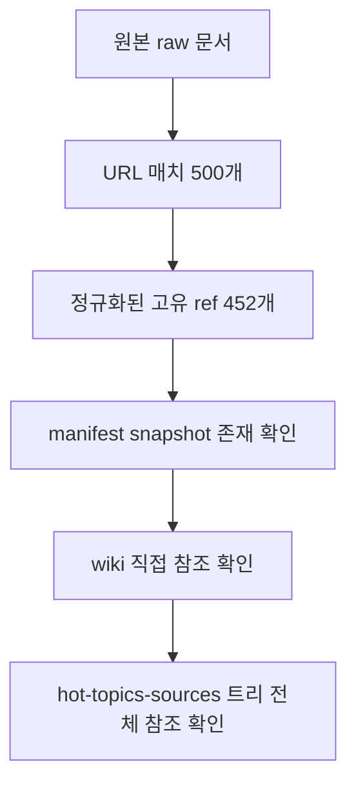

# 2026년 4월 핫토픽 corpus coverage audit

`raw/2026-04-10-hot-ai-topics-100.md`에 들어 있던 원본 링크 corpus가 실제로 모두 위키에 흡수되었는지 검증한 감사(audit) 문서다. 이 문서는 “대략 다 했다”가 아니라 **원문 링크 수 → 정규화된 ref 수 → raw snapshot 존재 → wiki 참조 존재** 순서로 coverage를 확인한 기록이다.

## 구조도

이 audit의 핵심은 링크 개수와 저장된 source 개수, 그리고 실제 wiki 반영 개수를 서로 분리해서 본다는 점이다.

## 핵심 수치

| 항목 | 값 | 의미 |
| --- | --- | --- |
| 원본 링크 매치 수 | 500 | raw 문서에 등장한 전체 링크 occurrence |
| 정규화된 고유 URL 수 | 452 | 중복 제거 후 실제 fetch 대상 |
| manifest snapshot 존재 | 452 / 452 | 저장 누락 없는지 확인 |
| manifest raw path의 wiki 직접 참조 | 452 / 452 | 저장된 고유 source가 wiki에 실제 흡수되었는지 확인 |
| hot-topics-sources 트리 전체 참조 | 549 / 549 | snapshot + topic packet 전체가 wiki에 연결되었는지 확인 |

## 판정

- 원본 500개 링크는 중복을 포함한 occurrence 수다.
- 이를 정규화하면 실제 fetch 대상은 452개 고유 URL이다.
- 그 452개는 모두 raw snapshot으로 저장되어 있다.
- 그리고 그 452개는 모두 wiki 페이지들 안에서 직접 참조된다.
- 추가로 `raw/hot-topics-sources/2026-04-10/` 아래 전체 트리 549개 경로(개별 snapshot + topic packet)도 전부 wiki에서 참조된다.

즉 **“500-link corpus는 모두 ingest되었는가?”**라는 질문에 대해, 현재 상태의 답은 **예**다.

## 왜 500개와 452개가 다른가

원본 문서에는 같은 URL이 여러 토픽에서 반복 인용된 경우가 있다. 따라서 ingest 파이프라인은 다음처럼 이해해야 한다.

1. raw 문서 기준 link occurrence는 500개
2. URL 정규화와 중복 제거 후 실제 fetch 대상은 452개
3. topic packet과 standalone/summary/entity/paper 페이지가 이 452개를 재조합해 위키 구조로 흡수

즉 500 → 452의 차이는 **누락이 아니라 deduplication**이다.

## 읽는 방법

- 링크 수는 breadth를 나타낸다.
- 고유 ref 수는 실제 fetch/저장 workload를 나타낸다.
- wiki 참조 수는 최종 ingest completeness를 나타낸다.

이 세 숫자를 섞어 읽으면 “500개였는데 왜 452개냐” 같은 혼동이 생긴다. audit는 이 층위를 분리해 보여 주는 역할을 한다.

## 운영 체크리스트

- manifest의 각 ref가 실제 raw snapshot 파일로 존재하는가?
- 저장된 snapshot 경로가 wiki 페이지에서 직접 참조되는가?
- topic packet까지 포함한 source tree 전체가 orphan 없이 연결되어 있는가?
- 위키 전역 링크/인덱스 무결성이 유지되는가?

## 관련 문서

- [[ai-hot-topics-2026-04|2026년 4월 AI 개발 핫토픽 100선]]
- [[frontier-model-comparison-2026-04|2026년 4월 Frontier Model 비교]]
- [[agent-benchmark-comparison-2026-04|2026년 4월 에이전트 벤치마크 비교]]
