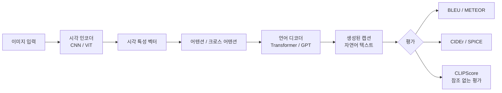
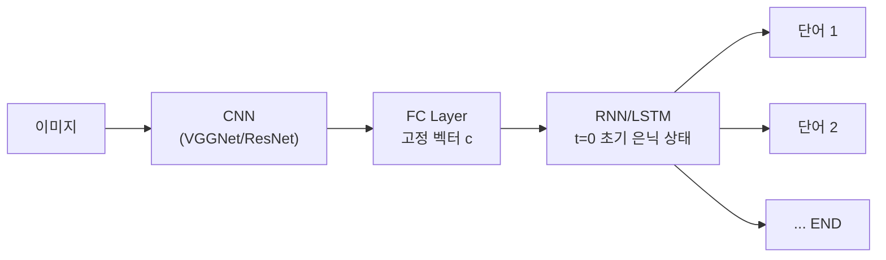
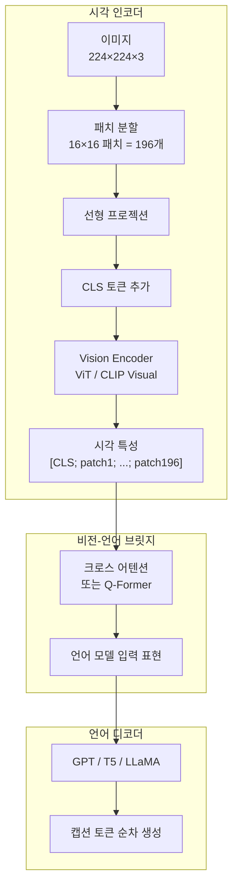
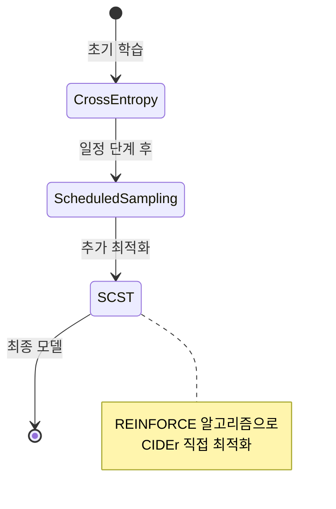

# 이미지 캡셔닝 (Image Captioning)

## 개념 정의

이미지 캡셔닝(Image Captioning)은 입력 이미지에 대해 **자연어 설명(caption)**을 자동으로 생성하는 태스크다. 컴퓨터 비전(Computer Vision)과 자연어 처리(NLP)가 교차하는 멀티모달 AI의 대표 응용이며, 시각 장애인 접근성 지원, 콘텐츠 검색, 의료 영상 보고서 생성 등 폭넓은 실용 분야를 갖는다.

입력: 이미지 (픽셀 또는 인코딩된 시각 특성)
출력: "A dog playing with a ball in a sunny park" 형태의 자연어 문장



---

## 역사적 진화

### 1세대: 검색 기반 (2011-2013)

이미지와 유사한 훈련 이미지를 찾아 해당 캡션을 재사용하는 방식. 새로운 표현을 생성하지 않으므로 다양성 제한.

### 2세대: CNN + RNN 인코더-디코더 (2014-2016)



- **Show and Tell (Vinyals et al., 2015)**: CNN으로 이미지 특성 추출 → LSTM으로 순차 생성. 첫 번째 end-to-end 학습 접근법.
- 한계: 이미지 전체를 단일 벡터로 압축 → 세부 영역 정보 손실

### 3세대: 어텐션 메커니즘 (2015-2018)

- **Show, Attend and Tell (Xu et al., 2015)**: 단어 생성 시 이미지의 **어느 영역을 볼 것인지** 소프트 어텐션으로 결정. 공간적 정보 보존.
- Hard attention vs. Soft attention: Hard는 하나의 영역에만 집중(이산 선택), Soft는 모든 영역의 가중 합산.

### 4세대: Transformer 기반 (2018-2021)

인코더-디코더 구조 전체를 Transformer로 대체. 이미지 패치 또는 객체 영역(region)을 토큰으로 취급.

- **OSCAR (Li et al., 2020)**: 객체 태그를 앵커로 시각-언어 정렬 학습
- **VinVL (Zhang et al., 2021)**: 강력한 객체 탐지기로 추출한 region feature 활용

### 5세대: 대규모 사전 학습 + 멀티모달 LLM (2021-현재)

CLIP, BLIP, BLIP-2, LLaVA 등 대규모 이미지-텍스트 쌍으로 사전 학습된 모델이 표준이 됨. 자세한 내용은 [[blip-paper]], [[blip-2-paper]] 참조.

---

## 핵심 아키텍처

### 인코더-디코더 구조 상세



### BLIP-2 Q-Former 아키텍처

BLIP-2는 고정된 시각 인코더와 고정된 LLM 사이를 잇는 경량 Q-Former(Querying Transformer)를 학습한다.

```python
# BLIP-2 추론 예시 (Hugging Face Transformers)
from transformers import Blip2Processor, Blip2ForConditionalGeneration
from PIL import Image
import requests

processor = Blip2Processor.from_pretrained("Salesforce/blip2-opt-2.7b")
model = Blip2ForConditionalGeneration.from_pretrained(
    "Salesforce/blip2-opt-2.7b",
    device_map="auto",
)

url = "https://example.com/image.jpg"
image = Image.open(requests.get(url, stream=True).raw)

# 조건 없는 캡셔닝
inputs = processor(image, return_tensors="pt").to("cuda")
generated_ids = model.generate(**inputs, max_new_tokens=50)
caption = processor.batch_decode(generated_ids, skip_special_tokens=True)[0].strip()
print(caption)
```

---

## 평가 지표

이미지 캡셔닝 평가는 **참조 기반(reference-based)**과 **참조 없는(reference-free)** 두 종류로 나뉜다.

### 참조 기반 지표

| 지표 | 특성 | 공식 개요 |
|------|------|----------|
| BLEU-4 | n-gram 정밀도 | 4-gram 오버랩의 기하 평균 |
| METEOR | 동의어·어간 처리 | F-score + 순서 페널티 |
| ROUGE-L | 최장 공통 부분 수열 | LCS 기반 재현율 |
| CIDEr | 시각 설명 특화 | TF-IDF 가중 n-gram 합의도 |
| SPICE | 시맨틱 구문 분석 기반 | 장면 그래프 F-score |

**CIDEr**가 인간 평가와의 상관관계가 가장 높아 주로 사용된다:

$$\text{CIDEr}_n(c, S) = \frac{1}{|S|} \sum_{s_i \in S} \frac{\mathbf{g}^n(c) \cdot \mathbf{g}^n(s_i)}{||\mathbf{g}^n(c)|| \cdot ||\mathbf{g}^n(s_i)||}$$

### 참조 없는 지표

- **CLIPScore**: 생성된 캡션과 이미지를 CLIP으로 인코딩하여 코사인 유사도 계산. 참조 캡션 불필요.
- **PAC-S**: CLIPScore를 개선한 버전으로 정확도-일관성 균형 개선.

```python
import torch
from transformers import CLIPProcessor, CLIPModel

def clip_score(image, caption: str) -> float:
    """이미지-캡션 쌍의 CLIPScore를 계산한다."""
    clip_model = CLIPModel.from_pretrained("openai/clip-vit-base-patch32")
    clip_processor = CLIPProcessor.from_pretrained("openai/clip-vit-base-patch32")

    inputs = clip_processor(text=[caption], images=[image], return_tensors="pt", padding=True)
    with torch.no_grad():
        outputs = clip_model(**inputs)
        score = outputs.logits_per_image[0][0].item()
    return score
```

---

## 멀티모달 LLM과의 통합

최신 트렌드는 이미지 캡셔닝을 독립 태스크로 보지 않고 **멀티모달 LLM의 하위 능력**으로 통합하는 것이다.

### 지시 기반 캡셔닝 (Instruction-Following Captioning)

```python
from transformers import AutoProcessor, LlavaForConditionalGeneration
from PIL import Image

model_id = "llava-hf/llava-1.5-7b-hf"
model = LlavaForConditionalGeneration.from_pretrained(model_id, device_map="auto")
processor = AutoProcessor.from_pretrained(model_id)

image = Image.open("scene.jpg")
prompt = "<image>\nUSER: 이 이미지를 시각 장애인도 이해할 수 있도록 상세하게 설명해 줘.\nASSISTANT:"

inputs = processor(text=prompt, images=image, return_tensors="pt").to("cuda")
output = model.generate(**inputs, max_new_tokens=200)
caption = processor.decode(output[0], skip_special_tokens=True)
```

### 밀도 있는 캡셔닝 (Dense Captioning)

이미지 전체가 아닌 **특정 영역(region)**에 대한 캡션 생성. 의료 영상에서 특히 중요하다.

---

## 접근성 응용 (Accessibility)

이미지 캡셔닝은 **시각 장애인을 위한 AI 접근성**([[ai-accessibility-tools]])의 핵심 기술이다.

### 주요 응용 시나리오

| 시나리오 | 설명 | 요구 품질 |
|----------|------|----------|
| 대체 텍스트(alt text) 자동 생성 | 웹 이미지의 alt 속성 자동 채우기 | 간결, 정확 |
| 화면 낭독기 연동 | 이미지 탐색 시 실시간 설명 | 저레이턴시 |
| 의료 영상 보고서 | X-ray, CT 영상 자동 기술 | 높은 정확도, 전문 용어 |
| 소셜 미디어 | 업로드 이미지 자동 설명 | 다국어, 빠른 처리 |
| 자율주행 | 주변 환경 실시간 기술 | 안전-critical |

### 접근성 표준 요건

- WCAG 2.1: 모든 이미지에 동등한 대안 텍스트 제공 의무
- 장식적 이미지: `alt=""` (빈 문자열)
- 복잡한 차트/그래프: 긴 설명(longdesc 또는 본문 내 설명) 필요

---

## 학습 전략

### 교사 강요 vs 자유 롤아웃

- **교사 강요(Teacher Forcing)**: 훈련 시 이전 예측 대신 실제 정답 토큰을 입력으로 사용. 학습이 빠르지만 노출 편향 문제.
- **스케줄된 샘플링(Scheduled Sampling)**: 점진적으로 모델 예측을 혼합하여 노출 편향 완화.
- **SCST(Self-Critical Sequence Training)**: 강화 학습으로 CIDEr 직접 최적화.



### SCST 손실 함수

$$\mathcal{L}_{SCST} = -\mathbb{E}_{w^s \sim p_\theta}[r(w^s)] = -\sum_t (r(w^s) - b) \log p_\theta(w^s_t | w^s_{1:t-1})$$

- $r(w^s)$: 샘플 시퀀스의 CIDEr 점수
- $b$: 그리디 디코딩 점수 (베이스라인)

---

## 대표 데이터셋

| 데이터셋 | 이미지 수 | 캡션/이미지 | 특징 |
|----------|----------|------------|------|
| MS COCO | 123,287 | 5 | 가장 널리 사용, 일상 장면 |
| Flickr30k | 31,783 | 5 | 인물/행동 중심 |
| Visual Genome | 108,249 | 50+ | 영역별 밀도 있는 주석 |
| Conceptual Captions | 3.3M | 1 | 웹 크롤링, 노이즈 많음 |
| LAION-5B | 5.85B | 1 | 대규모 사전 학습용 |
| NoCaps | 15,100 | 11 | 도메인 외 일반화 평가 |

---

## 현재 과제와 한계

| 과제 | 설명 |
|------|------|
| 환각(Hallucination) | 이미지에 없는 객체를 생성 (CHAIR 지표로 측정) |
| 문화 편향 | 서구 중심 데이터셋으로 문화적 뉘앙스 누락 |
| 추상적 장면 | 감정, 분위기, 아이러니 표현 어려움 |
| 세밀한 구분 | 유사한 외관의 객체 구분 어려움 |
| 텍스트 포함 이미지 | OCR과의 통합이 필요한 경우 |

### 환각 측정 (CHAIR)

$$\text{CHAIR}_i = \frac{|\text{환각된 객체를 포함한 캡션}|}{|\text{전체 캡션}|}$$

$$\text{CHAIR}_s = \frac{|\text{환각된 객체 인스턴스}|}{|\text{전체 언급된 객체}|}$$

---

## 관련 문서

- [[image-captioning-architecture]] - 캡셔닝 아키텍처 상세
- [[blip-paper]] - BLIP 논문 요약
- [[blip-2-paper]] - BLIP-2 Q-Former 아키텍처
- [[ai-accessibility-tools]] - AI 기반 접근성 도구
- [[multimodal-llm]] - 멀티모달 대형 언어 모델 개요
- [[vision-transformer]] - 시각 인코더 ViT 아키텍처
