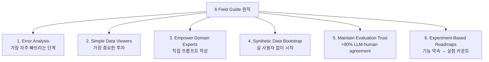

# A Field Guide to Rapidly Improving AI Products (Hamel Husain 2025-03)

Hamel Husain이 30+ 프로덕션 LLM 구현 컨설팅 경험에서 도출한 6가지 핵심 실천. 핵심 주장:

> 성공하는 AI 팀은 **도구가 아니라 측정과 반복**을 우선시한다.

## 6가지 핵심 원칙

### 1. Error Analysis (가장 흔히 빠뜨리는 단계)

팀들이 실제 실패 검토를 건너뜀.
- **Bottom-up**: 실제 데이터 검토, 패턴이 자연스럽게 나오게
- **Top-down**: 미리 정의된 에러 카테고리에서 시작

#### 사례: NurtureBoss (실제 케이스 스터디)

날짜 처리 실패가 에러의 **66%**를 차지. 발견 후 성공률 **33% → 95%로 개선**.

이 발견은 단일 failure mode 식별이 어떻게 거대한 성능 점프로 이어지는지 보여주는 대표 사례. error analysis가 "막연한 개선" 대신 **레버리지 큰 한 점**을 드러낸다.

### 2. Simple Data Viewers (가장 중요한 투자)

> "AI 행동 검토용 커스텀 인터페이스가 generic 대시보드를 능가."

핵심 기능:
- 통합 컨텍스트 표시
- 1-click 피드백 캡처
- 자유 형식 어노테이션
- 빠른 필터링 + 핫키 네비게이션

### 3. Empower Domain Experts

도메인 전문가가 엔지니어 통하지 않고 **직접 프롬프트 작성**해야 함.
- 통합 프롬프트 환경을 실제 앱 인터페이스에 임베드
- 번역 friction 제거

> "Prompts are just English"

### 4. Synthetic Data Bootstrap

사용자 데이터 없이 현실적 테스트 케이스 생성:
- Dimensions 정의: features, scenarios, user personas
- 실제 시스템 제약에 ground
- 생성된 쿼리가 의도한 시나리오를 실제로 트리거하는지 검증
- 엣지 케이스 커버하는 다양한 데이터셋

### 5. Maintain Evaluation Trust

**Criteria drift**: 출력을 더 많이 보면서 평가 기준이 진화함.

대응:
- **Binary > scales** (명료, 주관성 적음)
- Binary 판단 + 상세 critique
- LLM-judge alignment를 인간과 측정 — **목표: >90%**
- 가장 alignment 낮은 케이스에 인간 노력 집중

### 6. Experiment-Based Roadmaps

기능 약속에서 실험 cadence로:
- 가설 테스트 중심 작업 구조화
- "**Capability funnels**" — 점진적 유용성 레벨
- Timeboxed exploration phases (2-3개월 사이클)
- 실패 공유를 학습 가속화 자원으로

## 다른 실제 사례

### Honeycomb Query Assistant
LLM evaluator와 인간 전문가 간 **>90% agreement** 달성 (반복 검증으로). [[llm-judge-pattern|Critique shadowing 7단계]] 구현.

### GitHub Copilot Foundation
offline 평가 인프라에 사전 투자 → 레포 전반에 수천 번의 실험 가능. **평가가 실험 속도의 인프라**.

### Content Moderation Case Study
4개월 동안 외관상 실패 후 돌파구 — 전통적 로드맵이라면 프로젝트 조기 종료됐을 것. **Experiment-Based Roadmaps**가 timeboxed exploration을 정당화.

## 핵심 인용

> "Tools trap: belief that right frameworks solve problems while tracking vanity metrics"

> "Prompts are just English" — 인공 장벽 제거하면 도메인 전문가가 직접 기여 가능

> "LLMs are surprisingly good at generating diverse examples for both applications and evals" (Bryan Bischof)

> "Human judgment should drive evaluation criteria rather than precede observation of model outputs"

## 실용적 takeaway

- 데이터 검사 friction 제거하는 커스텀 도구 투자
- 정교한 대시보드 전에 Excel pivot table부터
- 실제 제약에 ground한 다양한 합성 테스트 케이스 생성
- **기능 완료가 아니라 실험 카운트** 추적
- 기능 약속 전에 평가 인프라 구축
- 팀 내 실패 공유 정상화

## 메모

- 게시일: 2025-03-24
- Hamel은 35+ 회사 컨설팅 경험에서 도출
- 본 글은 Vanishing Gradients 팟캐스트 ep.50, Lenny's Newsletter, YouTube 영상 등 다수 매체에 인용된 핵심 가이드

## 관련 문서

- [[llm-eval-best-practices]] — Hamel/Shreya FAQ
- [[llm-judge-pattern]] — Critique Shadowing 7단계
- [[error-analysis-for-evals]] — Error Analysis 가이드
- [[ai-evaluation]] — 일반 AI 평가
- [[anthropic-app-harness-case-study]] — Anthropic의 다른 케이스 스터디
- [[llm-application-patterns-eugene-yan]] — Eugene Yan 7대 패턴
