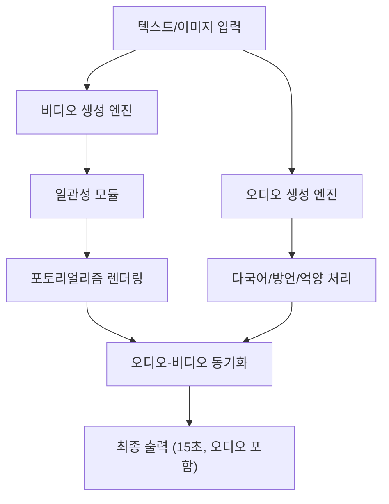

# Kling 3.0

## 개요

Kling 3.0은 Kuaishou Technology의 AI 비디오 생성 모델이다. 일관성(consistency), 포토리얼리스틱(photorealistic) 출력 품질, 확장된 비디오 길이, 네이티브 오디오 생성 등에서 이전 버전 대비 대폭 업그레이드되었다. 2026년 AI 비디오 생성 시장에서 Seedance 2.0에 이어 강력한 2위에 위치한다.

## 핵심 기능

- **최대 15초** 비디오 생성
- **포토리얼리스틱 출력** 품질 대폭 향상
- **일관성(consistency)** 개선 -- 프레임 간 인물/오브젝트 동일성 유지
- **네이티브 오디오 생성**: 다국어, 방언, 억양 지원
- 영상-오디오 동시 생성

## 기술 스택

위 다이어그램은 Kling 3.0의 비디오-오디오 병렬 생성 및 동기화 파이프라인을 도식화한 것이다.

## 경쟁 구도 (2026년)

| 순위 | 모델 | 개발사 | 특징 |
|------|------|--------|------|
| 1위 | Seedance 2.0 | ByteDance | Video Arena 양 부문 1위, 통합 생성 |
| **2위** | **Kling 3.0** | **Kuaishou** | **다국어 오디오, 포토리얼리즘** |
| 3위 | Veo 3 | Google | |
| 4위 | Sora 2 | OpenAI | |

2026년 AI 비디오 생성은 콘텐츠 팀의 가장 빠르게 성장하는 도구로 자리잡았으며, 제작 시간 최대 70% 단축 효과가 보고되고 있다. 중국 기업(ByteDance, Kuaishou)이 1-2위를 차지하며 Google과 OpenAI를 앞서는 양상이다.

## 시장 맥락

Kling 3.0의 차별점은 **다국어 네이티브 오디오**다. 방언과 억양까지 지원하는 점은 글로벌 콘텐츠 제작에서 유의미한 우위를 제공한다. Seedance 2.0과 함께 "비디오+오디오 네이티브 동시 생성"이 2026년 비디오 AI의 핵심 기준이 되었음을 보여준다.

## 관련 문서

- [[seedance-2]] -- ByteDance Seedance 2.0, Video Arena 1위 경쟁자
- [[ai-video-generation]] -- AI 비디오 생성 시장 전반
- [[ai-audio-voice-cloning]] -- AI 오디오/음성 기술
