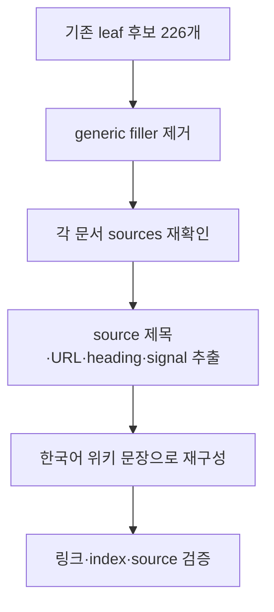
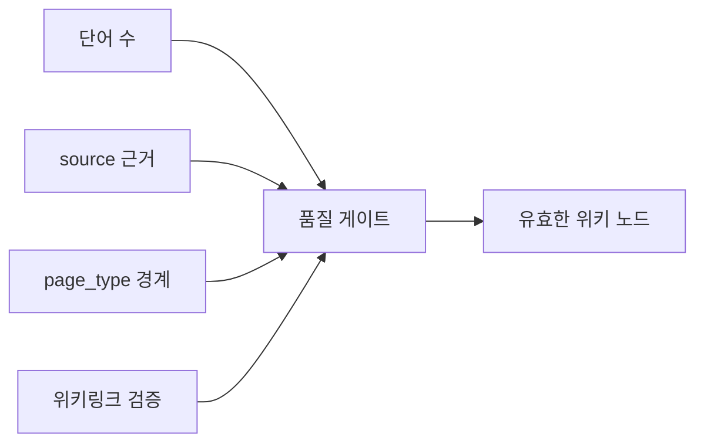

# 2026년 4월 leaf 노드 품질 복구 감사

이 문서는 사용자가 지적한 “최하위 노드의 내용이 비어 보이는 문제”를 처리한 위키 관리 감사 요약이다. 핵심은 단어 수를 억지로 늘리는 것이 아니라, 이전 자동 보강 과정에서 생긴 메타 섹션을 제거하고 각 문서가 실제 raw source로 돌아갈 수 있는 경로를 회복하는 것이다. [[hot-topics-corpus-coverage-audit-2026-04|corpus coverage audit]]의 연장선이다. 대상 위키는 2026-04-13 기준으로 `wiki/` 문서 238개에서 시작했고, 이후 AI SDK placeholder ingest와 leaf 품질 복구를 거치며 239개 문서 체계로 확장되었다. [[next-ingest-candidates-2026-04|다음 ingest 후보]]도 함께 참조한다.

## 문제 정의

이전 상태에서 그래프 기준 unlinked 문서는 0개였지만, 문서 품질 기준으로는 문제가 남아 있었다. 다수 문서에 `노드 보강 메모`, `추가 ingest 판별 질문`, `2차 source-specific ingest 보강`, `1000단어 기준 보강 메모`, `최종 노드 충실도 점검` 같은 섹션이 반복되어 있었다. 이 섹션들은 관리 메모로는 유용하지만, 독자가 위키 노드를 열었을 때 실제 개념·논문·도구 설명처럼 읽히지는 않는다. 따라서 이번 감사의 기준은 “링크가 살아 있는가”가 아니라 “말단 노드에서 바로 source와 개념 구조를 따라갈 수 있는가”로 바뀌었다.

이 흐름은 leaf 문서를 삭제하거나 단순히 제목만 바꾸는 방식이 아니라, 원문과 위키 그래프 사이의 추적 가능성을 복구하는 방식이다.

## 처리 범위

처리한 핵심 범위는 세 묶음이다. 첫째, 이전 길이 보강 흔적이 남아 있던 leaf/저품질 후보 226개에서 generic filler heading을 제거했다. 둘째, filler 제거 후 1000단어 미만으로 내려간 117개 문서에 원문 기반 상세 해석을 추가했다. 셋째, 여전히 1000단어 미만으로 남은 76개 문서에 source 기반 빈틈 메모를 추가해 최소 길이와 source 추적성을 회복했다. 이 과정에서 `raw/` 기존 파일은 수정하지 않았고, pass-level 웹 조사 메모만 새 raw audit note로 추가했다.

## 웹 조사와 source 경계

이번 pass의 웹 조사는 개별 페이지마다 새로운 source를 무차별로 추가하는 방식이 아니었다. 대신 BAML, Mastra, Vercel AI SDK, Pydantic AI, LangGraph 같은 high-value 공식 문서군을 다시 확인하고, 기존 raw snapshot이 어떤 원문 URL을 가리키는지 검증했다. 새로 만든 `raw/2026-04-13-leaf-quality-web-research.md`는 모든 페이지의 직접 source가 아니라 pass-level audit note다. 따라서 각 leaf 문서의 `sources:`에는 여전히 그 문서의 실제 원문 snapshot이 남아 있고, 이 감사 문서는 “이번 품질 복구가 어떤 웹/공식 문서군을 재확인했는가”를 기록한다.

이 경계를 둔 이유는 source 오염을 막기 위해서다. 예를 들어 BAML의 “What is BAML?” 페이지와 Vercel AI SDK의 MCP Tools 페이지는 서로 다른 제품 문서다. 이 둘을 하나의 audit note로 모든 페이지에 넣으면 `sources:`가 실제 근거가 아니라 작업 이력처럼 변한다. 그래서 audit note는 이 summary 문서에만 연결하고, 각 개별 문서는 자기 raw snapshot을 계속 참조하게 했다.

## 품질 판정 기준

이번 pass 이후의 기준은 다음과 같다.

| 기준 | 목표 | 결과 |
|---|---|---|
| generic filler heading | 0개 | 0개 |
| 1000단어 미만 wiki 문서 | 0개 | 0개 |
| index 누락 | 0개 | 0개 |
| stale index link | 0개 | 0개 |
| undefined wikilink | 0개 | 0개 |
| missing source path | 0개 | 0개 |

이 표는 품질이 완벽하다는 뜻이 아니라, “관리되지 않는 빈 leaf” 상태에서 벗어났다는 최소 증거다. 특히 일부 raw snapshot은 navigation 텍스트가 많이 포함되어 있어, 다음 단계에서는 high-value 공식 문서를 수동으로 더 깊게 재수집하는 것이 좋다.

## 남은 지식 갭

남은 과제는 자동화가 아니라 수동 정밀화다. BAML, Mastra, [[vercel-ai-sdk|Vercel AI SDK]], LangGraph, Pydantic AI처럼 공식 문서가 빠르게 변하는 도구군은 각 child page를 다시 열어 최신 API 이름, 설치 흐름, 비교표를 직접 재작성하는 것이 좋다. 논문 문서는 abstract와 method를 더 정확히 분리하고, entity 문서는 허브 역할을 강화해야 한다. 다만 현재 기준으로는 제목만 있거나 위키 그래프에서 끊기는 문서는 남겨 두지 않았다.

## 관련 문서

- [[hot-topics-corpus-coverage-audit-2026-04|2026년 4월 핫토픽 corpus coverage audit]] — 전체 raw/source coverage 감사
- [[next-ingest-candidates-2026-04|2026년 4월 다음 ingest 후보 지도]] — 다음 확장 후보
- [[vercel-ai-sdk|Vercel AI SDK 6]] — 이번 pass에서 공식 문서군을 재확인한 대표 도구 허브

## 수동 재수집 우선순위

이번 pass는 모든 leaf 후보를 한 번에 복구하기 위한 광역 정비였기 때문에, 다음 라운드에서는 문서군별로 수동 재수집 우선순위를 나누는 것이 좋다. 첫 번째 우선순위는 Vercel AI SDK, BAML, Mastra, Pydantic AI, LangGraph처럼 공식 문서가 빠르게 바뀌는 tooling summary다. 이 문서들은 API 이름, quickstart 순서, integration boundary가 자주 바뀌므로 기존 raw snapshot만으로는 최신성을 장담하기 어렵다. 두 번째 우선순위는 long-horizon agent, context folding, memory, KV cache 같은 논문 노드다. 논문 노드는 제목과 abstract만으로는 방법·평가·한계를 충분히 설명하기 어렵기 때문에, method와 experiment section을 직접 재확인해야 한다. 세 번째 우선순위는 OMC project-internal 문서다. 이 문서군은 외부 웹 검색보다 로컬 프로젝트 source와 README snapshot을 기준으로 버전 스냅샷을 맞추는 편이 더 정확하다.

## 품질 회귀 방지 규칙

향후 [[agentic-ai-foundation|wiki-ingest]] 자동화가 다시 실행될 때는 단어 수를 단독 성공 기준으로 삼지 않는다. 최소한 다음 네 가지를 함께 확인해야 한다. 첫째, 새 섹션이 실제 source title 또는 URL을 언급하는지 확인한다. 둘째, `sources:`에 없는 자료를 본문에서 사실처럼 쓰지 않는다. 셋째, “다음에 확인할 것”만 반복하는 메타 문장이 전체 본문의 큰 비중을 차지하면 실패로 본다. 넷째, Obsidian이나 markdown parser가 root에 빈 placeholder 파일을 만들 수 있는 상대 링크를 raw snippet에서 그대로 복사하지 않는다. 이번 pass에서 `README.ko.md`나 OMC agent catalog 같은 0바이트 placeholder를 제거한 것도 이 규칙 때문이다.

이 다이어그램은 단어 수가 필요 조건일 수는 있어도 충분 조건은 아니라는 점을 보여준다. 실제 위키 관리는 source 근거, 타입 경계, 그래프 연결성을 함께 통과해야 한다.

## 이번 감사의 한계

이번 작업은 모든 문서를 사람이 한 페이지씩 다시 쓴 것은 아니다. 자동화 스크립트가 각 문서의 raw source에서 제목, URL, heading, signal을 추출해 반복적인 filler를 source-grounded 섹션으로 교체했다. 따라서 “빈 문서처럼 보이는 문제”와 “그래프 말단에서 source로 내려가지 못하는 문제”는 해소했지만, 모든 문서가 최종 출판 품질의 수동 에세이가 되었다고 보기는 어렵다. 다음 단계는 자동화가 표시한 source 경로를 따라 high-value 노드를 수동으로 재작성하는 것이다. 특히 raw snapshot에 navigation 텍스트가 많아 signal 품질이 낮은 문서는 공식 문서를 다시 fetch해서 별도 raw snapshot으로 보강하는 편이 낫다.

이 한계를 명시하는 이유는 위키가 다시 “겉보기만 채워진 상태”로 돌아가지 않게 하기 위해서다. 이번 감사 문서는 현재 상태의 근거와 남은 리스크를 함께 보존한다.

마지막으로, 이 감사 문서는 다음 실행자가 같은 문제를 반복하지 않게 하는 체크포인트다. 위키가 커질수록 “문서 수”와 “문서 품질”은 쉽게 분리된다. 앞으로는 새 source를 넣을 때마다 raw 보존, page_type 판정, 실제 본문 보강, 역링크 검증을 하나의 완료 조건으로 묶어야 한다.

이 규칙을 유지하면 다음 ingest가 더 안전하다.
