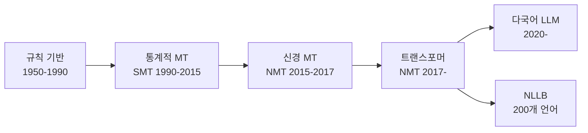
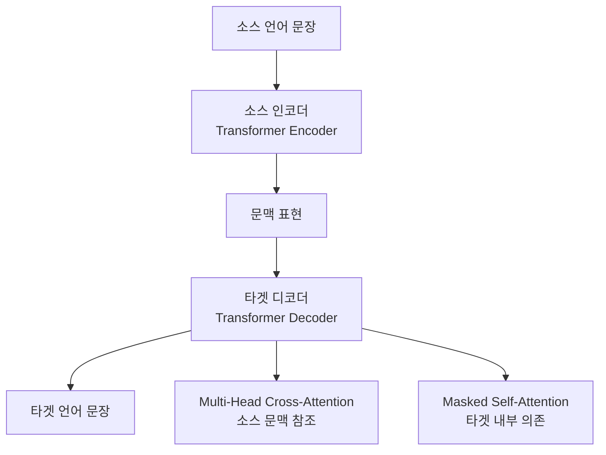

# 현대 기계번역 (Modern Machine Translation)

현대 기계번역(MT, Machine Translation)은 [[seq2seq]] 아키텍처와 [[transformer-architecture]]를 기반으로 하는 신경 기계번역(NMT, Neural MT)이 지배적이다. 2017년 트랜스포머 도입 이후 번역 품질이 인간 번역에 근접하는 수준으로 향상되었으며, NLLB(No Language Left Behind)와 다국어 LLM의 등장으로 저자원 언어 번역도 비약적으로 개선되고 있다.

## 기계번역의 발전 역사



- **규칙 기반 MT**: 언어학자가 수작업으로 번역 규칙 정의. 유연성 부족, 유지보수 비용 막대
- **통계적 MT(SMT)**: 병렬 코퍼스에서 번역 확률을 학습. Google Translate 초기 방식
- **신경 MT(NMT)**: RNN 기반 seq2seq + attention. 유창성 대폭 향상
- **트랜스포머 NMT**: 현재 주류. WMT 벤치마크에서 SMT 대비 BLEU 5-10점 향상
- **다국어 LLM**: GPT-4, Claude, Gemini 등이 번역 포함 범용 능력 보유

## 트랜스포머 기반 NMT 구조



트랜스포머 NMT는 인코더-디코더 구조다. 인코더가 소스 문장을 문맥 표현으로 변환하고, 디코더가 이를 참조하며 타겟 언어 토큰을 자동회귀적으로 생성한다.

## NLLB (No Language Left Behind)

Meta의 NLLB(2022)는 200개 언어 간 번역을 지원하는 다국어 MT 모델이다. 저자원 언어(아프리카, 동남아, 중앙아시아 언어 등) 번역 성능을 획기적으로 개선했다.

### NLLB의 핵심 기여

1. **대규모 다국어 데이터**: FLORES-200 벤치마크 구축 (200개 언어 × 1012 문장)
2. **언어 태그 토큰화**: 입력 시작에 목표 언어 태그 삽입으로 200개 언어 간 번역
3. **마이닝된 병렬 데이터**: CCMatrix, CCAligned 등으로 저자원 언어 병렬 코퍼스 확보

```python
from transformers import AutoModelForSeq2SeqLM, AutoTokenizer

model_name = "facebook/nllb-200-distilled-600M"
tokenizer = AutoTokenizer.from_pretrained(model_name)
model = AutoModelForSeq2SeqLM.from_pretrained(model_name)

# 한국어 -> 스와힐리어 번역
inputs = tokenizer("안녕하세요, 오늘 날씨가 좋네요.", return_tensors="pt",
                   src_lang="kor_Hang")  # 한국어 BCP-47 코드

translated = model.generate(
    **inputs,
    forced_bos_token_id=tokenizer.lang_code_to_id["swh_Latn"]  # 스와힐리어 목표
)
print(tokenizer.batch_decode(translated, skip_special_tokens=True))
```

## 번역 품질 평가 지표

### BLEU (Bilingual Evaluation Understudy)
n-그램 정밀도 기반의 전통적 자동 평가 지표. 빠르고 재현 가능하나 의미적 유사성을 충분히 반영하지 못한다.

$$\text{BLEU} = BP \times \exp\left(\sum_{n=1}^{N} w_n \log p_n\right)$$

- $p_n$: n-그램 정밀도
- $BP$: 길이 패널티(Brevity Penalty)

### COMET (Crosslingual Optimized Metric for Evaluation of Translation)
다국어 사전학습 모델 기반의 신경 MT 평가 지표. 소스 문장, 참조 번역, 생성 번역을 함께 인코딩해 품질을 예측한다. 인간 평가와 상관관계가 BLEU보다 높다.

### chrF (Character F-Score)
문자 n-그램 기반 평가. 형태론적으로 풍부한 언어(한국어, 아랍어 등)에서 BLEU보다 안정적이다.

| 지표 | 장점 | 단점 |
|------|------|------|
| BLEU | 빠르고 표준적 | 의미 유사성 미반영 |
| COMET | 인간 판단과 고상관 | 느리고 모델 의존 |
| chrF | 형태론적 언어에 강건 | 직관적 해석 어려움 |

## 다국어 LLM과 기계번역

GPT-4, Claude, Gemini 같은 대형 언어 모델은 별도 번역 모델 없이도 고품질 번역을 제공한다. 특히:

- **고자원 언어 쌍**: 영-한, 영-일, 영-중에서 WMT 기준 전문 NMT 모델과 동등하거나 우위
- **문맥 인식 번역**: 긴 문서의 일관성, 문화적 뉘앙스, 도메인 용어 번역에서 강점
- **지시 기반 제어**: "격식체로 번역", "의료 용어는 원어 병기" 등 자연어 지시로 번역 스타일 제어

그러나 저자원 언어에서는 전문 NLLB 모델이 LLM을 앞서는 경우가 많고, 속도·비용 측면에서도 전문 NMT 모델이 유리하다.

## 실무 적용 관점

### 번역 메모리와 CAT 도구 통합
번역 메모리(TM, Translation Memory)는 이전에 번역된 문장 쌍을 저장하고, 새 번역 시 유사 문장을 재활용한다. CAT(Computer-Assisted Translation) 도구에 NMT를 통합하면 번역사의 생산성이 40-60% 향상된다는 연구가 있다.

### 도메인 적응 (Domain Adaptation)
일반 MT 모델을 법률·의료·특허 등 특수 도메인에 그대로 적용하면 도메인 전문 용어 번역 오류가 빈번하다. 적은 양(수천 문장)의 도메인 특화 병렬 코퍼스로 파인튜닝하면 성능이 크게 개선된다.

### 번역 후처리
- **용어집(Terminology) 강제 적용**: 특정 용어는 반드시 특정 번역어를 사용해야 하는 경우, 제약 디코딩(constrained decoding)으로 용어집 적용
- **역번역(Back-Translation)**: 타겟→소스 방향으로 번역 후 다시 소스→타겟으로 평가해 일관성 검증

## 관련 문서

- [[seq2seq]] - 기계번역의 기반 아키텍처
- [[transformer-architecture]] - 현대 NMT의 핵심 구조
- [[text-summarization-dl]] - 동일 seq2seq 기반의 다른 생성 태스크
- [[bert]] - 다국어 사전학습 모델(mBERT)의 번역 평가 활용
- [[question-answering-extractive]] - 다국어 QA와 번역의 교차점
