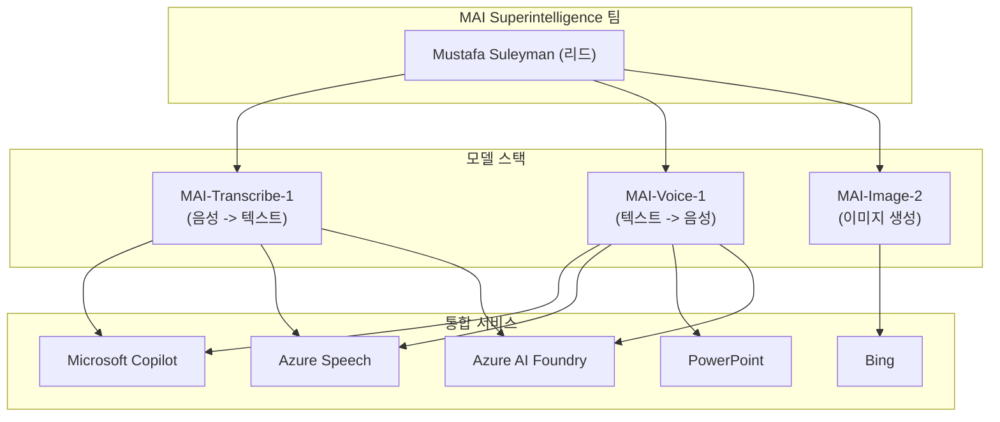

# Microsoft MAI Speech Models

## 개요

Microsoft의 MAI Superintelligence 팀(Mustafa Suleyman 리드)이 개발한 파운데이셔널 음성 모델 시리즈다. MAI-Transcribe-1(STT), MAI-Voice-1(TTS), MAI-Image-2의 3종 모델을 포함하며, Copilot, Bing, PowerPoint, Azure Speech 등 Microsoft 생태계 전반에 이미 통합되어 사용 중이다.

2025년 11월 MAI Superintelligence 팀 결성 발표 이후 첫 성과물로, OpenAI, Google과의 직접 경쟁을 위한 Microsoft의 자체 AI 모델 스택 확장 전략의 핵심이다.

## 핵심 모델

### MAI-Transcribe-1 (음성-텍스트 전사)

- **SOTA 음성-텍스트 전사**: FLEURS 벤치마크 상위 25개 언어 지원
- 실제 환경(노이즈, 다화자)에서 **세계 최고 품질**
- 배치 전사 속도: 기존 Azure Fast 대비 **2.5배**
- 가격: $0.36 USD/시간

### MAI-Voice-1 (음성 생성)

- **최상위 음성 생성 모델**
- 자연스럽고 사실적인 음성: 뉘앙스, 감정 범위, 표현력 보존
- 단일 GPU에서 60초 음성을 **1초 미만**에 생성
- 긴 콘텐츠에서도 **화자 정체성(speaker identity) 유지**
- 가격: $22 USD/1M 문자

### MAI-Image-2

- 이미지 생성 모델 (음성 모델과 함께 3종으로 발표)

## 아키텍처

위 다이어그램은 MAI 모델 스택과 Microsoft 서비스 통합 구조를 보여준다. 세 모델 모두 Azure AI Foundry를 통해 외부 개발자에게도 제공된다.

## 성능/가격 비교

| 모델 | 용도 | 핵심 성능 | 가격 |
|------|------|-----------|------|
| MAI-Transcribe-1 | STT | FLEURS 25개 언어 SOTA, 2.5x 속도 | $0.36/시간 |
| MAI-Voice-1 | TTS | 60초 음성 < 1초 생성, 화자 정체성 유지 | $22/1M 문자 |

## 시장 맥락

MAI Speech Models는 Microsoft가 OpenAI 의존을 줄이고 자체 파운데이셔널 모델 역량을 구축하려는 전략의 일환이다. Mustafa Suleyman(DeepMind 공동 창업자)을 영입하여 MAI Superintelligence 팀을 결성한 것은 Google, OpenAI와 모델 레벨에서 직접 경쟁하겠다는 의지의 표현이다.

- **OpenAI Whisper** 대비 MAI-Transcribe-1의 노이즈 환경 우위 주장
- **ElevenLabs, OpenAI TTS** 등과 MAI-Voice-1이 직접 경쟁
- Azure AI Foundry를 통한 B2B 음성 서비스 시장 공략

## 관련 문서

- [[ai-audio-voice-cloning]] -- AI 음성 생성 및 복제 기술
- [[frontier-model-comparison-2026-04]] -- 2026년 4월 프론티어 모델 비교
