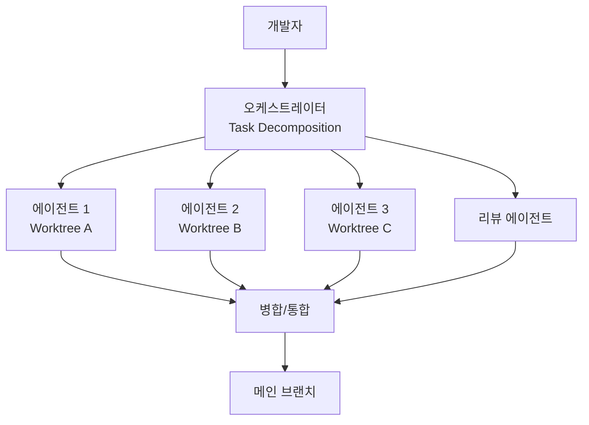

# 멀티에이전트 코딩 웨이브 (2026년 2월)

2026년 2월, 모든 주요 코딩 도구가 동시에 멀티에이전트(multi-agent) 기능을 출시한 현상. 코드베이스의 서로 다른 부분에서 복수의 에이전트가 동시에 작업하는 것이 업계 표준이 되었으며, 단일 에이전트 시대에서 **에이전트 팀 시대**로의 전환을 상징한다.

## 왜 중요한가

- **개발 패러다임 전환**: 개발자의 역할이 코딩에서 오케스트레이션(orchestration)/리뷰로 이동
- **생산성 도약**: 병렬 에이전트로 동시에 여러 기능/버그를 처리
- **인프라 요구 변화**: 격리(isolation), 관찰성(observability), 거버넌스(governance)가 핵심 인프라로 부상

## 동시 출시 라인업

| 제품 | 병렬 에이전트 수 | 개발사 |
|------|-----------------|--------|
| Grok Build | 8 에이전트 | xAI |
| Windsurf | 5 병렬 에이전트 | IDE 통합 |
| Claude Code Agent Teams | N개 | Anthropic |
| Codex CLI | Agents SDK 기반 | OpenAI |
| Devin | 병렬 세션 | Cognition |

## SWE-bench 성능 (2026년 4월)

| 모델/에이전트 | 점수 |
|-------------|------|
| Claude Mythos Preview | 가중 점수 100.0% (잠정 1위) |
| Gemini 3.1 Pro | 94.3% |
| Claude Opus 4.6 | 90.8% (SWE-bench Verified 80.8%) |

## 핵심 패턴

이 다이어그램은 멀티에이전트 코딩의 핵심 아키텍처를 보여준다. 오케스트레이터가 태스크를 분해하고, 각 에이전트가 격리된 worktree에서 병렬 작업한 후, 리뷰 에이전트의 검증을 거쳐 통합된다.

### Git Worktree 격리

각 에이전트가 별도의 git worktree에서 작업하여 상호 간섭 없이 독립적으로 코드를 수정한다. [[orchestrator-worker-pattern|오케스트레이터-워커 패턴]]의 실전 구현체다.

### 태스크 분해(Task Decomposition)

오케스트레이터가 복합 태스크를 독립 서브태스크로 분해하여 각 에이전트에 할당한다.

### 충돌 해결(Conflict Resolution)

병합 시 충돌이 발생하면 자동 해결을 시도하거나 오케스트레이터가 중재한다.

### 리뷰 에이전트(Review Agent)

별도 에이전트가 다른 에이전트의 산출물에 대해 코드 리뷰를 수행하여 품질을 보장한다.

## 실무 적용

- **Git Worktree 기반 격리**: 각 에이전트에 독립 작업 공간 제공
- **관찰성(Observability)**: 에이전트별 진행 상황, 리소스 사용량 모니터링
- **거버넌스**: 에이전트가 수정 가능한 파일/디렉토리 범위 제한

## 관련 문서

- [[orchestrator-worker-pattern]] -- 오케스트레이터-워커 패턴 상세
- [[subagents]] -- 서브에이전트 아키텍처
- [[agent-trees]] -- 에이전트 트리 구조
- [[how-coding-agents-work]] -- 코딩 에이전트 동작 원리
- [[long-horizon-agent-benchmarks]] -- 장기 에이전트 벤치마크 (SWE-bench 포함)
- [[agentic-engineering-guide]] -- 에이전틱 엔지니어링 가이드
