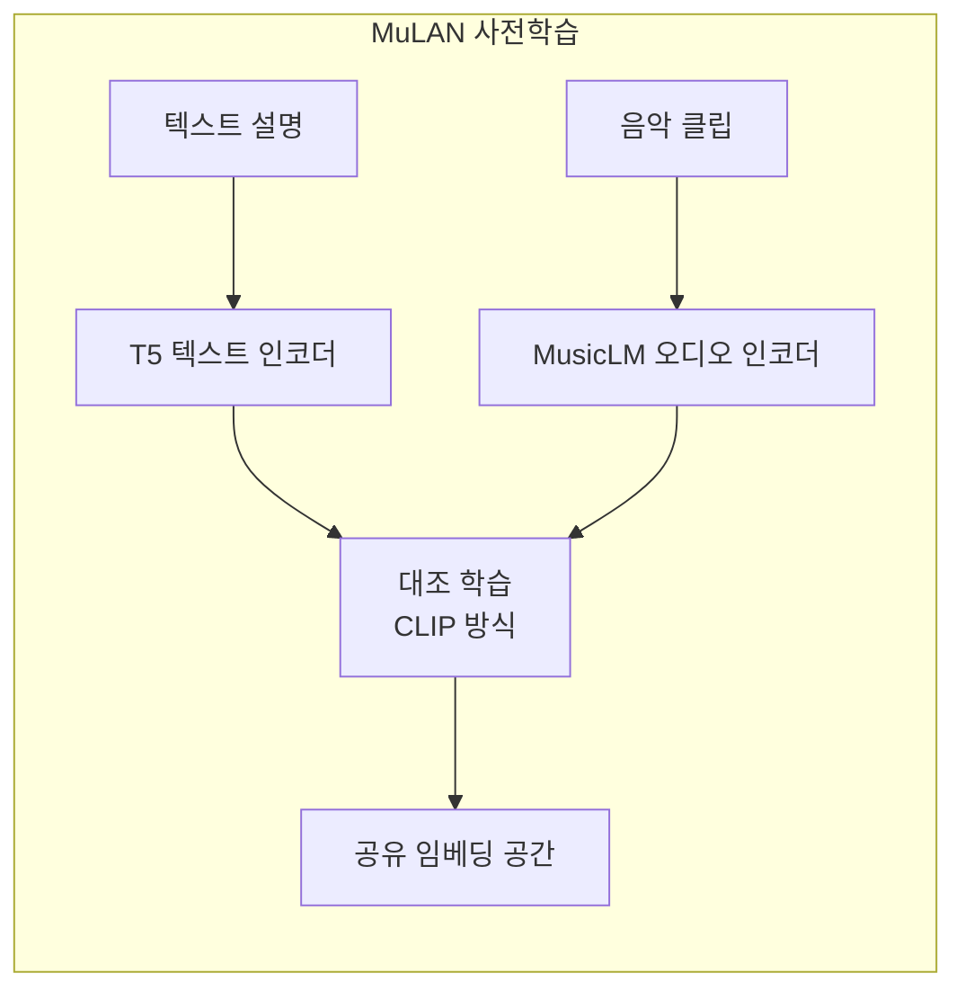
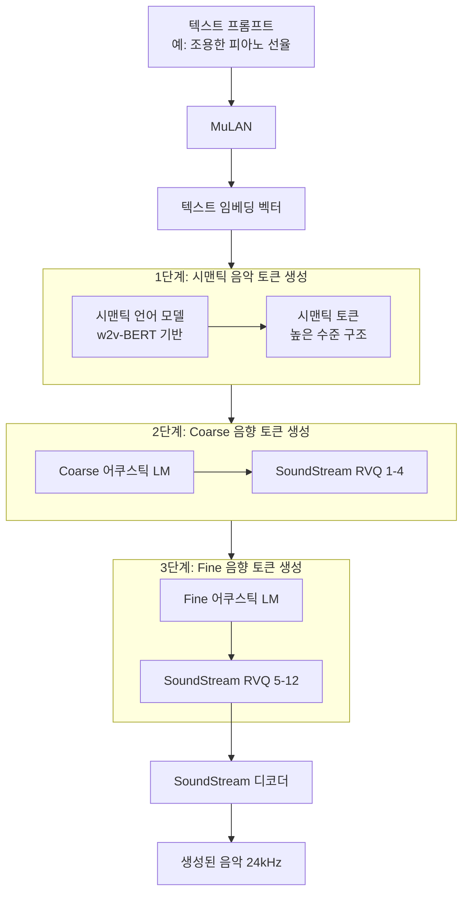

# MusicLM 음악 생성

## 개요

MusicLM은 Google Research가 2023년 발표한 텍스트-음악 생성(text-to-music) 모델이다. "조용하고 평화로운 피아노 소나타", "빠른 비트의 전자음악" 같은 자유 형식 텍스트 설명으로 고품질, 장기 일관성 있는 음악을 생성한다. [[audiolm-framework]]의 계층적 오디오 생성 파이프라인 위에 텍스트 조건을 추가한 구조로, [[ai-music-generation]] 분야의 중요한 이정표다.

## 핵심 문제: 텍스트와 음악의 연결

음악 생성에서 가장 어려운 문제는 텍스트 설명과 오디오 신호 사이의 의미적 간극(semantic gap)이다. "어두운 분위기", "8비트 스타일" 같은 추상적 설명을 음악적 특성으로 변환해야 한다. MusicLM은 **MuLAN**이라는 별도의 음악-텍스트 임베딩 모델로 이 문제를 해결한다.

## MuLAN: 음악-텍스트 공동 임베딩

MuLAN은 CLIP의 음악 버전이다. 텍스트와 음악 클립을 같은 임베딩 공간으로 매핑해 "텍스트 설명과 음악이 얼마나 잘 맞는가"를 점수로 표현할 수 있다. 이 임베딩이 MusicLM의 조건 신호로 사용된다.

## 전체 생성 파이프라인

[[audiolm-framework]]와 구조가 동일하되, 각 단계에 MuLAN 텍스트 임베딩이 조건으로 추가된다.

## [[audiolm-framework]]와의 관계

MusicLM은 [[audiolm-framework]]를 직접 확장한 모델이다.

| 비교 항목 | AudioLM | MusicLM |
|----------|---------|---------|
| 조건 입력 | 오디오 컨텍스트만 | 텍스트 + 선택적 오디오 |
| 텍스트 인코더 | 없음 | MuLAN |
| 주요 대상 | 음성 + 피아노 | 음악 전반 |
| 생성 길이 | 수십 초 | 수분 이상 |
| 훈련 데이터 | 일반 오디오 | 음악 특화 |

## [[ai-music-generation]] 분야에서의 위치

[[ai-music-generation]] 분야에서 MusicLM은 다음 측면에서 이정표적 의의를 가진다:

1. **고충실도 장기 생성**: 수 분 길이의 음악에서도 구조적 일관성 유지
2. **다양한 장르**: 팝, 클래식, 재즈, 전자음악 등 폭넓은 스타일 지원
3. **멜로디 조건 생성**: 허밍 클립을 입력으로 해당 멜로디를 발전시킨 음악 생성 가능
4. **스토리텔링 생성**: 시간에 따라 텍스트 설명을 바꿔가며 연속 음악 생성

## 훈련 데이터: MusicCaps

MusicLM 평가를 위해 Google은 **MusicCaps** 데이터셋을 함께 공개했다. 음악학자가 작성한 상세 텍스트 설명이 달린 5,521개 음악 클립으로 구성되며, 음악 생성 모델 평가의 표준 벤치마크로 자리잡았다.

## 평가 방법

음악 생성은 주관적이어서 다양한 지표를 조합해 평가한다.

| 지표 | 측정 대상 | 계산 방법 |
|------|----------|----------|
| FAD (Frechet Audio Distance) | 생성 음악의 분포 품질 | 실제 음악 임베딩 분포와의 거리 |
| MuLAN 유사도 | 텍스트-음악 정렬 | MuLAN 임베딩 코사인 유사도 |
| KL 다이버전스 | 음향 특성 분포 | 실제-생성 음악의 특성 분포 차이 |
| MOS | 주관적 음질 | 인간 평가자 점수 |

## 한계와 윤리 문제

- **저작권 논란**: 기존 저작권 음악으로 훈련되어 특정 아티스트 스타일 모방 가능
- **훈련 데이터 기억**: 훈련 데이터를 부분적으로 재현할 가능성
- **한국어 프롬프트**: 원래 영어 텍스트 조건으로 설계 (한국어 효과 불확실)
- Google 내부 사용 → 2023년 AI Test Kitchen으로 제한적 공개

## 실무 관점

MusicLM의 직접적인 영향은 후속 오픈소스 모델들이다. MusicGen(Meta), Stable Audio(Stability AI) 등이 MusicLM의 아이디어를 발전시켜 오픈소스로 공개했다. 음악 생성 프로젝트를 실제로 구축할 때는 오픈소스로 제공되는 이 후속 모델들을 사용하는 것이 현실적이다.

## 관련 문서

- [[audiolm-framework]] - MusicLM이 기반으로 삼은 계층적 오디오 생성 프레임워크
- [[ai-music-generation]] - 음악 생성 기술 전반의 개요
- [[soundstream-neural-codec]] - MusicLM의 음향 토크나이저
- [[rvq-residual-vector-quantization]] - 음향 토큰의 기반 기술
- [[encodec-audio-tokenizer]] - 유사한 오픈소스 오디오 코덱
