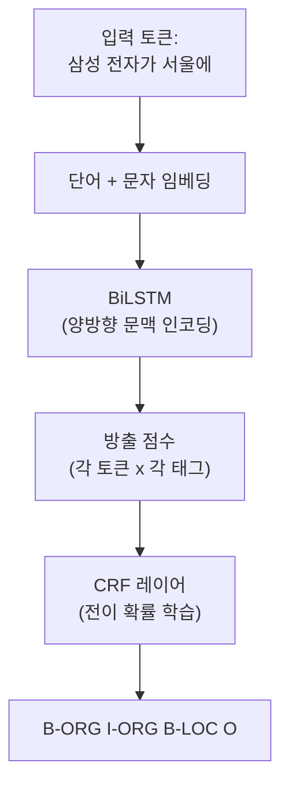
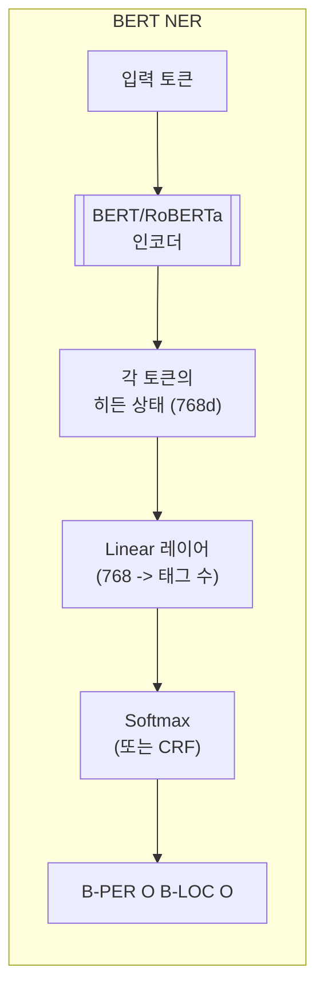

# 개체명 인식 (Named Entity Recognition, NER)

## 개요

개체명 인식(Named Entity Recognition, NER)은 비정형 텍스트에서 인명(PER), 지명(LOC), 조직명(ORG), 날짜, 금액 등 사전 정의된 범주의 고유 명칭(named entity)을 찾아 분류하는 NLP 태스크다. 정보 추출(Information Extraction)의 핵심 하위 태스크이며, 검색 엔진, 질의응답, 지식 그래프 구축, 문서 요약 등 다양한 NLP 응용의 기초 구성 요소로 활용된다. 규칙 기반에서 CRF, BiLSTM-CRF를 거쳐, 현재는 [[transformer-architecture|Transformer]] 기반 모델(BERT + 토큰 분류 헤드)이 표준 접근법이다. CoNLL-2003 영어 벤치마크에서 최신 모델은 F1 93-94%에 도달하며, 인간 수준에 근접한다.

## 엔티티 유형

### 표준 엔티티 (MUC/CoNLL 기준)

| 유형 | 태그 | 예시 |
|------|------|------|
| 인명 | PER | 이순신, Elon Musk |
| 지명 | LOC | 서울, Silicon Valley |
| 조직명 | ORG | 삼성전자, OpenAI |
| 기타 (Miscellaneous) | MISC | 올림픽, Python (언어) |

### 확장 엔티티 (OntoNotes, 도메인 특화)

| 유형 | 태그 | 예시 |
|------|------|------|
| 날짜 | DATE | 2026년 4월 14일, 지난 화요일 |
| 시간 | TIME | 오후 3시, 정오 |
| 금액 | MONEY | 150만 원, $99.99 |
| 비율 | PERCENT | 15%, 3할 |
| 수량 | QUANTITY | 500 미터, 3.5kg |
| 법률/규정 | LAW | 개인정보보호법 |
| 이벤트 | EVENT | 2024 파리 올림픽 |
| 제품 | PRODUCT | iPhone 16, GPT-4 |

도메인별로 엔티티 유형이 크게 달라진다. 의료 NER에서는 질병(DISEASE), 약물(DRUG), 증상(SYMPTOM)을, 금융 NER에서는 주식 코드(TICKER), 재무 지표(METRIC)를 추가로 정의한다.

## 시퀀스 레이블링

NER은 본질적으로 **시퀀스 레이블링(sequence labeling)** 문제다. 입력 시퀀스의 각 토큰에 엔티티 태그를 할당한다.

### IOB2 태깅 스킴

가장 널리 사용되는 태깅 형식이다:

- **B-XXX**: 엔티티 XXX의 시작(Begin)
- **I-XXX**: 엔티티 XXX의 내부(Inside)
- **O**: 엔티티가 아님(Outside)

```
토큰:   이순신    장군이    한산도    대첩에서    왜군을    격파했다
태그:   B-PER    O        B-LOC    O          O        O

토큰:   삼성     전자가    서울에     본사를     두고 있다
태그:   B-ORG   I-ORG    B-LOC    O         O   O
```

"삼성전자"가 두 토큰으로 분할된 경우, B-ORG(시작)과 I-ORG(계속)로 하나의 엔티티를 구성한다. 이 스킴은 연속된 동일 유형 엔티티("이순신 세종대왕")도 B 태그로 구분할 수 있다.

## 접근법의 변천

### 규칙 기반 시스템

정규식과 사전(gazetteer)을 조합하여 엔티티를 추출한다:

- 대문자로 시작하는 연속 단어 -> 인명/조직명 후보
- "주식회사", "대학교" 등 접미사 패턴 -> 조직명
- 날짜/숫자 정규식 -> DATE/MONEY

정밀도는 높을 수 있으나, 새로운 엔티티나 문맥 의존적 판단에 취약하다. "Amazon"이 회사인지 강인지는 규칙만으로 구별하기 어렵다.

### CRF (Conditional Random Fields)

NER의 첫 번째 통계적 표준 모델이다. 수작업 특징(단어 형태, 품사 태그, 접두/접미사, 주변 단어)을 입력으로 받아, 전체 시퀀스의 레이블 조합 중 가장 확률이 높은 것을 출력한다. CRF의 핵심 장점은 **레이블 간 전이 확률**을 학습하는 것이다: I-PER 뒤에 B-PER이 바로 오는 것은 허용하지만, I-PER 뒤에 I-ORG가 오는 것은 억제한다.

### BiLSTM-CRF (Huang et al., 2015)

딥러닝 기반 NER의 결정적 모델이다:



- **BiLSTM**: 각 토큰의 좌우 문맥을 양방향으로 인코딩하여 방출 점수(emission score)를 생성
- **CRF 레이어**: 방출 점수와 레이블 간 전이 점수를 결합하여 전체 시퀀스에서 최적의 레이블 조합을 Viterbi 알고리즘으로 탐색

이 조합은 BiLSTM의 문맥 표현력과 CRF의 구조적 제약을 결합하여, 개별 토큰 분류보다 일관된 시퀀스를 출력한다.

### BERT + 토큰 분류 (현재 표준)

[[transformer-architecture|Transformer]] 기반 사전 학습 모델이 NER의 성능을 한 단계 끌어올렸다:



BERT의 각 토큰 히든 상태를 분류 헤드에 통과시켜 IOB 태그를 예측한다. 사전 학습에서 획득한 깊은 언어 이해 덕분에, 문맥에 따라 "Apple"을 회사(ORG)와 과일(O)로 구분하는 능력이 크게 향상되었다.

| 모델 | CoNLL-2003 F1 | 특징 |
|------|--------------|------|
| BiLSTM-CRF | 91.2% | 딥러닝 NER 기준선 |
| BERT-base | 92.8% | 사전 학습 효과 |
| RoBERTa-large | 93.2% | 최적화된 학습 |
| LUKE | 94.3% | 엔티티 인식 특화 사전 학습 |
| ACE | 93.6% | 자동 교정 프레임워크 |

### 서브워드 토큰 문제

BERT 계열 모델은 WordPiece/BPE 토크나이저를 사용하므로, 하나의 단어가 여러 서브워드로 분할될 수 있다:

```
원본:  이순신     -->  이순 / ##신
태그:  B-PER     -->  B-PER / I-PER (첫 서브워드만 예측, 나머지는 전파)
```

일반적으로 첫 번째 서브워드의 예측만 사용하고, 나머지 서브워드에는 동일한 I-태그를 할당하거나 무시(-100) 처리한다.

## 난제와 도전

### 중첩 엔티티 (Nested NER)

```
[뉴욕대학교]_ORG 의 [뉴욕]_LOC 캠퍼스
```

"뉴욕대학교" 안에 "뉴욕"이라는 LOC 엔티티가 포함되어 있다. 표준 IOB 스킴은 중첩을 표현할 수 없으므로, span-based 접근법이나 다층 레이블링이 필요하다.

### 도메인 적응

일반 도메인에서 학습한 NER 모델은 의료, 법률, 과학 텍스트에서 성능이 크게 하락한다. "adalimumab"(약물명)이나 "BRCA1"(유전자)은 일반 말뭉치에서 거의 등장하지 않기 때문이다. BioBERT, SciBERT 등 도메인 특화 사전 학습 모델이 이를 완화한다.

### 저자원 언어

영어 NER 데이터는 풍부하지만, 한국어, 베트남어, 스와힐리어 등은 레이블 데이터가 부족하다. 대응 방안:

- **다국어 모델**: XLM-RoBERTa로 교차 언어 전이 학습
- **데이터 증강**: 엔티티 치환, 역번역 등으로 학습 데이터 확장
- **LLM 제로샷**: GPT-4 등으로 레이블 없이 NER 수행 (프롬프트 기반)

## [[text-classification|텍스트 분류]]와의 비교

| 속성 | [[text-classification\|텍스트 분류]] | NER |
|------|--------------------------------------|-----|
| 레이블 대상 | 문서 전체 | 개별 토큰 |
| 출력 | 1개 클래스 (또는 다중 레이블) | 토큰별 IOB 태그 시퀀스 |
| 태스크 유형 | 분류 (classification) | 시퀀스 레이블링 (sequence labeling) |
| BERT 활용 | [CLS] 토큰 표현 사용 | 모든 토큰 표현 사용 |
| 대표 벤치마크 | SST-2, AG News | CoNLL-2003 |

두 태스크는 NLP 파이프라인에서 상호 보완적이다: NER로 추출한 엔티티가 분류의 핵심 특징이 되고, 분류 결과가 NER의 엔티티 스킴 선택을 결정한다.

## 참고 자료

- [Named-entity recognition - Wikipedia](https://en.wikipedia.org/wiki/Named-entity_recognition)
- [What Is Named Entity Recognition (NER)?](https://www.datacamp.com/blog/what-is-named-entity-recognition-ner). DataCamp
- [Named Entity Recognition: A Comprehensive Guide](https://www.tonic.ai/guides/named-entity-recognition-models). Tonic.ai
