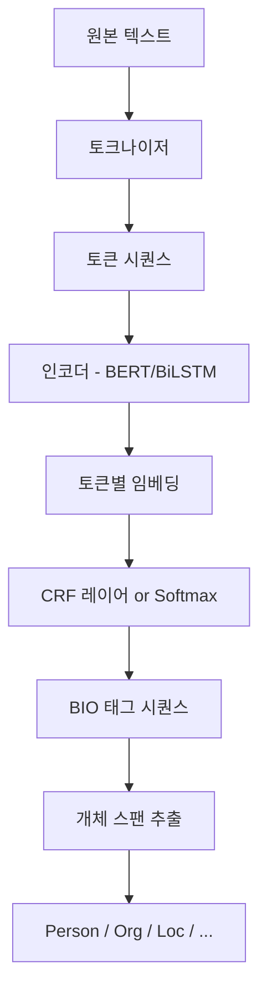

# NER - 개체명 인식 (Named Entity Recognition)

개체명 인식(NER)은 비정형 텍스트에서 인명, 지명, 기관명, 날짜, 금액 등 특정 의미를 가지는 개체(entity)를 자동으로 찾아내고 분류하는 NLP 태스크다. 정보 추출 파이프라인의 첫 번째 단계로, [[relation-extraction]], [[knowledge-graph]] 구축, 질의응답, 문서 요약 등 수많은 하위 태스크의 기반이 된다.

## 왜 중요한가

텍스트에서 "삼성전자가 갤럭시 S25를 서울에서 출시했다"라는 문장이 있을 때, NER은 "삼성전자(ORG)", "갤럭시 S25(PRODUCT)", "서울(LOC)"을 자동으로 식별한다. 이를 통해:

- 비정형 텍스트를 구조화된 데이터로 변환 가능
- 검색 엔진의 엔티티 인식 및 지식 베이스 연동
- 뉴스·문서 자동 분류 및 태깅
- 의료 기록에서 약물명·질병명·증상 추출

## BIO 태깅 스킴

NER의 핵심 표현 방식은 BIO(Beginning-Inside-Outside) 태깅이다. 각 토큰에 레이블을 붙여 연속된 개체 범위를 표현한다.

| 토큰 | BIO 태그 |
|------|---------|
| 삼성 | B-ORG |
| 전자 | I-ORG |
| 가 | O |
| 서울 | B-LOC |
| 에서 | O |

- **B (Beginning)**: 개체의 첫 번째 토큰
- **I (Inside)**: 개체의 중간/마지막 토큰
- **O (Outside)**: 개체에 해당하지 않는 토큰

BIO 외에도 BIOES(End, Single 태그 추가), BILOU 등 변형이 존재하며, BIOES가 더 세밀한 경계를 표현할 수 있어 성능 향상에 유리한 경우가 있다.

## NER 처리 흐름



각 토큰에 대해 독립적으로 분류하는 방식보다 CRF(Conditional Random Field) 레이어를 추가하면 태그 간의 전이 확률을 모델링해 "B-PER 다음에 O가 올 수 없다" 같은 제약을 자연스럽게 학습한다.

## 주요 접근 방식

### 1. 규칙 기반 (Rule-based)
정규식과 사전(가제트 목록)을 활용. 도메인이 좁고 엔티티 유형이 고정된 경우 높은 정밀도를 보이나 재현율이 낮고 유지보수 비용이 크다.

### 2. BiLSTM-CRF
양방향 LSTM이 문맥을 포착하고 CRF가 레이블 시퀀스 일관성을 보장. 딥러닝 NER의 표준 아키텍처로 2016-2019년까지 SOTA였다.

### 3. 트랜스포머 기반 NER
[[bert]]를 비롯한 사전학습 언어모델을 파인튜닝하는 방식이 현재 주류다. BERT 위에 선형 분류 헤드를 붙이고 BIO 레이블을 예측하도록 파인튜닝하면 다양한 NER 벤치마크에서 탁월한 성능을 발휘한다.

```python
# HuggingFace Transformers를 활용한 NER 파인튜닝 예시
from transformers import AutoTokenizer, AutoModelForTokenClassification
import torch

model_name = "klue/bert-base"  # 한국어 BERT
tokenizer = AutoTokenizer.from_pretrained(model_name)
model = AutoModelForTokenClassification.from_pretrained(
    model_name,
    num_labels=len(label_list)  # BIO 태그 수
)
```

## SpaCy를 활용한 실무 NER

SpaCy는 프로덕션 수준의 NER을 빠르게 구축하기 위한 대표 라이브러리다. 내장 파이프라인만으로도 영어 기준 F1 0.85 이상의 NER이 가능하며, 커스텀 데이터로 파인튜닝도 지원한다.

```python
import spacy

nlp = spacy.load("en_core_web_trf")  # 트랜스포머 기반 파이프라인
doc = nlp("Apple is looking at buying a UK startup for $1 billion.")

for ent in doc.ents:
    print(ent.text, ent.start_char, ent.end_char, ent.label_)
# Apple 0 5 ORG
# UK 27 29 GPE
# $1 billion 44 54 MONEY
```

SpaCy v3부터는 `en_core_web_trf`처럼 RoBERTa 기반 파이프라인을 지원하며, 커스텀 NER 학습 시 `spacy train` CLI를 통해 설정 파일 기반으로 재현 가능한 학습 파이프라인을 구성할 수 있다.

## 주요 벤치마크 및 데이터셋

| 데이터셋 | 언어 | 엔티티 유형 | 특징 |
|---------|------|------------|------|
| CoNLL-2003 | 영어/독어 | PER, ORG, LOC, MISC | NER 표준 벤치마크 |
| OntoNotes 5.0 | 영어 등 | 18개 유형 | 뉴스·대화·웹 멀티도메인 |
| KLUE-NER | 한국어 | 9개 유형 | 한국어 NER 표준 |
| BC5CDR | 영어 | 화학물질·질병 | 생의학 NER |

## 한국어 NER의 특수성

한국어는 교착어 특성상 형태소 분석이 선행되어야 한다. "삼성전자가"에서 "삼성전자"와 조사 "가"를 분리해야 정확한 개체 경계를 잡을 수 있다. KLUE 벤치마크에서는 형태소 단위 또는 어절 단위 NER 방식 간 성능 차이가 두드러진다.

## 실무 적용 관점

- **도메인 적응**: 일반 도메인 NER 모델을 의료·법률·금융 등 특수 도메인에 적용 시 성능이 급감한다. 최소 500-1,000개의 도메인 특화 어노테이션 데이터로 파인튜닝이 필요하다.
- **중첩 개체(Nested NER)**: "뉴욕 타임스"가 LOC이면서 동시에 ORG인 경우, 표준 BIO로는 표현 불가. Span-based 모델이나 계층적 모델을 사용한다.
- **제로샷 NER**: LLM에 프롬프트로 NER을 수행하는 방식이 부상 중. 어노테이션 없이 새 개체 유형을 인식할 수 있으나 속도와 비용 문제가 있다.

## 관련 문서

- [[named-entity-recognition]] - 개체명 인식 개요
- [[relation-extraction]] - NER 결과를 활용한 관계 추출
- [[bert]] - NER 파인튜닝에 활용되는 사전학습 모델
- [[knowledge-graph]] - NER + 관계 추출로 구축하는 지식 그래프
- [[coreference-resolution]] - 동일 개체의 다른 표현을 연결
