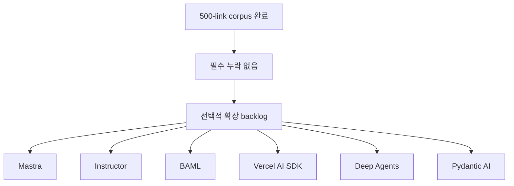

# 2026년 4월 다음 ingest 후보 지도

원본 500-link corpus는 모두 흡수되었지만, 추가적인 **공식 child-doc 확장** 후보는 여전히 존재한다. 이 문서는 “미반영 source가 남아 있는가?”와 “추가로 더 깊게 파고들 공식 문서 축이 있는가?”를 분리해서 보여 주기 위한 backlog 지도다.

## 구조도

이 문서는 **누락 보완**이 아니라 **다음 공식 문서 확장 경로**를 정리한다.

## 판정 요약

- 500-link corpus 기준의 미반영 source는 없다.
- 하지만 다음 단계의 deep-wiki 확장을 위해 공식 문서 축은 더 존재한다.
- 즉 **"남은 필수 ingest"는 없고, "남은 선택적 확장"은 있다.**

## 우선순위 후보

| 우선순위 | 축 | 확인된 공식 문서 후보 | 왜 의미가 큰가 |
| --- | --- | --- | --- |
| 1 | Mastra | agents / workflows / memory / MCP overview | 현재 허브에 child doc가 1개뿐이라 확장 여지가 큼 |
| 1 | Instructor | validation / retrying / patching | structured-output 운영 규칙을 더 깊게 문서화 가능 |
| 1 | BAML | comparison / reference overview | DSL 관점과 reference 층을 보강할 수 있음 |
| 1 | Vercel AI SDK | agents workflows / memory / subagents | 이미 branch가 있으므로 이어서 심화하기 좋음 |
| 2 | Deep Agents | context engineering / sandboxes / human-in-the-loop | long-horizon harness 운영 문서를 두껍게 만들 수 있음 |
| 2 | Pydantic AI | tools / message history / output | core concepts branch를 더 구조적으로 확장 가능 |

## 확인된 접근 가능 URL

### Mastra
- `https://mastra.ai/docs/agents/overview`
- `https://mastra.ai/docs/workflows/overview`
- `https://mastra.ai/docs/memory/overview`
- `https://mastra.ai/docs/mcp/overview`

### Instructor
- `https://python.useinstructor.com/concepts/validation/`
- `https://python.useinstructor.com/concepts/retrying/`
- `https://python.useinstructor.com/concepts/patching/`

### BAML
- `https://docs.boundaryml.com/guide/comparisons/baml-vs-pydantic`
- `https://docs.boundaryml.com/ref/overview`

### Vercel AI SDK
- `https://ai-sdk.dev/docs/agents/workflows`
- `https://ai-sdk.dev/docs/agents/memory`
- `https://ai-sdk.dev/docs/agents/subagents`

### Deep Agents
- `https://docs.langchain.com/oss/python/deepagents/context-engineering`
- `https://docs.langchain.com/oss/python/deepagents/sandboxes`
- `https://docs.langchain.com/oss/python/deepagents/human-in-the-loop`

### Pydantic AI
- `https://pydantic.dev/docs/ai/tools-toolsets/tools/`
- `https://pydantic.dev/docs/ai/core-concepts/message-history/`
- `https://pydantic.dev/docs/ai/core-concepts/output/`

## 읽는 방법

- **필수 coverage**는 이미 끝났다.
- 이 문서는 **추가 심화 가치가 높은 공식 문서**만 추린 backlog다.
- 다음 ingest를 시작한다면, child doc 수가 적은 허브부터 넓히는 편이 ROI가 높다.

## 추천 순서

1. Mastra child docs 4개
2. Instructor concepts 3개
3. BAML comparison/reference 2개
4. Vercel AI SDK agents memory/workflows/subagents
5. Deep Agents 운영 심화 3개
6. Pydantic AI tools/message-history/output

## 관련 문서

- [[hot-topics-corpus-coverage-audit-2026-04|2026년 4월 핫토픽 corpus coverage audit]]
- [[ai-hot-topics-2026-04|2026년 4월 AI 개발 핫토픽 100선]]
- [[vercel-ai-sdk|Vercel AI SDK 6]]
- [[mastra|Mastra]]
- [[pydantic-ai|Pydantic AI]]
- [[deep-agents|Deep Agents]]
