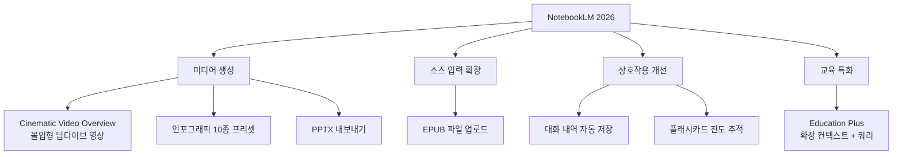
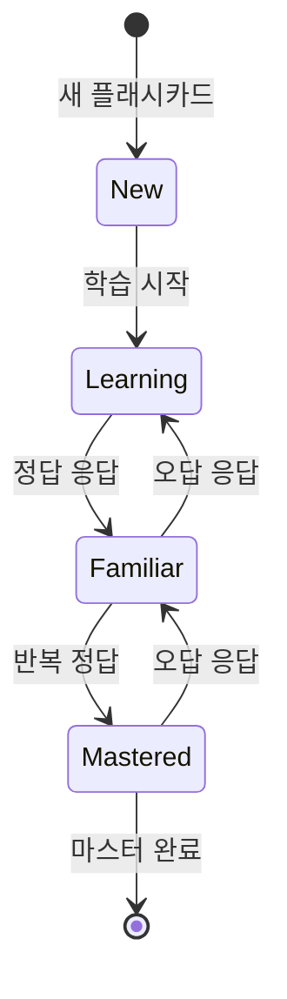
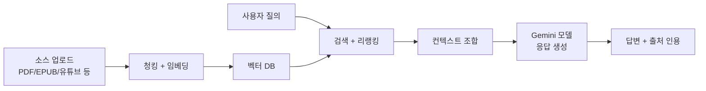

# NotebookLM 2026년 신기능 요약

이 페이지는 2026년 3-4월에 발표된 NotebookLM의 주요 업데이트를 정리한 요약(summary) 문서다. NotebookLM은 Google의 AI 기반 개인 지식 관리·학습 도구로, 사용자가 업로드한 소스(문서, 유튜브, 오디오 등)를 [[gemini-models]] 기반으로 분석·질의·요약하는 [[rag]] 기반 애플리케이션이다.

---

## 2026년 신기능 전체 맵

---

## Cinematic Video Overview

### 개요

Audio Overview(팟캐스트 형식 두 진행자 대화)에 이어 등장한 **영상 형식 딥다이브 요약 기능**이다. 소스 자료를 기반으로 몰입감 있는 설명 영상을 자동 생성한다.

- 음성 내레이션 + 시각 자료 결합
- 소스의 핵심 개념을 시각적으로 전달
- 복잡한 주제를 영상 스크롤로 소화하는 학습 방식 지원

**실무 활용**: 긴 연구 보고서나 논문을 팀에 공유할 때 텍스트 대신 2-3분 요약 영상을 자동 생성하여 배포.

### Audio Overview와의 관계

| 형식 | Audio Overview | Cinematic Video Overview |
|------|----------------|--------------------------|
| 미디어 | 오디오(팟캐스트) | 영상 |
| 스타일 | 두 진행자 대화 | 내레이션 + 시각 자료 |
| 접근성 | 이동 중 청취 | 집중 시청 |
| 적합 주제 | 스토리·인터뷰 구조 | 복잡한 개념·데이터 |

---

## 인포그래픽 10종 프리셋

소스 내용을 인포그래픽으로 변환하는 기능에 10가지 스타일 프리셋이 추가됐다.

| 프리셋 | 특징 |
|--------|------|
| Sketch Note | 손그림 노트 스타일, 비공식·창의적 분위기 |
| Kawaii | 귀여운 일러스트 스타일, 교육 자료에 적합 |
| Professional | 기업 프레젠테이션용 깔끔한 레이아웃 |
| (기타 7종) | 다양한 시각 스타일 지원 |

**활용 예시**: 연구 논문을 Professional 인포그래픽으로 변환해 LinkedIn 포스팅 자료로 활용.

---

## PPTX 내보내기

NotebookLM이 생성한 요약·개요·슬라이드 구조를 **Microsoft PowerPoint(.pptx) 형식으로 직접 내보낼 수 있다**. 이전에는 Google Slides 또는 텍스트 복사만 가능했으나, Microsoft 에코시스템 사용자도 즉시 활용 가능해졌다.

---

## EPUB 파일 업로드

전자책 형식(.epub)을 소스로 직접 업로드할 수 있게 됐다. 이전 지원 형식(PDF, 구글 드라이브, 유튜브 URL, 오디오)에 추가된 것이다.

**학습 시나리오**: 기술 서적의 EPUB 파일을 업로드하고 NotebookLM으로 Q&A, 개념 정리, 퀴즈 생성.

---

## 대화 내역 자동 저장

이전에는 세션이 종료되면 채팅 내역이 사라졌다. 이제 NotebookLM 노트북 내에서 이루어진 모든 대화가 자동으로 저장된다.

- 노트북을 재열었을 때 이전 질의·답변 이어서 확인
- 중요한 답변을 나중에 재참조 가능
- 학습 진행 경로 추적

---

## 플래시카드 진도 추적

소스로부터 자동 생성되는 플래시카드에 **진도 추적 기능**이 추가됐다.

- 스페이스드 리피티션(spaced repetition) 알고리즘 기반 복습 스케줄링 [교차검증 필요 - 알고리즘 상세]
- 카드별 정답률 통계
- 마스터된 카드와 복습 필요 카드 구분

---

## Google Workspace Education Plus 확장

**대상**: Google Workspace Education Plus 고객 및 Teaching and Learning Add-on 구독자

| 항목 | 일반 계정 | Education Plus |
|------|-----------|----------------|
| 소스 컨텍스트 | 기본 제한 | 확장 (더 많은 소스·더 긴 문서) |
| 일일 채팅 쿼리 | 기본 할당량 | 증가된 할당량 |
| 기능 접근 | 표준 | 추가 기능 우선 접근 |

교사가 교재 전체를 소스로 업로드하고, 학생이 자유롭게 Q&A·플래시카드·요약을 이용하는 교실 시나리오가 주요 타겟이다.

---

## NotebookLM의 RAG 아키텍처 관점

NotebookLM은 [[rag]] 패턴의 대표적인 소비자 제품 구현 사례다.

출처 인용(Source citation) 기능은 환각(hallucination) 방지를 위해 모든 답변에 어느 소스의 몇 번째 구절에서 가져왔는지 표시한다.

---

## 관련 문서

- [[gemini-models]] - NotebookLM의 기반 모델
- [[rag]] - NotebookLM이 구현하는 검색 증강 생성 일반 개념
- [[gemini-enterprise-agent-platform]] - 기업용 에이전트 플랫폼 (NotebookLM API 통합 가능성)
