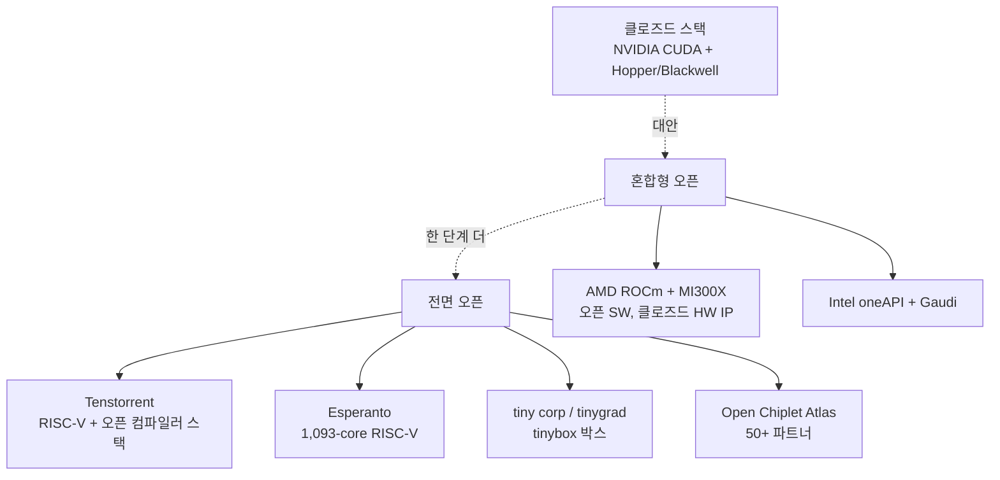
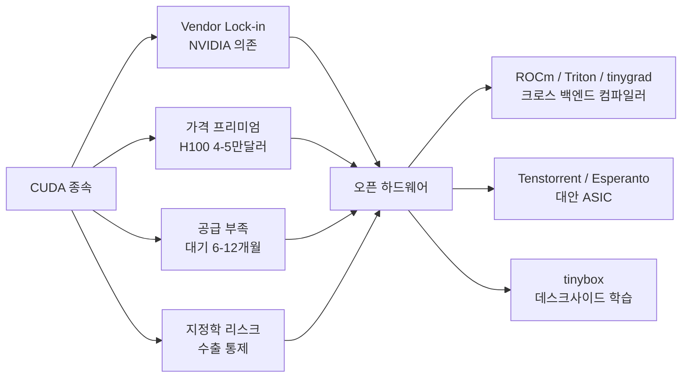

# 오픈 하드웨어 AI (Open Hardware AI)

오픈 하드웨어 AI(Open Hardware AI)는 NVIDIA CUDA·ASIC 클로즈드 스택 의존을 줄이고, 오픈 ISA·오픈 컴파일러·오픈 펌웨어로 학습/추론 가속기를 만들려는 흐름이다. 핵심 동기는 (1) vendor lock-in 회피, (2) 가격 구조 정상화, (3) 공급 다변화, (4) 정부의 산업 정책(CHIPS Act 등) 부합이다. 대표 플레이어는 RISC-V 기반 가속기를 만드는 Tenstorrent와 Esperanto Technologies, 오픈 GPU 컴퓨트 플랫폼 AMD ROCm, George Hotz의 tiny corp(tinygrad/tinybox)다. 단 소프트웨어 생태계 성숙도와 칩당 절대 성능에서 NVIDIA H100/B100과 격차가 남아 있다는 한계가 함께 따라다닌다.

## 오픈 하드웨어 스펙트럼

스펙트럼은 단일 잣대가 아니라 ISA(open vs proprietary), 컴파일러(open source vs closed binary), 펌웨어/RTL(공개 vs 비공개), 패키지/칩렛(표준 vs 독점) 등 여러 축의 조합이다.

## 주요 플레이어

### Tenstorrent

Jim Keller(전 Apple/Tesla/Intel)가 합류한 캐나다 기반 스타트업. 핵심 자산은 RISC-V 기반 Ascalon CPU 라인과 Tensix AI 코어다. 각 Tensix 코어는 RISC-V 데이터 무브먼트 프로세서, 8x8 BF16 매트릭스 엔진, 메모리 컨트롤러를 포함한 self-contained 컴퓨트 타일이다. 2025년 9월 공개한 TT-QuietBox 2(Blackhole 칩 기반)는 120B 파라미터 모델을 데스크 위에서 추론할 수 있는 RISC-V AI 워크스테이션으로 9,999달러부터 시작한다. Tenstorrent는 Polaris(시뮬레이션), Whisper, TT-Forge, TT-Metalium, TT-NN 등 컴파일러부터 커널까지 전체 스택을 오픈소스로 제공한다. Open Chiplet Atlas(OCA) 이니셔티브는 50개 이상 파트너와 함께 라이선스 없는 칩렛 통합 표준을 지향한다.

### Esperanto Technologies

Dave Ditzel이 창업한 회사로 ET-SoC-1 칩을 발표했다. 1,093 RISC-V 코어(1,088 ET-Minion + 4 ET-Maxion + 1 서비스 프로세서)를 단일 다이에 집적, TSMC N7 공정에 23.8억 트랜지스터, 다이 면적 약 570mm². 100-200 TOPS 피크 성능을 20W 미만 전력으로 달성하는 것이 목표라 ML 추천 시스템 추론 같은 저전력 워크로드에 초점을 맞췄다. 32GB LPDDR4x DRAM(137 GB/s)을 외장으로 연결하며, 6 모듈을 묶은 Glacier Point 카드 단위로 6,558 코어 / 192GiB / 822 GB/s까지 확장된다.

### AMD ROCm + MI300

Radeon Open Compute의 약자로, amdgpu 커널 드라이버부터 rocBLAS, MIOpen 같은 수학 라이브러리까지 모두 오픈소스인 GPU 컴퓨트 스택이다. HIP(Heterogeneous-Compute Interface for Portability)는 CUDA와 유사한 C++ 런타임 API를 제공해 코드 포팅을 단순화한다. 2024년 후반 출시된 MI300 시리즈는 PyTorch 설치 페이지에서 CUDA와 동급으로 ROCm 옵션을 노출하면서, 동급 NVIDIA 솔루션 대비 20-30% 낮은 가격으로 HPC 데이터센터에 채택되기 시작했다. CUDA 커널 호환성 측면에서 OpenAI Triton, PyTorch 2.0의 컴파일러 추상화가 ROCm을 1급 백엔드로 격상시키는 흐름과 맞물려 있다.

### tiny corp (tinygrad / tinybox)

George Hotz가 설립한 회사. 핵심 철학은 "petaflop을 commoditize한다"는 것. tinygrad는 PyTorch/JAX보다 훨씬 단순한 추상화로 NVIDIA, AMD, Apple Silicon, Qualcomm 등 다중 백엔드를 지원하는 오픈소스 딥러닝 프레임워크다. tinybox는 이를 활용한 데스크사이드 AI 박스로:

- **Tinybox Red**: AMD EPYC 32-core + 6× Radeon 7900XTX GPU + 144GB VRAM, 15,000달러
- **Tinybox Green**: 동일 베이스 + 6× RTX 4090, 25,000달러
- **Tinybox Green v2**: 4× RTX 5090

각 박스는 12U 랙 폼팩터, 128GB 시스템 RAM, 4TB RAID, 1600W 이중 전원이며 Ubuntu 22.04에 tinygrad/PyTorch/JAX가 사전 설치된다. 4-bit/8-bit 양자화로 120B 모델을 메모리에 적재한다.

## CUDA 의존 탈피 동기

NVIDIA의 데이터센터 GPU 점유율이 90%를 상회하는 상황에서, 가격(H100 한 장 4-5만 달러), 공급(주문 후 6-12개월 대기), 지정학(중국향 수출 통제)이 결합돼 NVIDIA 외 옵션 수요를 끌어올렸다. 동시에 OpenAI Triton, PyTorch 2.0의 `torch.compile`이 백엔드 추상화를 제공하면서 CUDA가 아니어도 모델을 돌릴 수 있는 생태계가 점진적으로 형성됐다.

## 한계와 현실

- **소프트웨어 생태계**: PyTorch/JAX는 ROCm·Tenstorrent에서도 동작하지만 라이브러리(FlashAttention, vLLM, TransformerEngine 등) 1급 지원은 여전히 CUDA 우선이다.
- **칩당 성능 갭**: H100/B100/B200 대비 절대 처리량 격차가 남아 있다. ROCm MI300X가 가장 근접한 대안이지만 1.0 TFLOPS급 매트릭스 연산에서는 여전히 NVIDIA가 선두다.
- **개발자 인력**: CUDA 개발자 풀이 압도적이라 신규 ASIC을 도입할 때 인력/툴체인 비용이 따라온다.
- **검증된 대규모 학습 사례**: 프런티어 모델 학습 사례 다수가 여전히 NVIDIA 클러스터 또는 Google TPU에서 이뤄진다. ROCm/Tenstorrent의 100B+ 학습 레퍼런스는 제한적이다. [교차검증 필요]

## 정책 컨텍스트

- **미국 CHIPS and Science Act (2022)**: 520억 달러 규모 반도체 산업 육성. Intel, TSMC Arizona 팹 등 미국 내 첨단 공정 투자가 직접 수혜.
- **EU Chips Act (2023)**: 430억 유로 규모. 유럽 내 칩 자급률 20% 목표.
- **이런 정책은 오픈 하드웨어 자체보다 첨단 공정 자급에 무게가 있지만, 결과적으로 NVIDIA 외 다른 사업자가 자본·공정 접근을 얻어 오픈 하드웨어 진영도 간접 수혜를 본다.**

## 위치적 의미

오픈 하드웨어 AI는 클로즈드 ASIC 시대(NVIDIA CUDA 1강, Google TPU + AWS Trainium 자체 사용)와 대비되는 "범용 가속기 + 오픈 스택"의 다극화 시나리오다. 단기적으로는 ROCm이 가장 현실적인 대안이고, 중장기적으로는 Tenstorrent OCA 같은 칩렛 표준이 시장을 다변화할지 여부가 관건이다. tinybox는 시장 점유율 측면에서는 마이너하지만 "데스크사이드 AI" 구도를 시각화한 상징적 사례로 의미가 크다.

## 관련 문서

- [[google-trillium-tpu-v6]] — Google 자체 ASIC (클로즈드 ISA, 사내 사용)
- [[ai-accelerators]] — AI 가속기 전체 생태계 지형
- [[gpu-architecture-ml]] — GPU 아키텍처 비교
- [[anthropic-openai-rl-infra]] — 프런티어 랩 RL 인프라 (NVIDIA/TPU 의존도)
- [[frontier-lab-rl-infra]] — RL 인프라 비교
- [[gpu-cluster-scheduling]] — 가속기 클러스터 운영
- [[ai-on-device-inference]] — 엣지/디바이스 추론 (오픈 하드웨어 활용)

## 1차 소스

- Tenstorrent, "The Open Hardware Revolution" (tenstorrent.com/vision)
- Tenstorrent, "TT-QuietBox 2" 발표 자료 (2025-09)
- Tenstorrent, "Tenstorrent is Continuing its Contributions to the RISC-V Open Source Ecosystem"
- Esperanto Technologies, "ET-SoC-1 RISC-V AI Accelerator Solution at Hot Chips 33"
- IEEE Xplore, "Accelerating ML Recommendation With Over 1,000 RISC-V/Tensor Processors on Esperanto's ET-SoC-1 Chip"
- AMD, "ROCm Software" (amd.com/en/products/software/rocm.html), GitHub ROCm/ROCm
- tinygrad.org / docs.tinygrad.org/tinybox/
- Phoronix, "Tiny Corp Details More Of Their Planned Tinybox System Specs"
- US CHIPS and Science Act (2022), EU Chips Act (2023) 정책 문서
