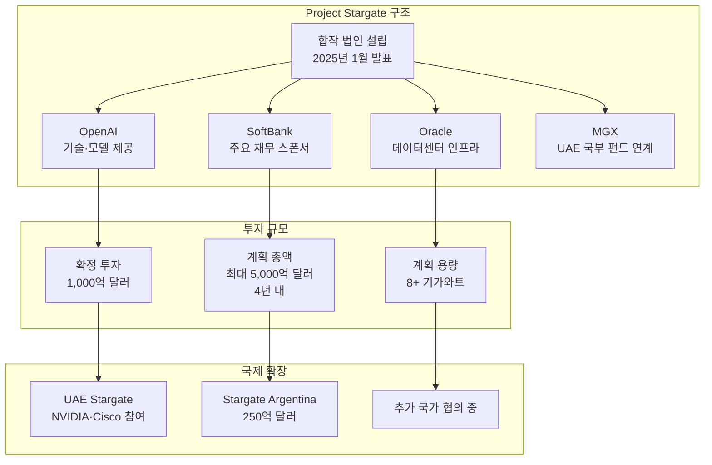
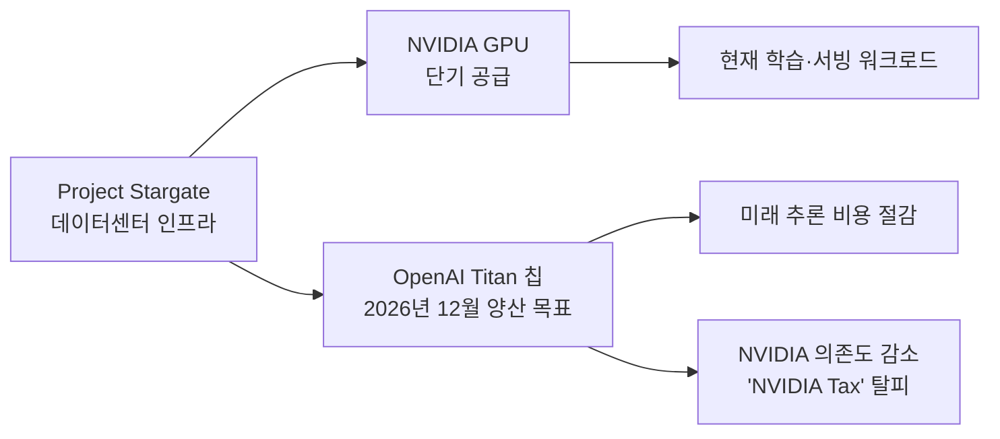

# Project Stargate: OpenAI-SoftBank-Oracle AI 인프라 합작 법인

## 사건 개요

**Project Stargate**는 2025년 1월 공식 발표된 OpenAI, SoftBank, Oracle, MGX의 합작 법인(JV)으로, 4년간 미국 내 AI 인프라에 최대 **5,000억 달러(5000억 달러)**를 투자하는 역사상 최대 규모의 AI 인프라 프로젝트다. 2026년 4월 현재 국제 확장(UAE Stargate, Stargate Argentina)이 진행 중이나, 설립 파트너 간 분쟁으로 진행이 더딘 상태다.

위 다이어그램은 Stargate의 구조, 투자 규모, 국제 확장 현황을 보여준다.

---

## 설립 배경

### 2025년 1월 발표 맥락

Stargate는 미국 AI 패권 강화를 위한 정치적 맥락에서 탄생했다:

- 2025년 1월 도널드 트럼프 대통령 취임 직후 백악관에서 발표
- 트럼프 행정부의 "미국 AI 우위 유지" 정책과 맞물림
- SoftBank 손정의 회장, OpenAI Sam Altman CEO, 트럼프 대통령이 공동 발표

이 정치적 후광은 프로젝트에 모멘텀을 부여했지만 동시에 거버넌스 복잡성을 높였다.

---

## 투자 구조 상세

### 확정 투자 1,000억 달러

발표 즉시 약정된 1,000억 달러의 용도:

| 항목 | 비중 (추정) | 내용 |
|------|------------|------|
| 데이터센터 건설 | 60~70% | 텍사스, 오클라호마 등 미국 중남부 |
| [[ai-accelerators]] 구매 | 20~30% | NVIDIA GPU, 커스텀 칩 |
| 네트워킹 인프라 | 5~10% | InfiniBand, 광네트워크 |
| 냉각·전력 설비 | 나머지 | 기가와트급 전력 공급 |

### 계획 총액 5,000억 달러와 현실 격차

"최대 5,000억 달러"라는 수치는 다음과 같은 조건부 성격을 가진다:

- SoftBank의 자금 조달 능력에 의존 (손정의의 대규모 투자 트랙 레코드 참조)
- 시장 상황, AI 수요, 규제 환경에 따라 변동 가능
- 실제 지출 속도는 확정 1,000억 달러에서 출발해 성과에 따라 확대

---

## 파트너 역할 분담

### SoftBank - 주요 재무 스폰서

- 손정의가 "10억 달러 이상을 투자하겠다고 결심했다"는 발언으로 주목
- SoftBank Vision Fund 투자 철학과 연계
- 일본 AI 인프라 투자 전략과 Stargate의 글로벌 확장을 연결

### Oracle - 데이터센터 인프라

- 기존 Oracle Cloud Infrastructure(OCI) 데이터센터 활용
- OpenAI가 이미 Oracle Cloud를 주요 훈련 클라우드로 사용 중
- 텍사스 Abilene 등 대규모 데이터센터 부지 제공

### OpenAI - 기술·모델 운영

- [[gpt-5-5-launch]], [[openai-workspace-agents]] 등 핵심 AI 서비스 운영
- Stargate 인프라를 통해 GPT 시리즈 학습 및 서빙
- 향후 AGI 달성을 위한 컴퓨트 기반으로 Stargate를 상정

### MGX - UAE 국부 펀드 연계

- UAE 아부다비 국부 펀드 계열사
- UAE Stargate(국제 확장 1호) 설립을 위한 자본 연결
- 중동 AI 허브 전략과 Stargate의 결합

---

## 국제 확장 현황

### UAE Stargate

- NVIDIA, Cisco가 추가 파트너로 합류
- 아부다비 AI 허브(MGX, G42 등)와 연계
- 중동 시장의 AI 수요를 미국 기술로 충족하는 지정학적 목표

### Stargate Argentina

- 250억 달러 규모로 라틴아메리카 최대 AI 인프라 투자
- 아르헨티나 에너지 비용 및 지리적 이점 활용
- 2026년 초 계약 서명 완료, 구체 착공 일정 미확인 [교차검증 필요]

---

## 분쟁과 진행 지연

2026년 4월 기준, Stargate는 설립 파트너 간 역할 분담 분쟁으로 진행이 더딘 상황이다:

### OpenAI-Oracle-SoftBank 갈등

- **수익 배분 구조**: 누가 얼마나 Stargate 수익을 가져가는지에 대한 이견
- **의사결정 권한**: 기술 로드맵(OpenAI 주도)과 인프라 결정(Oracle 주도) 간 충돌
- **SoftBank의 자금 조달 능력**: 약정한 규모를 실제로 동원할 수 있는지에 대한 의문

이 갈등은 The Decoder 등 미디어를 통해 보도됐으며, "5,000억 달러 프로젝트의 실현 가능성"에 대한 회의론을 낳았다.

---

## [[openai-titan-custom-chip]] 연계

Stargate는 단순한 인프라 투자를 넘어 OpenAI의 자체 칩 개발과 연결된다:

Stargate의 데이터센터에 Titan 칩이 배포되면 NVIDIA GPU 의존도를 낮추고 추론 비용을 획기적으로 절감하는 선순환이 설계돼 있다. [[openai-titan-custom-chip]] 참조.

---

## [[ai-accelerators]] 관점

Stargate는 AI 컴퓨트 인프라 전쟁의 OpenAI 버전이다. Anthropic의 Trainium+TPU+CoreWeave 다각화 전략([[amazon-anthropic-5gw-compute]], [[google-40b-anthropic-investment]])과 비교해보면:

| 전략 요소 | OpenAI(Stargate) | Anthropic |
|-----------|-----------------|-----------|
| 컴퓨트 규모 | 8GW+ (계획) | 8.5GW+ (계약 체결) |
| 주요 칩 | NVIDIA GPU + Titan(자체) | AWS Trainium + Google TPU + NVIDIA |
| 인프라 형태 | 자체 합작 법인(JV) | 클라우드 파트너 의존 |
| 재정 구조 | SoftBank 외부 자금 + Oracle | Google + Amazon 투자 |
| 장기 전략 | 자체 칩으로 자급화 | 다공급자 분산 |

---

## 거시경제적 의미

Stargate는 AI 인프라가 국가 전략 자산으로 인식되기 시작한 첫 번째 공식 사례다:

- 5,000억 달러 투자는 미국 국방비의 절반에 가까운 수준
- AI 컴퓨트를 "신(新)석유"로 보는 지정학적 관점의 제도화
- 민간 기업(OpenAI)이 주도하지만 정부 정책(트럼프 행정부)과 맞물린 공공-민간 협력 모델

[[ai-economic-impact]] 에서 다루는 AI의 경제 구조 변화와 직결된다.

---

## 관련 문서

- [[ai-accelerators]] - AI 가속기 및 컴퓨트 인프라 개요
- [[openai-titan-custom-chip]] - OpenAI Titan 커스텀 AI 추론 칩
- [[amazon-anthropic-5gw-compute]] - 비교: Amazon-Anthropic 컴퓨트 계약
- [[google-40b-anthropic-investment]] - 비교: Google-Anthropic 투자
- [[gpt-5-5-launch]] - Stargate 인프라에서 운영되는 GPT-5.5
- [[openai-workspace-agents]] - Stargate 인프라 기반 에이전트 플랫폼
- [[ai-economic-impact]] - AI의 거시경제적 영향
