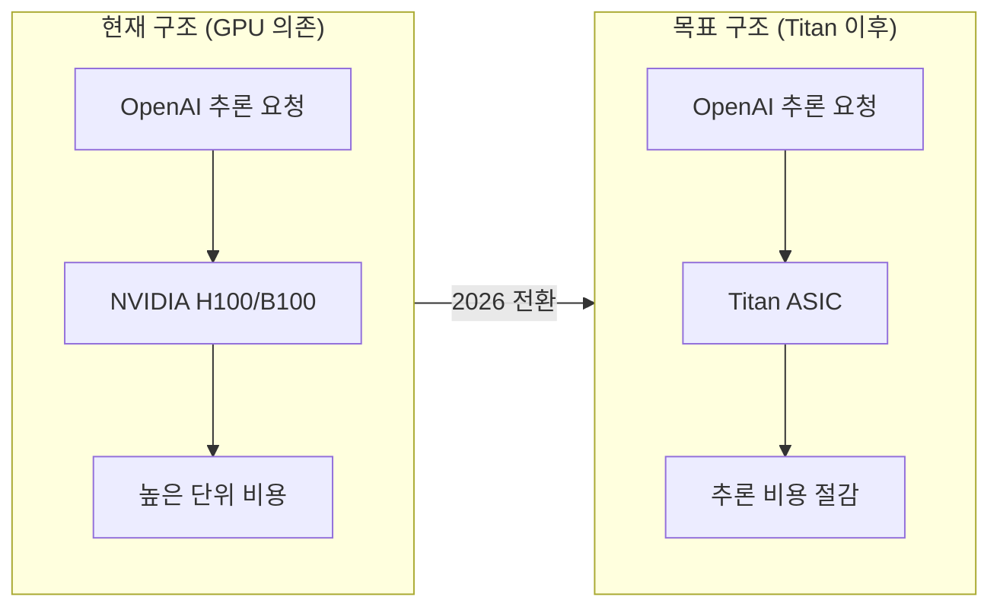
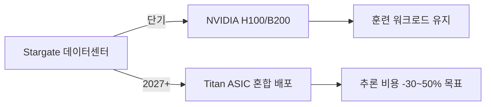

# OpenAI Titan 커스텀 AI 추론 칩

## 개요

OpenAI가 "엔비디아 세금(NVIDIA Tax)" 탈피를 목표로 Broadcom과 협업해 자체 AI 추론 전용 ASIC(Application Specific Integrated Circuit) "Titan"을 개발하는 사례다. TSMC 3nm(N3) 공정 기반으로 2026년 12월 양산을 목표로 한다. 이 사례는 대형 AI 기업들이 범용 GPU 의존도를 줄이고 추론 워크로드에 최적화된 커스텀 실리콘으로 전환하는 산업 흐름을 잘 보여준다.

## 배경: 왜 커스텀 칩인가

OpenAI는 GPT 시리즈를 서비스하면서 추론 비용이 사업 지속 가능성의 핵심 변수임을 인식했다. NVIDIA GPU는 훈련과 추론 모두에서 범용으로 작동하지만, 추론 전용 시나리오에서는 상당한 오버헤드가 발생한다.

- **NVIDIA 세금(NVIDIA Tax)**: GPU 하드웨어 가격 프리미엄 + CUDA 생태계 종속
- **추론 vs 훈련 워크로드 차이**: 추론은 대용량 배치 행렬 연산보다 저지연(latency) 단일 요청 처리가 중요
- **경쟁사 선례**: Google TPU, Amazon Trainium/Inferentia, Microsoft Maia가 이미 자체 실리콘 전략을 입증



위 다이어그램은 Titan 도입 전후 추론 인프라 구조 변화를 보여준다.

## Titan 칩 상세 사양

### 제조 공정

| 항목 | 1세대 Titan | 2세대 Titan 2 |
|------|------------|--------------|
| 공정 | TSMC N3 (3nm) | TSMC A16 (1.6nm) |
| 양산 목표 | 2026년 12월 | 2027년 |
| 설계 파트너 | Broadcom | 미정 |
| 메모리 | Samsung HBM4 | - |

**TSMC N3 공정**은 2023년 양산 개시된 3나노미터급 공정으로, Apple M3, NVIDIA GB100 등에 사용됐다. TSMC A16은 아직 초기 양산 단계로, 게이트올어라운드(GAA) 트랜지스터와 후면 전력 공급(Backside Power Delivery)을 결합해 전력 효율을 대폭 개선하는 기술이다.

### 설계 방향성

Titan은 범용 AI 가속이 아닌 **LLM 추론 특화** ASIC으로 설계된다. 주요 최적화 방향:

1. **저지연 디코딩**: 자동회귀(autoregressive) 토큰 생성에 최적화된 메모리 대역폭 설계
2. **배치 처리 효율**: 다수 사용자 요청을 동시 처리하는 continuous batching 하드웨어 지원
3. **HBM4 활용**: Samsung HBM4(고대역폭 메모리 4세대)로 메모리 병목 완화
4. **전력 효율**: NVIDIA GPU 대비 추론 토큰당 전력 소모 감소

## 공급망 구조

```mermaid
flowchart TD
    A[OpenAI 설계 사양] --> B[Broadcom 칩 설계]
    B --> C[TSMC N3 파운드리 제조]
    D[Samsung HBM4 메모리] --> E[패키징/조립]
    C --> E
    E --> F[OpenAI 데이터센터 배포]
    F --> G[[[openai-stargate]] Stargate 인프라]
```

- **Broadcom**: 네트워크 ASIC 및 커스텀 실리콘 분야 1위 업체. Google TPU 설계에도 참여한 이력이 있어 OpenAI와의 협업이 자연스럽다.
- **TSMC N3**: 현재 최선단 양산 공정. 단위 웨이퍼당 비용이 높으나 성능 밀도 측면에서 우위
- **Samsung HBM4**: 2025년 하반기부터 양산 시작된 차세대 HBM. 전 세대 HBM3e 대비 대역폭 50% 이상 향상

## 산업 맥락: 커스텀 실리콘 경쟁

| 기업 | 칩명 | 용도 | 파운드리 |
|------|------|------|---------|
| Google | TPU v5p / Trillium | 훈련+추론 | TSMC |
| Amazon | Trainium 2 / Inferentia 3 | 훈련/추론 분리 | TSMC |
| Microsoft | Maia 2 | 추론 | TSMC |
| Meta | MTIA v2 | 추론 | TSMC |
| OpenAI | Titan | 추론 특화 | TSMC N3 |

OpenAI의 Titan은 이 흐름에서 후발주자이지만, 가장 집중된 LLM 추론 최적화를 목표로 한다는 점이 차별점이다. 대규모 [[ai-accelerators]] 생태계에서 ASIC 특화 전략은 이미 Google TPU가 입증한 방향이다.

## Stargate 인프라와의 연계

Titan은 [[openai-stargate]] Stargate 프로젝트(OpenAI-SoftBank-Oracle 합작, 5000억 달러 투자)의 인프라 전략과 맞물린다. Stargate의 장기 로드맵에서 NVIDIA GPU 의존도를 Titan으로 부분 대체하면 단위 추론 비용을 낮추고 인프라 운영 수익성을 개선할 수 있다.



## 리스크 및 불확실성

1. **수율(yield) 리스크**: TSMC N3은 높은 불량률 가능성. 초기 양산에서 원가 상승 가능
2. **소프트웨어 스택**: CUDA 생태계와 달리 자체 컴파일러/런타임 개발 필요. Google이 XLA에 수년을 투자한 사실을 고려하면 상당한 공학 투자 필요
3. **출시 일정 불확실성**: 반도체 개발은 12-24개월 지연이 흔함. 2026년 12월 목표는 낙관적 시나리오
4. **NVIDIA 대응**: NVIDIA도 추론 특화 제품(NIM 마이크로서비스, 추론 최적화 GPU)으로 시장 방어 중

## 실무적 의의

- **AI 기업 비용 구조**: 대규모 LLM 서비스 기업에서 하드웨어 내재화가 경쟁력의 핵심 변수로 부상
- **반도체 산업 영향**: 빅테크 AI 기업들의 ASIC 수요가 Broadcom, Marvell 같은 커스텀 실리콘 설계사의 성장을 견인
- **생태계 분화**: NVIDIA CUDA 중심 단일 생태계에서 다양한 하드웨어 추상화 계층 공존으로 이행

## 관련 문서

- [[ai-accelerators]] - AI 가속기 전반 개요
- [[openai-stargate]] - OpenAI Stargate 인프라 프로젝트
- [[altman-agi-redefinition]] - Sam Altman의 AGI 전략 전환과 인프라 투자의 연계
