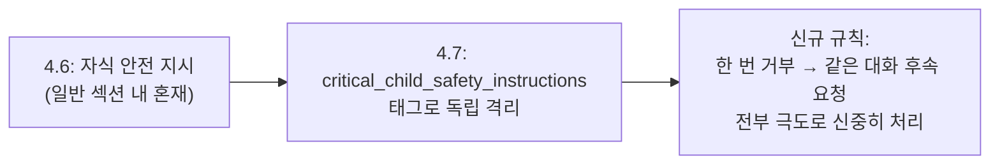
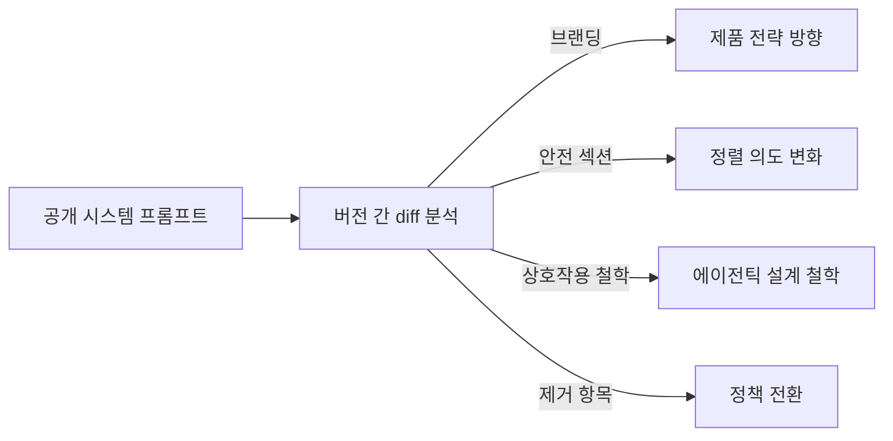

# Opus 4.7 시스템 프롬프트 diff 분석

Simon Willison이 2026년 4월 18일 공개한 분석. Claude Opus 4.6과 4.7의 공식 시스템 프롬프트를 diff하여 변경 내역을 카테고리별로 정리했다. 단순한 릴리스 노트를 넘어, **시스템 프롬프트 변경 자체가 alignment 의도를 추적하는 관측 기법**임을 보여준다.

## 원본 소스

- 저자: Simon Willison
- 발행: 2026-04-18
- URL: https://simonwillison.net/2026/Apr/18/opus-system-prompt/

## 변경 카테고리별 분석

### 브랜딩 / 도구

| 항목 | 4.6 | 4.7 |
|------|-----|-----|
| 플랫폼 명칭 | developer platform | **Claude Platform** |
| 신규 에이전트 | - | Claude in Chrome, Claude in Powerpoint |

"Claude in Chrome"은 웹사이트와 자율 상호작용하는 브라우징 에이전트, "Claude in Powerpoint"는 슬라이드 자동화 에이전트다. 에이전틱 응용 범위 확장을 공식 시스템 프롬프트에 반영한 점이 주목할 만하다.

### 자식 안전 (Child Safety)

가장 구조적으로 큰 변화다.

`<critical_child_safety_instructions>` 태그 도입은 자식 안전 지시를 시스템 프롬프트의 다른 규칙과 구조적으로 분리한 것이다. 한 번 거부 이후 대화 컨텍스트 전체에 걸쳐 경계 수준을 유지하는 연속적 안전 메커니즘이 추가됐다.

### 사용자 상호작용 철학

`<acting_vs_clarifying>` 섹션 신설이 핵심이다.

| 항목 | 4.6 | 4.7 |
|------|-----|-----|
| clarification 기본 태도 | 불명확 시 질문 | 합리적 시도 우선 |
| 대화 이탈 처리 | 명시 없음 | 종료 신호 시 붙잡지 않음 |
| 주도성 | 중립적 | 자율 행동 선호 |

핵심 문구:
> "the person typically wants Claude to make a reasonable attempt now, not to be interviewed first"

에이전틱 워크플로우에서 연속적인 질문이 실제로는 사용자 경험을 해친다는 Anthropic의 설계 철학이 반영되었다.

### Tool Search 메커니즘

`tool_search` 기능 명시 추가.

> "call tool_search to check whether a relevant tool is available but deferred"

[교차검증 필요] deferred tool 인프라의 구체적 구현 방식은 Anthropic 공식 개발자 문서에서 확인 필요.

용도: Claude가 "저는 X 기능이 없습니다"라고 잘못 주장하는 것을 방지. 실제로는 deferred 상태로 있을 수 있는 도구를 먼저 검색하도록 유도한다.

### 콘텐츠 모더레이션 정제

- Disordered eating 명시적 가드: 영양, 식이, 운동에 대해 구체적 수치·목표·단계별 계획 제공 금지
- 논쟁적 이슈에서 yes/no 강요 방지 → 뉘앙스 있는 응답 허용

### 제거된 요소

| 삭제 내용 | 이유 추정 |
|-----------|-----------|
| "avoid emotes or actions inside asterisks" | 표현 방식 제약 완화 |
| "genuinely", "honestly" 회피 지시 | 자연스러운 언어 사용 허용 |
| "Donald Trump is the current president" 명시 | 2026-01 지식 컷오프 반영 |

특히 "honestly/genuinely" 회피 지시 삭제는 모델이 이제 진정성 표현을 자연스럽게 사용할 수 있게 된 것을 의미한다. 기존에는 AI가 과장되거나 가식적인 어조로 해석될 수 있는 단어를 피하도록 했으나, 이를 제거했다.

## 메타 인사이트: Alignment Observability

### 시스템 프롬프트 diff 자체가 관측 기법이다

모델의 내부 파라미터가 공개되지 않더라도, 시스템 프롬프트의 버전 간 변화를 추적하면 Anthropic이 모델 행동에 대해 어떤 의도를 갖고 있는지를 간접적으로 관측할 수 있다. Simon Willison이 Claude 시스템 프롬프트를 git 저장소로 관리하는 이유가 바로 이것이다.

### Capability vs Safety 균형 트렌드

이번 변경에서 두 방향이 동시에 강화됐다:
- **자율성 증가**: acting_vs_clarifying (에이전트가 더 주도적으로 행동)
- **안전 강화**: critical_child_safety_instructions (더 강화된 안전 격리)

이는 능력 향상과 안전 강화가 제로섬이 아님을 실제 시스템 설계 차원에서 보여주는 사례다.

## 분석 도구: Extract System Prompts

이 분석의 방법론적 기반은 Willison이 별도로 공개한 `extract-system-prompts` 도구다. Anthropic 공개 시스템 프롬프트 마크다운을 Claude Code로 분해해 모델/버전별 파일로 재구성하고, synthetic git history를 생성한다. 이 도구 덕분에 수작업 diff 없이 `git diff`로 변경을 추적할 수 있었다.

저장소: `https://github.com/simonw/research/tree/main/extract-system-prompts`

상세: [[prompt-archaeology-willison|Claude 시스템 프롬프트 Archaeology (Willison)]]

## 관련 문서

- [[claude-opus-4-7|Claude Opus 4.7]]
- [[claude-opus-4-6|Claude Opus 4.6]]
- [[claude-prompts-git-timeline|Claude 시스템 프롬프트 git 타임라인]]
- [[prompt-archaeology-willison|Claude 시스템 프롬프트 Archaeology (Willison)]]
- [[prompt-engineering|프롬프트 엔지니어링]]
