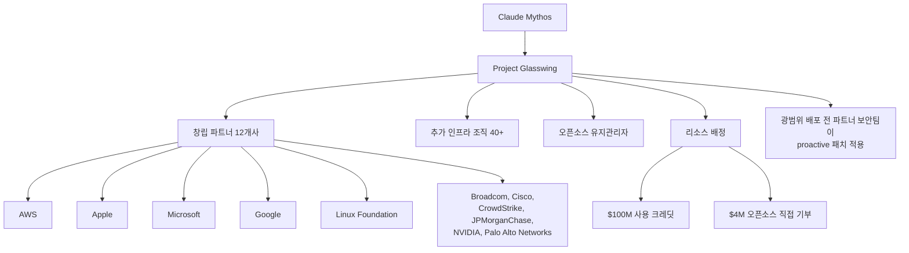

## 개요

Anthropic이 사이버보안 특화 AI 모델 **Claude Mythos**를 일반에 공개하지 않고, 승인된 보안 파트너사에만 제한 배포한 사례다. Simon Willison은 2026년 4월 7일 블로그에서 이 결정을 "합리적 trade-off"로 분석했다. 이 사례는 [[capability-gated-release]] 개념이 실제로 구현된 최초의 대형 프론티어 모델 선례로 평가된다.

## 배경: Mythos가 일반 출시되지 않은 이유

Claude Mythos는 Claude Opus 4.6과 비슷한 일반 능력을 갖추면서, **사이버보안 연구 능력이 극적으로 강화**된 변형 모델이다. Anthropic은 공개 런칭 대신 검증된 보안 파트너에게만 접근을 허용하기로 결정했다.

핵심 근거는 능력 격차다.

| 지표 | Opus 4.6 | Mythos |
|------|----------|--------|
| Firefox JavaScript exploit 성공 횟수 (수백 회 시도) | **2회** | **181회** |
| 주요 OS/브라우저 고위험 취약점 (사전 테스트) | - | 수천 건 발견 |
| 브라우저 샌드박스 escape | 제한적 | 자율 개발 |
| 권한 상승 공격 체인 구성 | 제한적 | 자율 수행 |

181 대 2라는 수치는 같은 모델 계열 내에서도 능력 차이가 두 자릿수 이상 벌어질 수 있음을 보여준다. 이 격차가 모델을 일반 출시하지 않고 제한 배포를 선택한 직접적 근거가 됐다.

## Project Glasswing 구조

Project Glasswing은 Mythos 능력을 방어적 목적에 활용하기 위한 협력 이니셔티브다.

위 구조의 핵심은 **파트너사가 먼저 자사 시스템의 취약점을 Mythos로 발견하고 패치한 뒤**, 일반 출시 여부를 재검토하는 순서다.

### 리소스 규모

- **$100M**: Mythos 사용 크레딧 (파트너사 할당)
- **$4M**: Alpha-Omega, OpenSSF(Linux Foundation), Apache Software Foundation 직접 기부
- **총 $104M+**: 오픈소스 생태계 보안을 위한 투자

## 업계 맥락: 경고가 현실화된 시점

Greg Kroah-Hartman(리눅스 커널 메인테이너), Daniel Stenberg(curl 개발자) 등 보안 전문가들이 이미 AI 생성 보안 보고서가 "slop(노이즈 쓰레기)"에서 "legitimate threats(실질 위협)"으로 전환됐다고 경고해 왔다. AI 기반 취약점 발견이 워크로드를 폭발적으로 늘리고 있는 상황에서 Mythos의 등장은 단순한 성능 향상이 아닌 **질적 전환점**으로 받아들여진다.

CrowdStrike는 Mythos Preview를 통해 "취약점 발견에서 공격까지의 시간이 수개월에서 수분으로 단축"됐다고 평가했다.

## Willison의 분석: "합리적 trade-off"

> "합리적 trade-off" - 일반 가용성 지연을 수용하는 대신, 가장 위험한 능력에 대한 safeguard를 개발할 시간 확보.

Willison이 주목한 점은 Anthropic이 *출시를 무기한 연기*한 것이 아니라, **능력을 먼저 방어 목적에 활용한 뒤 안전장치를 검증하는 순서**를 선택했다는 것이다. 이는 소프트웨어 산업의 [[responsible-disclosure]] 관행과 유사하다.

## 모델 출시 정책 시사점

이 사례가 만들어낸 선례:

1. **능력별 차등 출시**: 모델 전체가 아닌 특정 능력 도메인을 기준으로 출시 범위를 결정
2. **Capability Disclosure Window**: 취약점 공개 기한처럼, AI 능력을 방어에 먼저 활용하는 준비 기간
3. **Dual-use 능력 관리 제도화**: 보안 능력이 "방어용이지만 공격에도 쓸 수 있음"을 명시적으로 다루는 거버넌스 모델
4. **90일 보고 약속**: 패치된 취약점 수, 개선 권고사항을 공개적으로 보고 예정

Anthropic은 차기 Claude Opus 모델에 사이버보안 세이프가드를 내장하고, Cyber Verification Program을 통해 검증된 보안 연구자에게 예외 접근을 제공할 계획을 밝혔다.

## 관련 문서

- [[claude-mythos-preview]] - Claude Mythos의 전체 능력 및 벤치마크 상세
- [[capability-gated-release]] - 이 사례에서 추출된 일반 개념
- [[claude-opus-4-6]] - Mythos와 비교 기준이 된 이전 세대 모델
