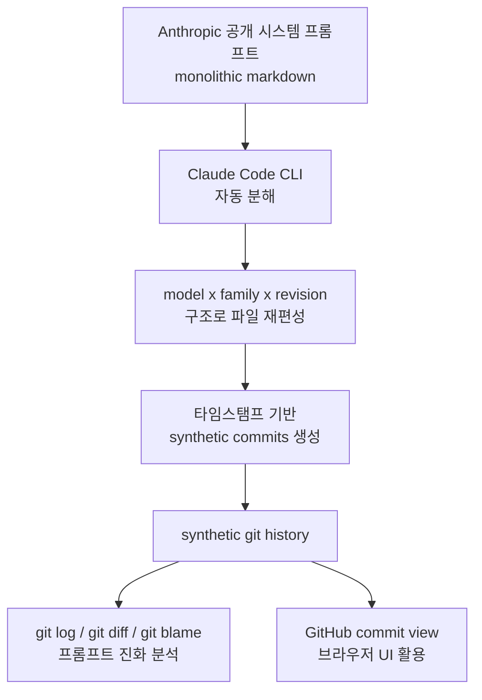

# Claude 시스템 프롬프트 Archaeology (Willison)

Simon Willison이 2026년 4월 18일 공개한 연구 프로젝트. Anthropic이 공개한 시스템 프롬프트 마크다운 문서를 **Claude Code로 자동 분해**해 모델별·버전별 파일로 재구성하고, 타임스탬프 기반 **synthetic git history**를 생성하는 방법론이다. 프롬프트를 소프트웨어 코드와 동등한 버전 관리 아티팩트로 취급한다는 패러다임 전환이 핵심이다.

## 원본 소스

- 저자: Simon Willison
- 발행: 2026-04-18
- URL: https://simonwillison.net/2026/Apr/18/extract-system-prompts/
- 저장소: https://github.com/simonw/research/tree/main/extract-system-prompts

## 작업 파이프라인

각 단계:

1. Anthropic이 공개한 시스템 프롬프트 마크다운을 소스로 수집
2. Claude Code CLI로 파일 분해 (모델, 패밀리, 리비전 단위)
3. 각 변경에 타임스탬프를 붙여 synthetic commit 생성
4. 표준 git 툴링으로 분석 (diff, blame, log)

## 실제 활용 사례

Willison은 이 파이프라인으로 **Opus 4.6 → 4.7 시스템 프롬프트 diff 분석**을 수행했다. 수작업으로 두 마크다운 파일을 비교하는 대신, `git diff` 명령 하나로 `<critical_child_safety_instructions>` 신설, `acting_vs_clarifying` 섹션 추가, `tool_search` 메커니즘 명시 등의 변경을 추적했다.

상세 분석 결과: [[opus-4-7-system-prompt-diff|Opus 4.7 시스템 프롬프트 diff 분석]]

## 패러다임 전환: 프롬프트를 코드로

시스템 프롬프트를 버전 관리 아티팩트로 취급하면:

| 기존 접근 | Willison 방법론 |
|-----------|----------------|
| 수작업 diff | `git diff` 자동화 |
| 변경 이유 추측 | commit message + blame으로 타임라인 |
| 단일 버전 비교 | 전체 역사 귀납 분석 가능 |
| 연구자 개인 비교 | 저장소 공유로 커뮤니티 협력 |

**기술 역사(technical history)로서의 프롬프트**: 안전 강화 패턴, 철학 변화, 기능 추가가 모두 diff로 가시화된다.

## 분석 도구로서의 Claude Code

이 프로젝트는 Claude Code를 연구 도구로 사용한 사례이기도 하다. monolithic 마크다운을 구조화된 파일 트리로 분해하는 작업을 Claude Code에 위임함으로써 반복 가능한 파이프라인을 구축했다.

## 관련 문서

- [[opus-4-7-system-prompt-diff|Opus 4.7 시스템 프롬프트 diff 분석]]
- [[claude-opus-4-7|Claude Opus 4.7]]
- [[claude-code|Claude Code]]
- [[claude-prompts-git-timeline|Claude 시스템 프롬프트 git 타임라인]]
