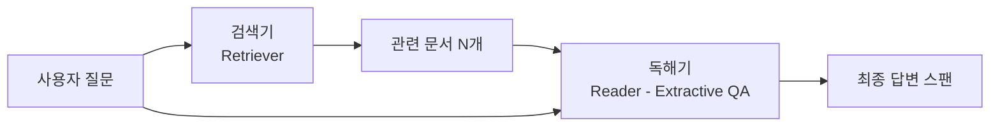

# 추출적 질의응답 (Extractive Question Answering)

추출적 질의응답(Extractive QA)은 주어진 지문(context) 내에서 질문에 대한 답변에 해당하는 텍스트 구간(스팬, span)을 찾아 반환하는 NLP 태스크다. "트랜스포머 논문은 언제 발표됐나요?"라는 질문에 대해 지문에서 "2017년"이라는 스팬을 정확히 찾아내는 것이 목표다. [[bert]]가 이 태스크에서 획기적인 성능 향상을 이끌었으며, [[rag-pipeline]]의 핵심 리더(reader) 컴포넌트로 활용된다.

## 왜 중요한가

추출적 QA는 생성형 QA에 비해 다음 장점이 있다:

- **사실성 보장**: 답변이 지문 내 텍스트를 그대로 반환하므로 환각(hallucination) 불가
- **근거 명시**: 답변 위치(start/end 인덱스)를 제공해 사용자가 원문 확인 가능
- **빠른 추론**: 생성 없이 분류 헤드만 사용하므로 속도 우수

실무 적용 분야:
- 기업 내부 문서 검색 시스템(RAG reader)
- 고객 지원 FAQ 자동화
- 의료 기록·법률 문서에서 특정 정보 추출
- 교육 시스템의 자동 채점

## 스팬 추출 방식

```mermaid
flowchart TD
    Q[질문] --> CONCAT[질문 + 지문 결합]
    CTX[지문] --> CONCAT
    CONCAT --> ENC[BERT 인코더]
    ENC --> HIDDEN[토큰별 숨김 벡터]
    HIDDEN --> START[시작 위치 분류기]
    HIDDEN --> END[종료 위치 분류기]
    START --> SPAN[예측 스팬: tokens[start:end]]
    END --> SPAN
```

BERT 기반 스팬 추출의 핵심 메커니즘:

1. 질문과 지문을 `[CLS] 질문 [SEP] 지문 [SEP]` 형식으로 결합
2. BERT 인코더로 전체 시퀀스를 인코딩
3. 각 토큰에 대해 "여기서 답변이 시작할 확률"과 "여기서 답변이 끝날 확률"을 계산
4. 최적의 (start, end) 쌍을 선택해 스팬 반환

```python
from transformers import pipeline

qa_pipeline = pipeline(
    "question-answering",
    model="deepset/roberta-base-squad2"
)

context = """
2017년 구글 Brain 팀은 'Attention Is All You Need' 논문에서
트랜스포머 아키텍처를 처음 제안했다. 이 모델은 RNN을 사용하지 않고
셀프 어텐션만으로 seq2seq 문제를 해결했다.
"""

result = qa_pipeline(
    question="트랜스포머 아키텍처는 누가 제안했나요?",
    context=context
)
print(result)
# {'score': 0.92, 'start': 12, 'end': 25, 'answer': '구글 Brain 팀'}
```

## SQuAD: 스탠퍼드 질의응답 데이터셋

SQuAD(Stanford Question Answering Dataset)는 추출적 QA의 표준 벤치마크다.

### SQuAD 1.1 (Rajpurkar et al., 2016)
- 위키피디아 지문에서 인간이 작성한 10만여 개 질문-답변 쌍
- 모든 답변이 지문 내 스팬으로 존재
- 평가 지표: EM(Exact Match), F1

### SQuAD 2.0 (Rajpurkar et al., 2018)
- SQuAD 1.1에 "답변 불가(unanswerable)" 질문 5만개 추가
- 모델이 지문에서 답변을 찾을 수 없을 때 "답변 없음"으로 판단해야 함
- 더 현실적인 QA 시나리오 반영

| 지표 | 설명 |
|------|------|
| EM (Exact Match) | 예측 스팬이 정답 스팬과 정확히 일치하는 비율 |
| F1 | 토큰 수준 정밀도·재현율의 조화 평균 |

BERT-large는 SQuAD 1.1에서 EM 84.2, F1 91.0을 달성해 당시 인간 수준(EM 82.3)을 최초 초과했다.

## BERT 이후의 발전

| 모델 | SQuAD 2.0 EM | 특징 |
|------|-------------|------|
| BERT-large | 80.0 | 추출적 QA의 시작 |
| RoBERTa-large | 86.8 | 더 많은 데이터로 학습 |
| ALBERT-xxlarge | 87.4 | 파라미터 공유로 경량화 |
| DeBERTa-v3-large | 91.4 | 분리 어텐션으로 최고 성능 |

## 한국어 추출적 QA

한국어 추출적 QA는 KLUE-MRC(Machine Reading Comprehension) 벤치마크가 표준이다.

```python
from transformers import pipeline

# 한국어 MRC 파이프라인
ko_qa = pipeline(
    "question-answering",
    model="snunlp/KR-ELECTRA-discriminator"  # 한국어 ELECTRA 기반 MRC 모델
)

context = "세종대왕은 1443년 훈민정음을 창제하였으며, 1446년 반포하였다."
result = ko_qa(
    question="훈민정음은 언제 반포되었나요?",
    context=context
)
# {'answer': '1446년', ...}
```

한국어 MRC의 특수성:
- 교착어 특성으로 형태소 경계와 스팬 경계가 불일치 가능
- "언제" 질문 유형에서 연도/날짜 스팬의 조사 포함 여부 처리

## RAG 파이프라인에서의 역할

추출적 QA 모델은 [[rag-pipeline]]의 리더(reader) 컴포넌트로 활용된다:



검색기가 관련 문서를 반환하면, 독해기(reader)가 각 문서에서 질문에 답하는 스팬을 추출하고 신뢰도 점수가 가장 높은 답변을 최종 답변으로 선택한다.

## 추출적 QA vs. 생성적 QA

| 측면 | 추출적 QA | 생성적 QA |
|------|----------|----------|
| 답변 방식 | 지문 스팬 반환 | 새 텍스트 생성 |
| 환각 위험 | 없음 | 있음 |
| 유연성 | 낮음(지문 내로 제한) | 높음(합성·추론 가능) |
| 속도 | 빠름 | 느림 |
| 적합 사례 | 사실 검색, 문서 QA | 복잡한 추론, 요약형 답변 |

실무에서는 두 방식을 결합하는 하이브리드 QA도 많이 사용된다: 추출적 QA로 후보를 찾고, 생성 모델로 자연스러운 답변 문장을 구성한다.

## 실무 적용 관점

- **다중 지문 QA**: 단일 지문이 아닌 여러 문서에서 답변을 찾아야 하는 경우, 문서별 confidence 점수를 비교해 최상위 답변 선택
- **답변 불가 감지**: 지문에 답변이 없는 경우 "모르겠습니다"를 반환하는 능력이 중요. SQuAD 2.0 기반 모델은 null answer threshold로 제어
- **긴 지문 처리**: BERT의 512토큰 제한을 넘는 지문은 슬라이딩 윈도우로 분할해 각 청크에서 추출 후 최고 점수 스팬 선택

## 관련 문서

- [[bert]] - 추출적 QA의 핵심 모델 아키텍처
- [[rag-pipeline]] - 추출적 QA가 리더 컴포넌트로 활용되는 파이프라인
- [[named-entity-recognition]] - QA 답변의 개체 유형 식별
- [[transformer-architecture]] - QA 모델의 기반 아키텍처
- [[text-summarization-dl]] - QA와 함께 자주 결합되는 생성 태스크
