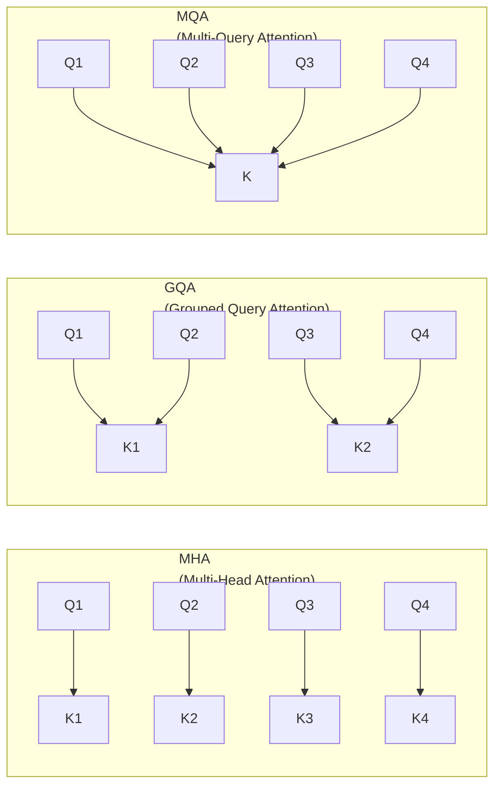
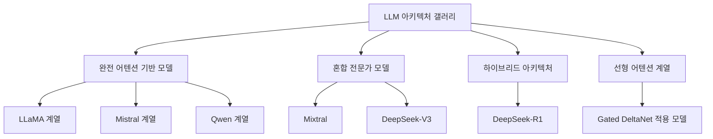

# Sebastian Raschka의 LLM 아키텍처 갤러리

## 개요

2026년 3월 14일, Sebastian Raschka가 공개한 **LLM 아키텍처 갤러리(LLM Architecture Gallery)**는 최신 오픈-웨이트(open-weight) LLM들의 아키텍처 다이어그램을 한곳에 모은 시각적 레퍼런스 컬렉션이다.

각 모델의 공식 논문과 기술 보고서에서 추출한 고해상도(hi-res) 아키텍처 다이어그램을 클릭 가능한 형태로 제공하며, 출시일, 설정 링크, 인용 정보를 함께 포함한 레퍼런스 시트로 구성된다.

이 갤러리는 Raschka의 두 후속 작업과 연계된 시리즈의 일부다:
- **"Big LLM Architecture Comparison"**: 다수 LLM의 아키텍처 결정을 표 형식으로 비교
- **"A Dream of Spring for Open-Weight LLMs"**: 2026년 상반기 오픈-웨이트 LLM 생태계 동향 분석

## 수록된 핵심 아키텍처 기법

갤러리가 다루는 모델들에서 반복적으로 등장하는 핵심 혁신 기법들을 정리한다.

### 주의 메커니즘 (Attention Mechanisms)

| 기법 | 전체 이름 | 핵심 아이디어 |
|------|----------|-------------|
| GQA | Grouped Query Attention | 쿼리 헤드를 그룹으로 묶어 KV 헤드 수를 줄임. MHA의 품질 + MQA의 효율성 |
| MLA | Multi-head Latent Attention | KV를 저차원 잠재 벡터로 압축. DeepSeek에서 도입. KV 캐시 크기 대폭 감소 |
| SWA | Sliding Window Attention | 각 토큰이 인접한 w개 토큰만 참조. 긴 시퀀스에서 O(n^2) → O(n·w) |

**GQA vs MQA vs MHA 비교**:

GQA는 현재 사실상의 표준으로, LLaMA 3, Mistral, Qwen 등 대부분의 주요 오픈-웨이트 LLM에서 채택되었다.

### 정규화 및 안정성 기법

**QK-Norm (Query-Key Normalization)**:
- 어텐션 스코어 계산 전 쿼리(Q)와 키(K)에 정규화를 적용
- 어텐션 엔트로피 폭발(attention entropy explosion) 방지
- 긴 시퀀스나 많은 레이어에서 학습 안정성 향상
- Gemma 2, Command R+ 등에서 채택

### 위치 인코딩 (Positional Encoding)

**NoPE (No Positional Embeddings)**:
- 명시적 위치 인코딩 없이 인과적 어텐션 마스크만으로 위치 정보를 처리
- 이론: 트랜스포머는 어텐션 마스크의 비대칭성만으로 순서를 학습할 수 있다
- RoPE 의존성 없이 컨텍스트 길이 확장이 유연해진다
- MambaFormer, 일부 실험적 모델에서 탐구

**RoPE(Rotary Position Embedding)와의 대조**: RoPE는 상대적 위치를 회전 행렬로 인코딩하며 현재 가장 널리 쓰이는 위치 인코딩이다. NoPE는 이 전통에 도전한다.

### 선형 어텐션 계열

**Gated DeltaNet**:
- 선형 어텐션(linear attention)의 발전형
- 델타 규칙(delta rule)에 게이팅(gating) 메커니즘을 추가해 선택적 기억 갱신
- O(1) 추론 복잡도 (기존 어텐션의 O(n)) - 긴 시퀀스에서 이론적 우위
- SSM(State Space Model, 예: Mamba)과 선형 어텐션의 아이디어를 혼합

## 수록 모델 구성

갤러리에는 출시일 순으로 정렬된 모델들이 포함된다:

각 모델 항목에는 다음이 포함된다:
- 고해상도 아키텍처 다이어그램 (클릭시 확대)
- 출시 날짜
- 공식 기술 보고서/논문 링크
- 하이퍼파라미터 설정 링크 (모델 크기, 레이어 수, 어텐션 헤드 수 등)
- 인용 정보 (BibTeX)

## 활용 방법

이 갤러리의 실용적 활용 시나리오:

**1. 아키텍처 의사결정**
새 모델을 설계하거나 파인튜닝 대상 선택 시, 특정 아키텍처 기법(GQA 여부, KV 캐시 크기 등)을 빠르게 비교할 수 있다.

**2. 논문 리뷰 준비**
새 아키텍처 논문을 읽기 전 기존 모델들의 다이어그램을 훑어보면 "이 모델이 어떤 선택을 했나"를 시각적으로 파악하기 좋다.

**3. 강의/발표 자료**
각 다이어그램은 출처가 명시된 공식 자료이므로 교육 목적으로 인용 가능하다.

**4. 아키텍처 트렌드 추적**
출시일 순 정렬 + 기법 채택 여부를 보면 "GQA가 언제부터 표준이 됐나", "NoPE가 어디서 시도됐나" 같은 트렌드를 읽을 수 있다.

## 갤러리의 의의

Raschka는 "Build a Large Language Model From Scratch" 저자이자 Lightning AI의 연구자로, LLM 구현의 실용적 이해를 중시한다. 이 갤러리는 그 철학의 연장선이다.

아키텍처 다이어그램은 종종 논문 본문보다 이해하기 쉽고, 다양한 모델을 비교하는 데 최적의 형식이다. 갤러리 형식은 산발적으로 흩어진 공식 다이어그램들을 한 맥락에서 비교할 수 있게 해준다는 점에서 커뮤니티 기여도가 높다.

## 한계

- 다이어그램은 원본 논문에서 가져온 것이므로 각 논문의 표현 방식이 통일되지 않았다
- 모델 구현 코드나 가중치 링크는 별도 검색 필요
- 갤러리 업데이트 주기에 따라 가장 최신 모델이 누락될 수 있다

## 관련 문서

- [[evolution-of-agentic-patterns]] - 아키텍처 혁신의 세대별 흐름
- [[context-folding]] - 긴 컨텍스트 처리의 아키텍처 관점
- [[how-coding-agents-work]] - LLM 아키텍처 선택이 에이전트 성능에 미치는 영향
- [[anthropic-multi-agent-research-system]] - 실제 오픈-웨이트 모델 선택 사례
