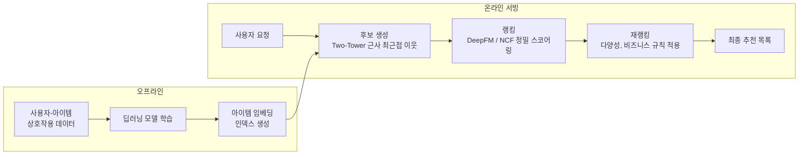
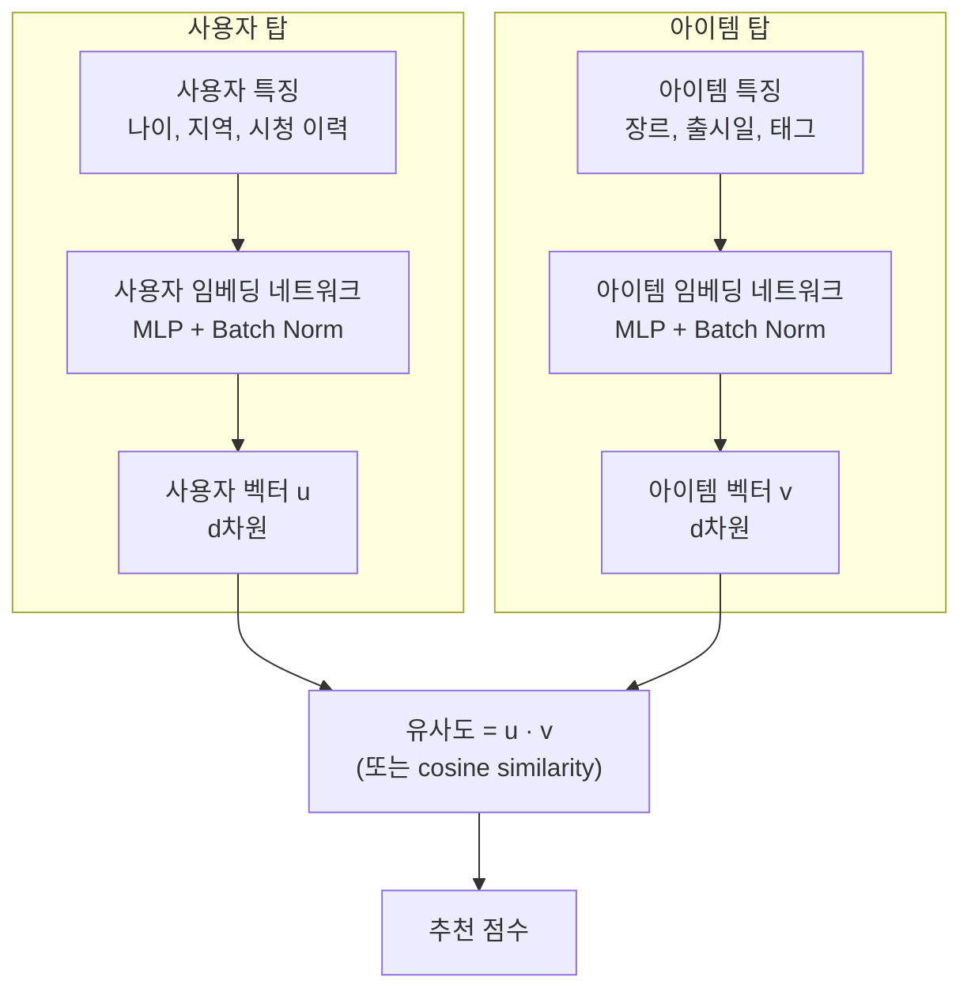
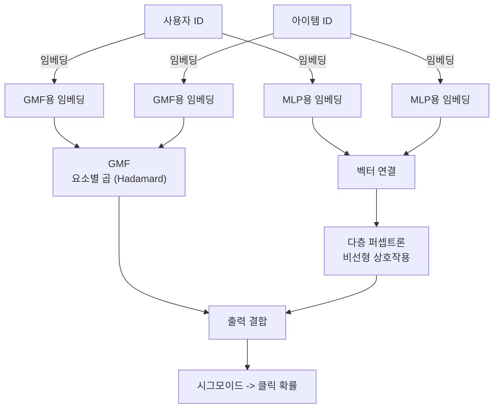
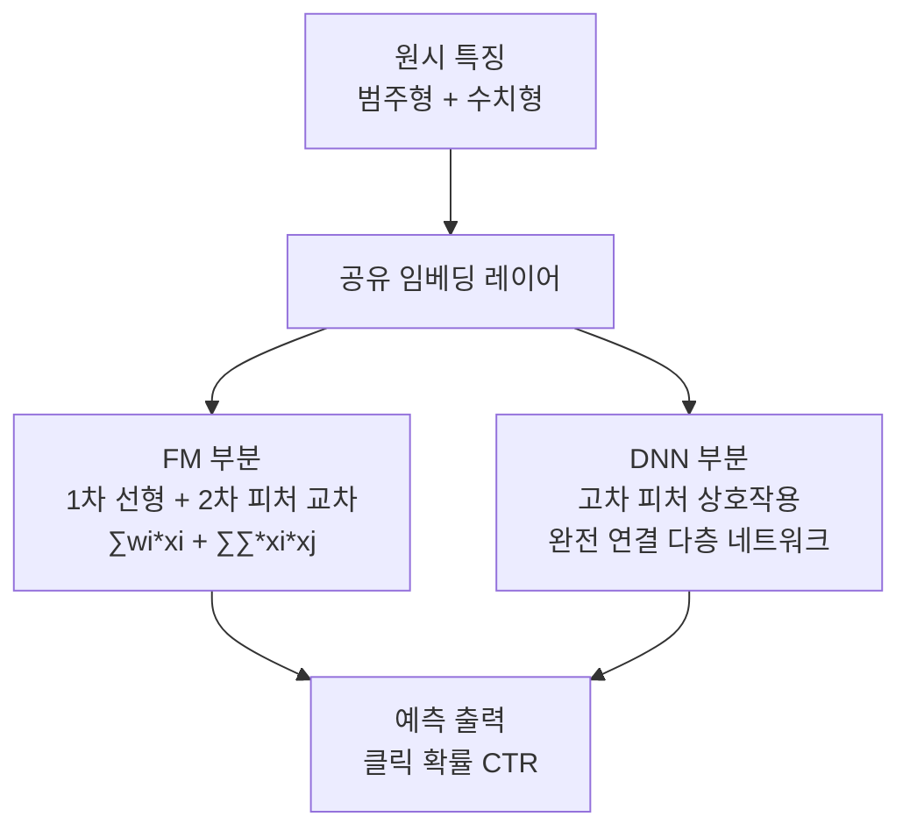

# 추천 시스템 딥러닝

딥러닝 기반 추천 시스템은 협업 필터링(collaborative filtering)과 콘텐츠 기반 필터링의 한계를 극복하고, 복잡한 사용자-아이템 상호작용 패턴을 대규모로 모델링하기 위해 발전했다. 유튜브, 넷플릭스, 쇼피파이 등 주요 플랫폼들이 이 접근법을 채택하고 있으며, 두 탑 모델(Two-Tower), NCF(Neural Collaborative Filtering), DeepFM이 실무에서 가장 널리 사용되는 아키텍처다. [[embedding-layers]]는 이 모든 아키텍처의 핵심 구성 요소이며, [[ai-recommendation-systems]]의 현대적 구현 기반이 된다.

## 추천 시스템 파이프라인 개요

대규모 추천 시스템은 단일 모델이 아닌, 후보 생성 - 랭킹 - 재랭킹의 다단계 파이프라인으로 구성된다.

각 단계는 서로 다른 모델과 제약 조건(지연 시간, 처리량)을 가진다.

## 두 탑 모델 (Two-Tower Model)

두 탑 모델은 **후보 생성(candidate retrieval)** 단계에서 가장 많이 사용되는 아키텍처다. 사용자 특징과 아이템 특징을 각각 독립적인 신경망(탑)으로 임베딩한 후, 내적(dot product)으로 유사도를 계산한다.

**핵심 장점**: 아이템 탑의 출력(임베딩)을 사전에 계산해두면, 서빙 시 사용자 임베딩 하나만 계산하고 ANN(Approximate Nearest Neighbor) 검색으로 수백만 아이템 중 후보를 수십 밀리초 내에 추출할 수 있다.

**학습 방법**: 소프트맥스 손실(in-batch negative sampling)이나 이진 교차 엔트로피(BPR loss)로 학습한다.

$$\mathcal{L} = -\log \frac{\exp(u \cdot v^+)}{\exp(u \cdot v^+) + \sum_j \exp(u \cdot v^-_j)}$$

## NCF (Neural Collaborative Filtering)

NCF는 2017년 He 외 연구진이 발표한 모델로, 전통적인 행렬 분해(Matrix Factorization)를 신경망으로 확장했다. 사용자와 아이템의 임베딩을 행렬 분해처럼 선형 결합(GMF)하는 것과 MLP로 비선형 상호작용을 모델링하는 것을 결합한다.

**GMF(Generalized Matrix Factorization)**: 사용자와 아이템 임베딩의 요소별 곱으로 전통적 MF의 신경망 일반화.

**MLP(Multi-Layer Perceptron)**: 두 임베딩을 연결(concatenate)한 후 여러 은닉층을 통과시켜 복잡한 비선형 상호작용 포착.

**NeuMF**: GMF와 MLP를 결합한 최종 모델. 명시적 피드백(평점)과 암묵적 피드백(클릭, 시청) 모두에 적용 가능하다.

## DeepFM

DeepFM은 2017년 Guo 외 연구진이 발표했으며, FM(Factorization Machine)의 2차 피처 상호작용 모델링과 DNN의 고차 상호작용 학습을 결합한다. [[embedding-layers]]를 공유하는 구조로 효율적이다.

FM 부분이 희소한 피처 간 2차 상호작용을 명시적으로 포착하고, DNN 부분이 그 이상의 고차 상호작용을 암묵적으로 학습한다. Wide & Deep 모델의 개선판으로, 수동 피처 엔지니어링 없이 자동으로 피처 교차를 학습한다.

## 세 아키텍처 비교

| 특성 | Two-Tower | NCF | DeepFM |
|------|----------|-----|--------|
| 주용도 | 후보 생성 | 랭킹 | 클릭률(CTR) 예측 |
| 서빙 지연 | 매우 낮음 (ANN) | 중간 | 높음 |
| 입력 피처 | 사용자/아이템 특징 | 사용자/아이템 ID | 다양한 피처 |
| 피처 상호작용 | 암묵적 | 선형+비선형 | 명시적 2차 + 암묵적 고차 |
| 신선도 | 실시간 업데이트 어려움 | 중간 | 배치 학습 중심 |

## 실무 고려사항

**Cold Start 문제**: 새 사용자나 아이템에 대한 임베딩이 없을 때, 콘텐츠 피처 기반 백오프 전략이 필요하다.

**임베딩 차원 선택**: 아이템/사용자 수의 로그 비례로 설정하는 경험칙이 있다 ($d \approx \sqrt[4]{|\text{vocab}|}$).

**부정 샘플링(Negative Sampling)**: 상호작용하지 않은 사용자-아이템 쌍을 부정 예시로 사용하되, 비율과 샘플링 전략이 성능에 크게 영향을 미친다.

**실시간 피처 갱신**: 사용자의 최근 행동을 실시간으로 반영하기 위해 스트리밍 파이프라인(Kafka, Flink 등)과 결합하는 경우가 많다.

## 관련 문서

- [[ai-recommendation-systems]] - 추천 시스템 전체 맥락 (전통적 방법 포함)
- [[embedding-layers]] - 추천 시스템의 핵심 구성 요소인 임베딩 기법
- [[temporal-fusion-transformer]] - 시간 의존성을 고려한 순차적 추천으로 확장 가능
