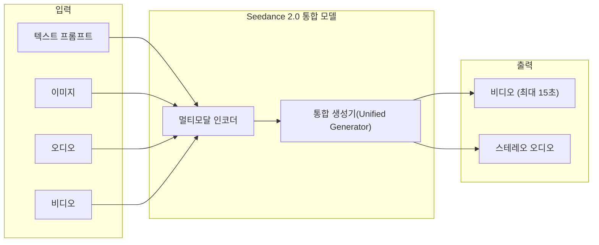

# Seedance 2.0

## 개요

Seedance 2.0은 ByteDance의 최신 통합 멀티모달 오디오-비디오 생성 모델이다. 텍스트/이미지 입력에서 최대 15초의 **동기화된 오디오-비디오 출력**을 단일 생성 패스(single generation pass)로 생산한다. 2026년 3월 기준 Artificial Analysis Video Arena 리더보드에서 Text-to-Video, Image-to-Video 모두 1위를 기록했다.

핵심 차별점은 **네이티브 오디오 동시 생성**이다. 별도 후처리 단계 없이 비디오와 완벽히 매칭된 듀얼 채널 스테레오 오디오를 한 번에 생성한다.

## 핵심 기능

- **시네마틱 출력**: 네이티브 오디오, 실제 물리 시뮬레이션, 감독급 카메라 컨트롤
- **다양한 입력 모달리티**: 텍스트, 이미지, 오디오, 비디오
- **듀얼 채널 스테레오 오디오** 동시 생성
- **최대 15초** 비디오 출력
- fal.ai에서 API 형태로 제공

## 아키텍처

위 다이어그램은 Seedance 2.0의 멀티모달 입출력 흐름을 보여준다. 다양한 모달리티의 입력을 단일 통합 생성기에서 비디오와 오디오를 동시에 출력하는 것이 핵심이다.

## 벤치마크 성능 (2026년 3월)

Artificial Analysis Video Arena 리더보드 기준:

| 모델 | Text-to-Video Elo | Image-to-Video Elo | 순위 |
|------|-------------------|---------------------|------|
| **Seedance 2.0** | **1,269** | **1,351** | **1위** |
| Kling 3.0 | - | - | 2위 |
| Veo 3 (Google) | - | - | 3위 |
| Sora 2 (OpenAI) | - | - | 4위 |

## 타임라인

- **2026년 2월 12일**: 공식 발표
- **2026년 4월 9일**: 최신 버전 런칭
- fal.ai에서 API 제공 개시

## 시장 맥락

2026년 AI 비디오 생성 시장은 콘텐츠 팀의 가장 빠르게 성장하는 도구로, 제작 시간 최대 70% 단축 효과가 보고되고 있다. ByteDance(Seedance), Kuaishou(Kling), Google(Veo), OpenAI(Sora)의 4강 구도가 형성되었으며, 네이티브 오디오 동시 생성이 2026년의 핵심 차별화 포인트로 부상했다.

## 관련 문서

- [[kling-3]] -- Kuaishou의 Kling 3.0, Video Arena 2위 경쟁자
- [[ai-video-generation]] -- AI 비디오 생성 시장 전반 개요
- [[ai-audio-voice-cloning]] -- AI 오디오 생성 관련 기술
