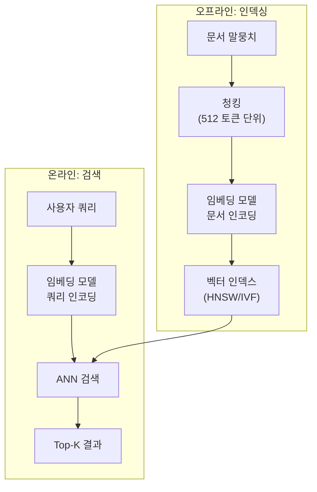

# 시맨틱 검색 (Semantic Search)

## 개요

시맨틱 검색(Semantic Search)은 쿼리와 문서의 **의미적 유사도**를 기반으로 관련 정보를 찾는 검색 기법이다. 키워드의 정확한 일치에 의존하는 [[sparse-retrieval-bm25|BM25 등 전통적 검색]]과 달리, 텍스트를 벡터 임베딩으로 변환하여 의미 공간에서의 거리로 관련성을 판단한다. "강아지 훈련 방법"이라는 쿼리로 "반려견 교육 가이드"라는 문서를 찾을 수 있는 것이 시맨틱 검색의 핵심 역량이다. [[dense-retrieval|Dense Retrieval]]이 기술적 기반을 제공하며, 현대 RAG(Retrieval-Augmented Generation) 시스템, 추천 엔진, 기업 지식 관리의 핵심 구성 요소다.

## 키워드 검색의 한계

[[sparse-retrieval-bm25|BM25]]로 대표되는 키워드 검색은 어휘 불일치(vocabulary mismatch) 문제에 근본적으로 취약하다:

| 문제 유형 | 예시 | 키워드 검색 결과 |
|----------|------|-----------------|
| 동의어 | "자동차" 검색 시 "차량" 문서 | 미검색 |
| 약어/줄임말 | "ML" 검색 시 "machine learning" 문서 | 미검색 |
| 개념적 관련 | "두통 해결" 검색 시 "아스피린 복용법" 문서 | 미검색 |
| 다국어 | "apple" 검색 시 "사과" 문서 | 미검색 |
| 다의어 | "사과" 검색 시 과일/사과(apology) 혼재 | 오검색 |

시맨틱 검색은 이러한 어휘 간극(lexical gap)을 의미 표현 수준에서 해소한다.

## 핵심 원리

### 임베딩: 의미의 벡터 표현

시맨틱 검색의 기반은 **텍스트 임베딩 모델**이다. [[transformer-architecture|Transformer]] 기반 인코더가 텍스트를 고차원(768-4096) 실수 벡터로 변환하며, 의미적으로 유사한 텍스트는 벡터 공간에서 가까운 위치에 매핑된다.

```
"고양이가 소파에서 잔다"  --> [0.23, -0.15, 0.87, ..., 0.41]  (768차원)
"소파 위의 잠자는 고양이" --> [0.25, -0.13, 0.85, ..., 0.39]  (유사한 벡터)
"주식 시장 분석 보고서"   --> [-0.71, 0.34, -0.22, ..., 0.15] (먼 벡터)
```

대표적인 임베딩 모델:

| 모델 | 차원 | 개발사 | 특징 |
|------|------|--------|------|
| text-embedding-3-large | 3072 | OpenAI | 상용 API, 다국어 |
| E5-large-v2 | 1024 | Microsoft | 오픈소스, 범용 |
| BGE-M3 | 1024 | BAAI | 다국어 특화, 다중 표현 |
| GTE-Qwen2 | 1536 | Alibaba | 최신 MTEB 상위권 |
| multilingual-e5-large | 1024 | Microsoft | 100+ 언어 지원 |

### 유사도 계산

두 벡터 사이의 유사도를 측정하는 주요 메트릭:

**코사인 유사도 (Cosine Similarity)**: 벡터 방향의 유사성을 측정. 벡터 크기에 무관하며, 텍스트 검색에서 가장 널리 사용된다.
```
cos(A, B) = (A . B) / (||A|| * ||B||)     범위: [-1, 1]
```

**내적 (Dot Product)**: 방향과 크기 모두 반영. 정규화된 벡터에서는 코사인 유사도와 동일하다.

**유클리드 거리 (L2 Distance)**: 벡터 간 직선 거리. 작을수록 유사. 정규화되지 않은 임베딩에서 활용된다.

### 벡터 인덱싱과 검색

수백만-수십억 건의 벡터에서 실시간 검색을 수행하려면 전수 비교(brute-force)가 아닌 근사 최근접 이웃(Approximate Nearest Neighbor, ANN) 알고리즘이 필요하다:

**HNSW (Hierarchical Navigable Small World)**: 그래프 기반 인덱스로, 계층적 네비게이션으로 O(log N) 검색 복잡도를 달성한다. 메모리 사용량이 높지만 검색 정확도와 속도의 균형이 우수하다.

**IVF (Inverted File Index)**: 벡터를 k개 클러스터로 나누고, 쿼리와 가장 가까운 클러스터만 검색하여 탐색 범위를 축소한다. 대규모 데이터셋에서 효과적이다.

**Product Quantization (PQ)**: 벡터를 서브벡터로 분할하여 각각 양자화함으로써 메모리 사용량을 크게 줄인다. IVF와 결합하여 IVF-PQ로 자주 사용된다.

대표적인 벡터 검색 라이브러리/DB:

| 도구 | 유형 | 주요 알고리즘 | 특징 |
|------|------|-------------|------|
| Faiss | 라이브러리 | IVF, PQ, HNSW | Meta 개발, C++ 기반, GPU 지원 |
| Pinecone | 관리형 DB | 독자적 | 완전 관리형, 실시간 업데이트 |
| Weaviate | 벡터 DB | HNSW | 오픈소스, 하이브리드 검색 내장 |
| Qdrant | 벡터 DB | HNSW | Rust 기반, 필터링 성능 우수 |
| ChromaDB | 벡터 DB | HNSW | 경량, 로컬 개발에 적합 |

## 시맨틱 검색 파이프라인



1. **문서 전처리**: 긴 문서를 적절한 크기의 청크로 분할. 너무 길면 의미가 희석되고, 너무 짧으면 문맥이 부족
2. **임베딩 생성**: 각 청크를 임베딩 모델로 벡터 변환
3. **인덱싱**: 벡터를 ANN 인덱스에 저장
4. **쿼리 인코딩**: 사용자 쿼리를 동일한 임베딩 모델로 변환
5. **유사도 검색**: ANN 알고리즘으로 가장 가까운 벡터 K개를 반환

## 하이브리드 검색: 시맨틱 + 키워드

실무에서는 시맨틱 검색과 [[sparse-retrieval-bm25|키워드 검색]]을 결합한 하이브리드 검색이 가장 높은 성능을 보인다:

| 검색 유형 | 강점 | 약점 |
|----------|------|------|
| [[sparse-retrieval-bm25\|BM25 (키워드)]] | 정확한 용어 매칭, 고유명사, 코드 | 동의어, 의미적 관련성 |
| 시맨틱 ([[dense-retrieval\|Dense]]) | 동의어, 개념적 유사성, 다국어 | 정확한 용어, 희귀 키워드 |
| **하이브리드** | **양쪽 강점 결합** | 점수 정규화 복잡성 |

하이브리드 검색의 점수 결합 방식:

- **Reciprocal Rank Fusion (RRF)**: 각 검색 결과의 순위를 기반으로 통합. 가장 단순하고 강건함
- **가중 합산**: alpha * sparse_score + (1-alpha) * dense_score. alpha 튜닝 필요
- **리랭킹**: [[reranker-cross-encoder|Cross-Encoder 리랭커]]로 1차 검색 결과를 정밀 재순위화

## 활용 분야

- **RAG (Retrieval-Augmented Generation)**: LLM이 응답 생성 전 관련 문서를 검색하여 근거 기반 답변을 생성
- **기업 지식 관리**: 사내 문서, 위키, 슬랙 메시지에서 질의응답
- **이커머스 검색**: "가벼운 여름 재킷" 검색 시 "린넨 블레이저" 등 의미적으로 관련된 상품 노출
- **코드 검색**: 자연어 설명으로 관련 코드 스니펫을 검색
- **학술 논문 검색**: 연구 질문에 의미적으로 관련된 논문 탐색
- **고객 지원**: 질문의 의도를 파악하여 가장 관련 있는 FAQ나 지식베이스 문서를 검색

## 참고 자료

- [What is vector search?](https://www.ibm.com/think/topics/vector-search). IBM
- [Understanding Semantic Search: Vector Embeddings and Similarity Search](https://dev.to/derrickryangiggs/understanding-semantic-search-vector-embeddings-and-similarity-search-2ahp). DEV Community
- [What is vector search? Better search with ML](https://www.elastic.co/what-is/vector-search). Elastic
