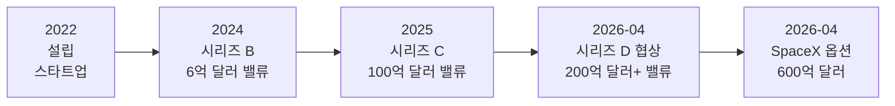
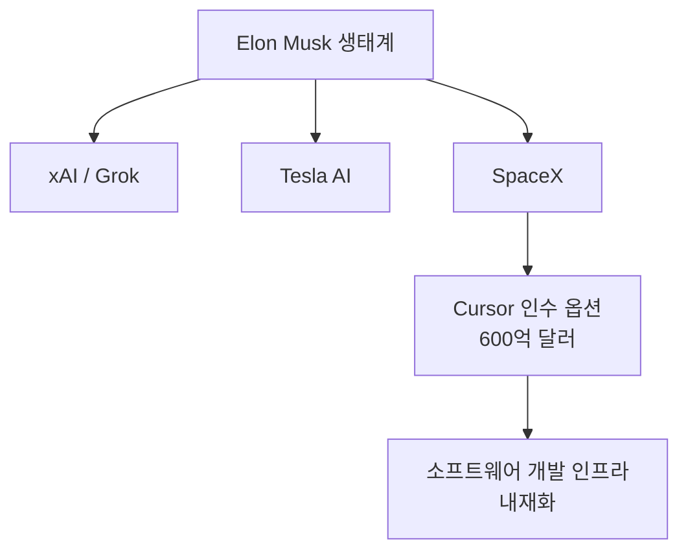
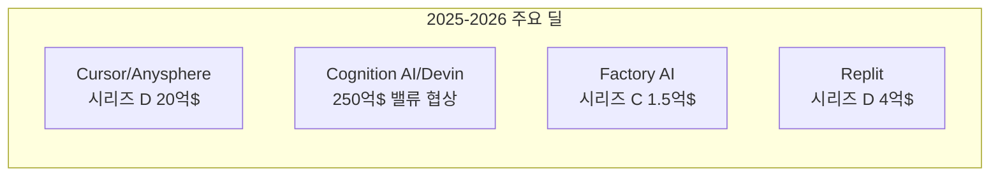

# SpaceX-Cursor 600억 달러 인수 옵션 - AI 코딩 도구 투자 붐 2026

## 사건 개요

2026년 4월 21일, TechCrunch가 SpaceX가 AI 코딩 스타트업 Cursor(운영사: Anysphere)를 **600억 달러(약 83조 원)**에 인수할 수 있는 옵션을 확보했다고 보도했다. 이 보도는 AI 코딩 도구 시장의 폭발적 가치 상승을 상징하는 사건으로 주목받았다.

[[cursor]]는 2022년 설립된 AI 코딩 에디터 회사로, VS Code를 포크(fork)해 AI 기능을 깊이 통합한 에디터를 개발했다. [[cursor-3-2-release]]에서 최신 기술 업데이트를 확인하라.

## 사건의 맥락과 배경

### Cursor의 성장 궤적

2024년까지만 해도 6억 달러 수준이던 밸류에이션이 2026년 4월 600억 달러 인수 옵션까지 약 100배 성장했다. 이 급등은 AI 코딩 도구가 "개발자용 장난감"에서 "전사적 인프라"로 인식이 전환된 것을 반영한다.

### 병행 진행된 자체 펀딩 라운드

SpaceX 옵션 보도와 거의 동시에, Cursor는 별도의 독립 펀딩 라운드를 진행 중이었다:

- **리드 투자자**: Andreessen Horowitz (a16z)
- **참여 투자자**: Nvidia, Thrive Capital
- **금액**: 20억 달러
- **밸류에이션**: 200억 달러 이상

두 트랙이 동시에 진행된다는 것은 Cursor가 인수 vs 독립 사이에서 협상력을 극대화하는 전략을 구사했음을 시사한다.

## SpaceX의 전략적 동기

### 소프트웨어 엔지니어링 규모

SpaceX는 세계 최대 민간 로켓 개발사 중 하나로, 수천 명의 소프트웨어 엔지니어가 임베디드 시스템, 시뮬레이션, 지상 제어 소프트웨어를 개발한다. AI 코딩 도구가 엔지니어 1인당 생산성을 10-20% 향상시킨다고 가정하면, 연간 수억 달러의 비용 절감 또는 동일 인력으로 더 많은 프로젝트 수행이 가능해진다.

### Elon Musk의 AI 도구 전략

Elon Musk는 xAI(Grok), Tesla(Autopilot), Neuralink 등 AI 분야에 광범위한 포트폴리오를 보유하고 있다. Cursor 인수 옵션은 소프트웨어 개발 인프라 자체를 내재화하려는 수직 통합 전략의 일환으로 해석된다.

## 시장 반응과 파장

### Cognition AI(Devin) 연동 보도

같은 시기 CNBC는 Devin을 개발한 Cognition AI가 **250억 달러 밸류에이션**으로 신규 펀딩 라운드를 협상 중이라고 보도했다. 두 회사의 동시 고밸류에이션 보도는 AI 코딩 에이전트 섹터 전반의 투자 열기를 보여준다.

### 산업 벤치마크로서의 의미

600억 달러라는 수치가 미치는 파급 효과:

| 영향 | 내용 |
|------|------|
| 인재 경쟁 | AI 코딩 도구 회사로의 인재 유입 가속 |
| 경쟁사 밸류에이션 | Windsurf, Codeium 등 유사 도구 밸류에이션 상승 압력 |
| 기존 IDE 업체 | JetBrains, VS Code 팀 긴장감 고조 |
| VC 투자 패턴 | AI 개발자 도구 섹터 추가 투자 집중 |

## 비판적 시각

### 거품(Bubble) 논쟁

600억 달러 밸류에이션에 대해 회의적 시각도 존재한다:

1. **수익 기반 검토**: Cursor의 정확한 ARR(연간 반복 수익)은 비공개지만, 업계 추정 1-3억 달러 ARR에 200배 이상의 배수가 적용된 것
2. **경쟁 심화**: Microsoft(GitHub Copilot), Google(Antigravity), Amazon(CodeWhisperer) 등 빅테크가 무료 또는 저가로 유사 기능 제공
3. **모델 의존성**: Cursor 자체는 Claude/GPT/Gemini를 호출하는 래퍼(wrapper) 성격이 강해, AI 모델 개발사의 가격 정책 변화에 취약

### 역사적 선례

2021년 RPA(Robotic Process Automation) 열풍 때 UiPath가 350억 달러 IPO를 했다가 현재 시총 100억 달러 수준으로 하락한 사례가 반면교사로 언급된다. AI 코딩 도구도 유사한 과대평가-조정 사이클을 겪을 수 있다는 주장이다.

## AI 코딩 도구 M&A 트렌드

2025-2026년 주요 AI 개발자 도구 투자/M&A 흐름:

공통 패턴:
- "AI 코딩 = 개발자 생산성 3-10배 향상" 내러티브가 밸류에이션 근거
- 기업(Enterprise) 고객 확보가 핵심 성장 동력
- 소비자 제품에서 B2B SaaS로 피벗(pivot) 중

## [[ai-economic-impact]] 관점에서의 해석

이 사건은 AI 코딩 도구가 단순한 개발자 편의 도구를 넘어 **산업 인프라**로 인식되기 시작했음을 보여준다. SpaceX 같은 우주·방산 기업이 AI 코딩 도구에 600억 달러의 가치를 인정한다는 것은, AI가 하드웨어 중심 산업의 소프트웨어 개발 방식을 근본적으로 바꾸고 있음을 의미한다.

동시에 [[ai-labor-market-impact-2026-04]]에서 다루는 것처럼, 이 투자 붐의 이면에는 AI 코딩 도구가 주니어 개발자 채용을 줄이고 시니어 개발자의 생산성을 극대화하는 방식으로 노동시장을 재편하는 현상이 있다.

## 후속 전개 (2026년 4월 이후)

이 문서 작성 시점(2026-04-27) 기준으로 SpaceX 인수 옵션의 실행 여부는 확정되지 않았다. 600억 달러 딜이 성사되려면:
- Anysphere 창업팀의 동의
- 미국 CFIUS 심사 (우주·방산 기업의 소프트웨어 인프라 관련)
- 현재 진행 중인 자체 펀딩 라운드와의 조율

이 세 가지 조건이 모두 충족되어야 한다.

## 관련 문서

- [[cursor]] - Cursor 제품 엔티티 허브
- [[cursor-3-2-release]] - Cursor 3.2 최신 기술 업데이트
- [[ai-economic-impact]] - AI의 경제적 영향 일반
- [[ai-labor-market-impact-2026-04]] - AI가 개발자 노동시장에 미치는 영향
- [[devin-2-0-release]] - 동시기 고밸류에이션 Devin 2.0
