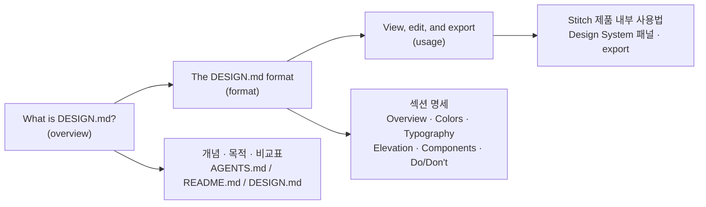

# Google Stitch DESIGN.md 가이드 (요약)

Google Stitch 공식 문서의 DESIGN.MD 섹션 3개 페이지(overview/format/usage)를 한국어로 요약한 문서. 원본은 `raw/2026-04-09-stitch-design-md.md`에 보존.

## 왜 이 가이드가 중요한가

전통적인 디자인 시스템은 Figma 파일, 브랜드 PDF, 또는 디자이너의 머릿속에 산다. 셋 다 AI 에이전트가 읽을 수 없다. [[DESIGN.md 포맷]]은 이 격차를 메우는 **사람·에이전트 공용 평문 문서**다. Google Stitch가 정의한 포맷이지만, 포맷 자체는 portable해서 [[Claude Code]] 같은 다른 에이전트에도 쓸 수 있다.

## 세 문서의 구조

세 페이지는 "무엇인가 → 어떤 형태인가 → 어떻게 쓰는가" 순서로 연결된다.

## 1. What is DESIGN.md? (개념)

> "DESIGN.md is a **living artifact**, not a static config file." — Stitch 공식 문서

- **정의**: 사람과 디자인 에이전트가 공유하는 평문 디자인 시스템 문서
- **위치**: 세 파일 체계의 한 축

| 파일 | 읽는 주체 | 정의하는 것 |
|------|-----------|-------------|
| README.md | 사람 | 프로젝트가 무엇인지 |
| AGENTS.md | 코딩 에이전트 | 프로젝트를 어떻게 빌드하는지 |
| DESIGN.md | 디자인 에이전트 | 프로젝트가 어떻게 보이고 느껴져야 하는지 |

상세는 [[ai-readable design system]] 참조.

### 생성 경로 3가지

1. **에이전트가 생성** — "playful coffee shop app with warm colors" 같은 분위기(vibe) 프롬프트만 던지면 Stitch가 토큰과 가이드라인을 생성
2. **브랜딩에서 파생** — 기존 브랜드 URL/이미지를 넘기면 에이전트가 팔레트·타이포·스타일 패턴을 추출
3. **직접 작성** — 고급 사용자가 마크다운으로 직접 작성. 특수 문법·도구 필요 없음

## 2. The DESIGN.md format (포맷 명세)

DESIGN.md는 다음 6개 섹션을 **고정 순서**로 가진다 (관련 없는 섹션은 생략 가능, 순서는 유지):

1. **Overview** — 디자인의 퍼스널리티. "장난스러운가 전문적인가, 밀도가 높은가 여유로운가" 같은 하이레벨 분위기 기술. 특정 토큰이 없을 때 에이전트의 결정을 가이드
2. **Colors** — primary / secondary / tertiary / neutral 팔레트. 각 색상은 hex 값 + **역할(role)** 을 함께 명시 (예: "`#2665fd`: CTAs, active states"). 에이전트는 여기서 `surface`, `on-primary`, `error`, `outline` 같은 named color를 자동 파생
3. **Typography** — headline / body / label 폰트 패밀리와 weight, size
4. **Elevation** — 깊이(depth) 표현 방식. 그림자를 쓰거나, border/surface 변화만으로 표현하거나
5. **Components** — atom 컴포넌트 스타일 가이드 (Buttons, Inputs, Cards, Chips, Lists, Checkboxes, Radio buttons, Tooltips 등). 각 variant, sizing, padding, corner radius, state를 명시
6. **Do's and Don'ts** — "Do use primary sparingly", "Don't mix rounded and sharp corners" 같은 실천 가이드라인. 에이전트의 가드레일

### 이중 표현 (Stitch 고유 메커니즘)

Stitch는 DESIGN.md를 두 얼굴로 관리한다 — 이 부분은 Stitch 내부 동작이라 포맷 자체가 아니라 [[Google Stitch]] project-internal 디테일:

- **Markdown**: 사람이 읽고 편집. 근사치 허용 ("warm colors, rounded feel")
- **Structured tokens**: hex 값, font enum, spacing scale, 전체 named color 팔레트. 에이전트의 생성 시 일관성 강제

> "The markdown is for collaboration. The tokens are for enforcement."

상세 섹션 명세는 [[design-md format]] concept 페이지 참조.

## 3. View, edit, and export (Stitch 내부 사용법)

Stitch 제품 내부 워크플로우 — 여기는 [[Google Stitch]] 고유 동작:

- **Design System 패널**: 활성 디자인 시스템의 resolved 토큰을 볼 수 있음
- **프로젝트 기본값 지정**: 이후 생성되는 모든 새 화면이 상속. **기존 화면은 소급 업데이트되지 않음**
- **직접 편집**: 패널에서 color palette / typography / roundedness는 GUI로 편집 가능, 세밀한 내용(컴포넌트 가이드·do's/don'ts·overview)은 마크다운을 직접 편집
- **Export**: 프로젝트 export 시 DESIGN.md가 zip에 포함. standalone 문서로 Stitch 없이도 사용 가능

## 핵심 인사이트

1. **Portability가 핵심 가치** — export된 DESIGN.md는 Stitch에 의존하지 않는다. 다른 AI 에이전트·팀·도구가 그대로 읽을 수 있다
2. **평문의 힘** — 특수 schema·build tooling 없이 마크다운만으로 동작. git diff, 리뷰, 협업이 자연스러움
3. **사람과 에이전트의 공용어** — 사람의 근사 기술("warm, rounded")과 에이전트의 정확한 값(`#2665fd`, `8px`)이 같은 문서 안에 공존
4. **Living artifact** — 한 번 쓰고 끝내는 설정 파일이 아니라 프로젝트와 함께 진화

## 실무 적용 관점

- **Claude Code로 일관된 UI 생성**: DESIGN.md를 프로젝트에 넣어두면 Claude Code가 매 화면마다 같은 토큰을 참조 (→ [[ai-readable design system]])
- **기존 브랜드 마이그레이션**: Stitch의 "derive from branding" 경로를 사용하면 기존 사이트에서 DESIGN.md를 역추출 가능
- **팀 협업 소스오브트루스**: 디자이너는 마크다운으로 의도를 적고, 에이전트는 그 의도를 토큰으로 강제

## 관련 문서

- [[DESIGN.md 포맷]]
- [[Google Stitch]]
- [[ai-readable design system]]
- [[design tokens]]
- [[Claude Code]]

## 출처
- https://stitch.withgoogle.com/docs/design-md/overview/
- https://stitch.withgoogle.com/docs/design-md/format/
- https://stitch.withgoogle.com/docs/design-md/usage/
- raw 파일: `raw/2026-04-09-stitch-design-md.md`
