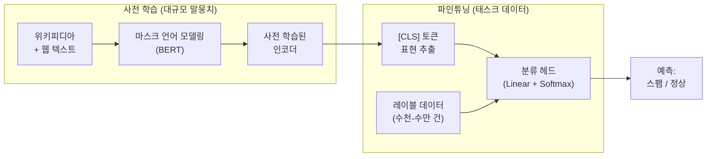

# 텍스트 분류 (Text Classification)

## 개요

텍스트 분류(Text Classification)는 주어진 텍스트를 사전 정의된 카테고리 중 하나(또는 여러 개)에 할당하는 NLP 기본 태스크다. 스팸 필터링, 감정 분석(sentiment analysis), 토픽 분류, 언어 감지, 유해 콘텐츠 탐지 등 광범위한 응용을 포함하며, NLP에서 가장 오래되고 가장 널리 배포된 태스크 중 하나다. 규칙 기반 시스템에서 Naive Bayes, SVM을 거쳐, 현재는 [[transformer-architecture|Transformer]] 기반 사전 학습 모델(BERT, RoBERTa 등)의 파인튜닝이 표준 접근법이다. 최근에는 LLM의 제로샷/퓨샷 능력이 발전하면서, 파인튜닝 없이도 높은 성능을 달성하는 방식이 부상하고 있다.

## 태스크 유형

### 이진 분류 (Binary Classification)

텍스트를 두 클래스 중 하나로 분류한다:

- **스팸 탐지**: 이메일/문자가 스팸인지 정상인지 판별
- **감정 분석 (긍/부정)**: 리뷰가 긍정적인지 부정적인지 판별
- **유해성 탐지**: 콘텐츠가 유해한지 안전한지 판별

### 다중 클래스 분류 (Multi-class Classification)

텍스트를 3개 이상의 상호 배타적 클래스 중 하나에 할당한다:

- **토픽 분류**: 뉴스 기사를 정치/경제/스포츠/문화 등으로 분류
- **감정 분석 (다중)**: 매우 긍정/긍정/중립/부정/매우 부정의 5단계
- **의도 인식**: 챗봇에서 사용자 발화의 의도(주문/취소/환불/질문) 분류

### 다중 레이블 분류 (Multi-label Classification)

하나의 텍스트에 여러 레이블을 동시에 할당한다:

- **태그 지정**: 블로그 글에 "AI", "Python", "튜토리얼" 등 여러 태그 부여
- **감정 인식**: "기쁘지만 걱정된다" -> [기쁨, 걱정] 동시 할당

## 접근법의 변천

### 1세대: 규칙 기반

수작업으로 만든 키워드/패턴 규칙으로 분류한다. "무료", "당첨"이 포함되면 스팸으로 판정하는 식이다. 정밀도가 높을 수 있으나, 규칙 작성 비용이 크고 새로운 패턴에 대응이 어렵다.

### 2세대: 전통 머신러닝

텍스트를 수치 벡터로 변환(feature engineering)한 뒤 분류기를 학습한다:

**특징 추출**:
- Bag-of-Words (BoW): 단어 출현 빈도로 벡터 생성
- TF-IDF: 문서 내 단어 중요도를 가중치로 반영
- n-gram: 연속된 n개 단어 조합을 특징으로 추가

**분류 알고리즘**:

| 알고리즘 | 장점 | 단점 |
|---------|------|------|
| Naive Bayes | 빠른 학습, 소량 데이터에 효과적 | 특징 독립성 가정 |
| SVM | 고차원에서 강력, 과적합 방지 | 대규모 데이터에서 느림 |
| Logistic Regression | 해석 가능, 확률 출력 | 비선형 패턴 포착 한계 |
| Random Forest | 앙상블 효과, 과적합 저항 | 텍스트 특화 아님 |

### 3세대: 딥러닝

신경망이 특징 추출과 분류를 동시에 학습한다:

- **CNN for Text**: Kim(2014)의 TextCNN. 다양한 크기의 1D 합성곱 필터로 n-gram 패턴을 자동 추출
- **LSTM/BiLSTM**: 순차적 문맥을 포착. 양방향(Bi) 구조로 전후 문맥 모두 활용
- **Attention + RNN**: 중요한 단어에 가중치를 부여하여 분류 근거를 해석 가능하게 함

### 4세대: 사전 학습 + 파인튜닝

[[transformer-architecture|Transformer]] 기반 사전 학습 언어 모델이 텍스트 분류의 표준이 되었다:

**BERT 기반 분류**: [CLS] 토큰의 최종 히든 상태를 분류 헤드에 입력하여 클래스를 예측한다. 사전 학습에서 획득한 언어 이해 능력 덕분에, 소량의 레이블 데이터로도 높은 성능을 달성한다.

| 모델 | 특징 | 대표 벤치마크 성능 |
|------|------|-------------------|
| BERT-base | 110M 파라미터, 양방향 | SST-2: 93.5% |
| RoBERTa | BERT 학습 최적화 | SST-2: 96.4% |
| DeBERTa | 분리된 어텐션 + 향상된 마스크 디코더 | SuperGLUE: 90.0+ |
| XLM-RoBERTa | 100+ 언어 다국어 모델 | XNLI: 다국어 최고 |

### 5세대: LLM 프롬프팅

GPT-4, Claude 등 대규모 LLM은 파인튜닝 없이 프롬프트만으로 분류를 수행할 수 있다:

**제로샷**: "다음 리뷰의 감정을 '긍정' 또는 '부정'으로 분류하시오:" + 리뷰 텍스트
**퓨샷**: 몇 개의 예시와 함께 분류 지시를 제공

| 접근법 | 레이블 데이터 필요 | 배포 비용 | 유연성 |
|--------|------------------|----------|--------|
| BERT 파인튜닝 | 수천-수만 건 | 낮음 (경량 모델) | 태스크 고정 |
| LLM 프롬프팅 | 0-수십 건 | 높음 (API 비용) | 즉석 변경 가능 |
| LLM 파인튜닝 | 수백-수천 건 | 중간 | 태스크 특화 + 범용 |

## 실무 고려사항

### 데이터 불균형

실제 데이터는 대부분 불균형하다(스팸 5% vs 정상 95%). 대응 전략:

- **오버샘플링**: 소수 클래스 데이터를 복제/증강 (SMOTE 등)
- **언더샘플링**: 다수 클래스 데이터를 축소
- **클래스 가중치**: 손실 함수에서 소수 클래스에 높은 가중치 부여
- **평가 지표**: 정확도(accuracy) 대신 F1-score, AUPRC 사용

### 평가 지표

| 지표 | 설명 | 적합한 상황 |
|------|------|-----------|
| Accuracy | 전체 정답 비율 | 클래스 균형 시 |
| Precision | 양성 예측 중 실제 양성 비율 | 오탐(false positive) 비용이 높을 때 |
| Recall | 실제 양성 중 탐지 비율 | 미탐(false negative) 비용이 높을 때 |
| F1-score | Precision과 Recall의 조화 평균 | 불균형 데이터 일반 |
| AUROC | 임계값 독립적 분류 성능 | 이진 분류 전반 |

### 해석 가능성

분류 결과의 근거를 설명하는 것이 중요한 도메인(의료, 법률, 금융)에서는:

- **Attention 가중치 시각화**: 모델이 주목한 단어/구간 표시
- **LIME/SHAP**: 개별 예측에 대한 특징 기여도 분석
- **라벨별 대표 키워드**: TF-IDF 기반으로 각 클래스를 대표하는 키워드 추출

## [[named-entity-recognition|NER]]과의 관계

텍스트 분류와 [[named-entity-recognition|개체명 인식(NER)]]은 NLP의 양대 기본 태스크다. 분류는 문서 전체에 하나의 레이블을 할당하는 반면, NER은 문서 내 개별 토큰에 레이블을 할당한다(시퀀스 레이블링). 두 태스크는 종종 파이프라인으로 결합된다: NER로 추출한 엔티티 정보를 텍스트 분류의 추가 특징으로 활용하거나, 분류 결과에 따라 다른 NER 모델을 적용하는 식이다.

## 참고 자료

- [Text Classification: The First Step Toward NLP Mastery](https://blog.dataiku.com/text-classification-the-first-step-toward-nlp-mastery). Dataiku
- [Text Classification: Sentiment Analysis and Spam Detection](https://keylabs.ai/blog/text-classification-sentiment-analysis-and-spam-detection/). Keylabs
- [Understanding Text Classification in NLP](https://www.analyticsvidhya.com/blog/2020/12/understanding-text-classification-in-nlp-with-movie-review-example-example/). Analytics Vidhya
